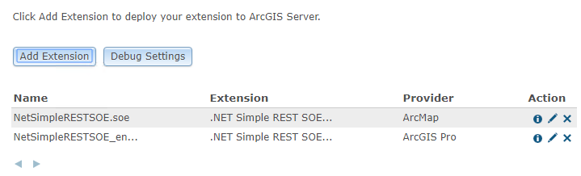

# Migration strategies

This topic describes migration strategies that needs to be understood before migrating ArcObjects .NET SOEs and SOIs to ArcGIS Enterprise SDK SOEs and SOIs.

### Interface changes

ArcGIS Enterprise SDK is bundled with core set of assemblies to facilitate development of custom extensions and interceptors. ArcGIS Enterprise SDK .NET assemblies includes necessary classes, interfaces required for development of custom extensions and interceptors. While migrating server object extensions and interceptors from the ArcObject .NET SDK to the ArcGIS Enterprise SDK, you may receive common error saying “Type or namespace name could not be found”.

To illustrate this, refer to code below.

```cs
public void Construct(IPropertySet props)
{
    configProps = props;
    // Read the properties.

    if (props.GetProperty("LayerName") != null)
    {
        m_mapLayerNameToQuery = props.GetProperty("LayerName")as string;
    }
    else
    {
        throw new ArgumentNullException();
    }
    try
    {
        // Get the feature layer to be queried.        
        IMapServer3 mapServer = (IMapServer3)serverObjectHelper.ServerObject;
        string mapName = mapServer.DefaultMapName;        
    }
    catch 
    {
        logger.LogMessage(ServerLogger.msgType.error, "Construct", 8000, 
            "SOE custom error: Could not get the feature layer.");
    }
}
```

If you try to compile above code in an ArcGIS Enterprise SDK template you will receive error saying **"The type or namespace name 'IMapServer3' could not be found. (Are you missing a using directive or an assembly reference?)".**.

To fix above error, change `IMapServer3` to `IMapServer` in your code. `IMapServer3` interface does not exist in ArcGIS Enterprise SDK. `IMapServer` interface is latest interface which includes required methods and properties. Likewise, you may encounter such errors for various other interfaces like `IMapLayerInfo`, `IMapServerDataAccess`, `ILayerDescription` etc.

Refer to [.NET Samples](/sample-code/) available with ArcGIS Enterprise SDK, to get an idea about interface changes.

We strongly advise that you refer to [.NET API Reference](/api-reference/net/) section of this help document to get rid of such errors.

### Retrieval of service configuration parameter

In ArcObjects .NET SDK, you can use interface `IMapServerInit` to retrieve service configurations details like `MaxBufferCount`, `MaxImageHeight`, `MaxImageWidth`, `MaxRecordCOunt`, `PhysicalCacheDirectory`, `PhysicalOutputDirectory` etc.

But in ArcGIS Enterprise SDK, interface `IMapServerInit` does not exists. In ArcGIS Enterprise SDK, you can retrieve service configurations as below.

```cs
using ESRI.ArcGIS.SOESupport.SOI;

public void Construct(IPropertySet props)
{
    configProps = props;    
    try
    {
        // Get the access to server object        
        IServerObject  mapServer = serverObjectHelper.ServerObject;
        //Use QueryConfigurationProperties method available in SOESupport assembly        
        IPropertySet  pPorpSet = SOIBase.QueryConfigurationProperties(pServerObject.ConfigurationName, pServerObject.TypeName);
        string maxRecordCount = pPropSet.GetProperty("MaxRecordCount").ToString();
    }
    catch 
    {
        logger.LogMessage(ServerLogger.msgType.error, "Construct", 8000, "SOE custom error");
    }
}
```

Refer to [SimpleRESTSOE Sample](/sample-code/Samples/net/SOE/SimpleRESTSOE/) available with ArcGIS Enterprise SDK. This sample contains snippet for retrieving service configuration parameters.

### Extensions can coexist

In ArcGIS Server, you can register extensions (SOE/SOI) developed in the ArcObjects SDK and in the ArcGIS Enterprise SDK with the same extension name. But the extension file name should be different. For example, if you have developed an extension with the name “SimpleRESTSOE” and extension file name “SimpleRESTSOE.soe” using the ArcObjects .NET SDK, then a similar extension can be developed using the ArcGIS Enterprise SDK. Its extension name can also be “SimpleRESTSOE”, but its extension file name will be changed to “SimpleRESTSOE_ent.soe”. Then, you can rename the file to any appropriate name you want.

Once you register your extensions with ArcGIS Server, to help you distinguish between extensions developed using the ArcObjects SDK and the ArcGIS Enterprise SDK, access ArcGIS Server Manager. In Manager, navigate to “Site -> Extensions”. You will find one additional column is added with the column name “Provider”. Extensions developed using the ArcObjects .NET SDK have “ArcMap” for a provider value, whereas extensions developed using the ArcGIS Enterprise SDK have “ArcGIS Pro.”



In ArcGIS Server, if you try to upload an extension with the same extension file again, you should get an error saying, **"The extension file with the name has already been registered. Please upload and register the file with a different name".**.

Consider a scenario where you have already registered one extension with ArcGIS Server developed using the ArcGIS Enterprise SDK, and are trying to register another extension developed using the ArcGIS Enterprise SDK with the same extension name but a different extension file name. In this case, you should get an error saying **"An extension with name 'XXXXXXXX' is already registered for service type 'MapServer'"**.

Important points to remember

1.  Extensions developed using the ArcObjects SDK and the ArcGIS Enterprise SDK with same extension name can coexist, as long as their extension file names are different.
2.  You cannot use the same extension name for multiple extensions using the ArcGIS Enterprise SDK.
3.  All extensions registered with ArcGIS Server and developed using the ArcGIS Enterprise SDK, should have a unique extension name and extension file name.

### Custom HTML property page

You can use custom HTML property page in your SOEs and SOIs. These will be displayed in ArcGIS Server Manager inside the Capabilities section of map service on which you are enabling your extension. As explained above you can register extensions with same name if you have developed extensions in ArcObjects SDK and the ArcGIS Enterprise SDK. If your extension is implementing custom HTML property page, then folder structure under “Resources” should be different for extensions developed in ArcObjects .NET SDK and ArcGIS Enterprise SDK, even though extension name might be the same.

Make sure you update the config.js file with respect to the updated structure of the “Resources” folder. If you keep the same structure for the “Resources” folder for both extensions, registering the extensions with ArcGIS Server, it will override each other’s property page.

Refer to [SimpleRESTSOEWithProperties Sample](/sample-code/Samples/net/SOE/SimpleRESTSOEWithProperties/) available with ArcGIS Enterprise SDK, to understand custom HTML property pages.

### Unsupported interfaces, classes and methods

As explained in the [design philosophy](../design-philosophy-for-arcgis-enterprise-sdk-net/) section, the ArcGIS Enterprise SDK does not support some implementations in this release.

For example, geoprocessing is not supported with the ArcGIS Enterprise SDK. You cannot execute any geoprocessing model in your SOE.

To illustrate this, see the code below.

```cs
IGeoProcessor gp = new GeoProcessorClass();
```

Using this code, you should get error saying **"The type or namespace name ‘IGeoProcessor’ could not be found. (Are you missing a using directive or an assembly reference?)"**.

Similarly, geometric network, plugin data sources are not supported in the ArcGIS Enterprise SDK.

During your migration process, if you find some interfaces, classes, or methods are missing, which are required in your SOE/SOI and if you think you have an appropriate use case to have those missing interfaces, classes, or methods, then you can log a case with Esri Technical Support and provide your use case.

### Also See

-   [Migration steps](../migration-steps-net/)
-   [Walkthrough : How to migrate an ArcObjects .NET SOE to ArcGIS Enterprise SDK](../how-to-migrate-a-net-soe-net/)
