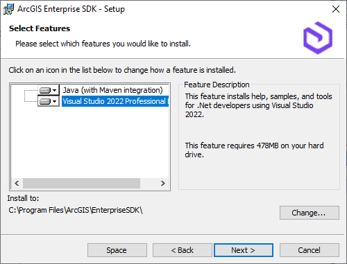
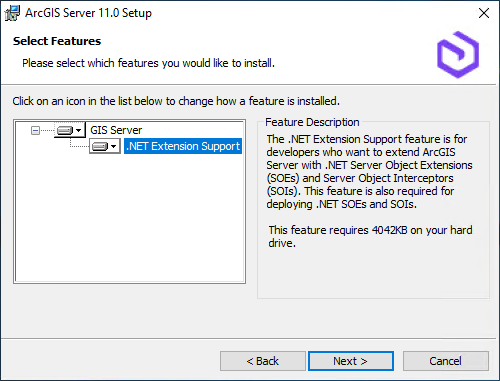

# Overview of .NET 8 support for SOEs and SOIs

Starting from 11.3, ArcGIS Enterprise SDK supports creating and building SOEs and SOIs with [.NET 8](https://docs.microsoft.com/en-us/dotnet/core/whats-new/dotnet-8). The .NET SOE and SOI project templates and build tools provided by the SDK now target .NET 8 instead of .NET Framework 4.x, which impacts the following workflows with ArcGIS Enterprise SDK:

It's also worth noting that deploying .NET 8 SOEs and SOIs requires installing .NET 8 on the server machine and the .NET Extension Support feature of ArcGIS Server. See [Deploy the .NET 8 SOEs or SOIs to ArcGIS Server](#deploy-net-8-soes-and-sois-to-arcgis-server) for more details.

> **Note**: The .NET-based SOEs and SOIs built with .NET 8 can be deployed to ArcGIS Server in Windows. Currently, they are not supported for ArcGIS Server in Linux. Only Java-based SOEs and SOIs can be deployed to ArcGIS Server in Linux.

## Set up the .NET 8 development environment

Make sure you go through [System requirements](../system-requirements-net/) first to install all the supported software before installing ArcGIS Enterprise SDK.

To set up the .NET development environment for Enterprise SDK 11.3, you must first install Visual Studio 2022 with the **.NET desktop development** workload enabled (see [Installation](../installation-net/)). Since this automatically installs **.NET SDK 8.0 (x64) from Visual Studio**, you will not need to install .NET SDK 8.0 (x64) by yourself. You can confirm that both Visual Studio 2022 and .NET SDK 8.0 are successfully installed by checking Programs and Features in Control Panel as shown in the following screenshot.

After Visual Studio 2022 is installed, you should be able to launch the Enterprise SDK setup and select the **Visual Studio 2022 Community/Professional/Enterprise Edition** feature to complete the installation. See the following screenshot:

## Create a new .NET 8 SOE or SOI

The workflow of creating a new SOE or SOI with ArcGIS Enterprise SDK 11.3 is the same as using the previous versions of the SDK. You can refer to [How to create an SOE from the template in Visual Studio](../how-to-open-soe-templates-in-visual-studio-net/) and [Create a simple SOI](../quick-tour-of-a-simple-soi-net/#create-a-simple-soi) for detailed instructions.

## Build .NET 8 SOEs and SOIs

Once the SOE or SOI project is created from the template, it automatically targets .NET 8. There is no need to change the project's target framework. You can inspect it by right-clicking the project in Solution Explorer and selecting Properties.

  

The **Target framework** property of the SOE or SOI project should only be set to `.NET 8.0`. Other versions of .NET are not supported to set for target framework of SOEs or SOIs. 

All the ESRI libraries (`ESRI.Server.*`) are referenced under the project's **Dependencies > Assemblies** with their properties automatically set properly once the project is created. There is no need to change or set any properties of these assemblies, even though some properties of these assemblies may not display any values. 

> Note: The **Embed Interop Types** property of these assemblies should only be set to `No`. The **Copy Local** property of these assemblies should only be set to **Yes**. Using the **Copy Local** property as **No** for these ESRI assemblies is currently not supported with Enterprise SDK 11.3.

  

Now, you can build the SOE or SOI project, which will generate an .soe file in the project output folder (`\bin\Debug\net8.0\` or `\bin\Release\net8.0`). There will be multiple other files copied to this project output folder, however, the .soe file is the only file needed to deploy the extension to ArcGIS Enterprise.

## Debug .NET 8 SOEs and SOIs

Debugging a .NET 8 SOE or SOI works the same way as previous versions of ArcGIS Enterprise SDK, see [Debug extensions](../debug-extensions-net/).

## Deploy .NET 8 SOEs and SOIs to ArcGIS Server

The prerequisites for deploying and consuming a .NET 8 SOE and SOI is to install both .NET 8.0 and the **.NET Extension Support** feature of ArcGIS Server on the server machine. See [.NET 8 requirement for .NET Extension Support](https://enterprise.arcgis.com/en/system-requirements/latest/windows/arcgis-server-system-requirements.htm#ESRI_SECTION1_C284997E64A045F282C8FB3839FBF716).

Follow these steps to install the prerequisites before you deploy a .NET 8 SOE or SOI to ArcGIS Enterprise:

### 1. Install .NET 8.0

   Make sure you install either **.NET SDK 8.0 (x64)** or **.NET Desktop Runtime 8.0 (x64)** (see the [Download .NET 8.0](https://dotnet.microsoft.com/en-us/download/dotnet/8.0) site) on your server machine. You do not need to download or install .NET 8.0 from the above site if you have already installed Visual Studio 2022 with the **.NET desktop development** workload, since Visual Studio 2022 includes **.NET SDK 8.0 (x64)**. 
   
   You can also find the version of the installed .NET in **Programs and Features**. For example, any one of the following .NET installations meets the .NET 8.0 prerequisite.

   

### 2. Install .NET Extension Support

   Once you complete step 1, you should install the **.NET Extension Support** feature of ArcGIS Server.

     
   
   If you see the **Missing Dependencies** page like the following screenshot, this indicates you don't have a supported .NET 8.0 installed:

   

   You should revisit step 1 to install the supported .NET 8.0, run the ArcGIS Server setup again, or modify the existing ArcGIS Server setup, and then you should be able to install the **.NET Extension Support** feature.
  
## Troubleshooting and errors

This section illustrates a few typical errors that you may see when you deploy an SOE or SOI in ArcGIS Server 11.3.

- Add Extension error: "The extension cannot be registered because it requires the .NET Extension Support feature which is not installed. See 'ArcGIS Server system requirements'."

   

   This error indicates that you are trying to deploy a .NET 8 SOE or SOI, but your ArcGIS Server doesn't have **.NET Extension Support** installed. To deploy a .NET SOE or SOI in ArcGIS Server 11.3, you must install the **.NET Extension Support** feature first. Follow the steps in [Deploy the .NET 8 SOE or SOI to ArcGIS Server](#deploy-net-8-soes-and-sois-to-arcgis-server) to install this feature.

- Add Extension error: "The extension cannot be deployed because it is a .NET-based extension and is currently not supported on Linux. Please deploy a Java-based extension."

   This error indicates that you are trying to deploy a .NET SOE or SOI to ArcGIS Server on Linux, which is currently not supported. You can only deploy Java SOEs or SOIs to ArcGIS Server on Linux. ArcGIS Server on Windows supports both .NET-based extensions and Java-based extensions.