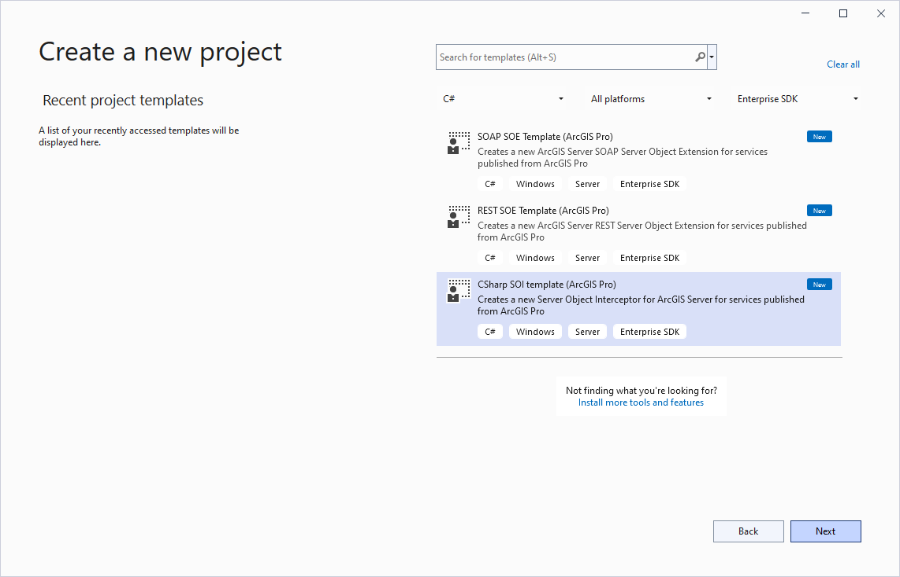
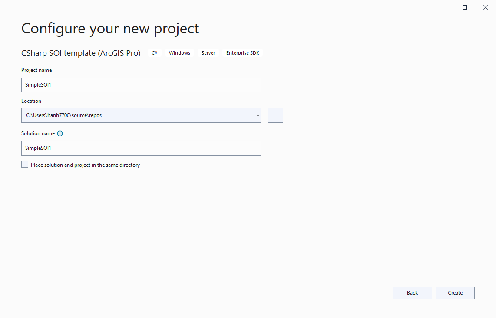
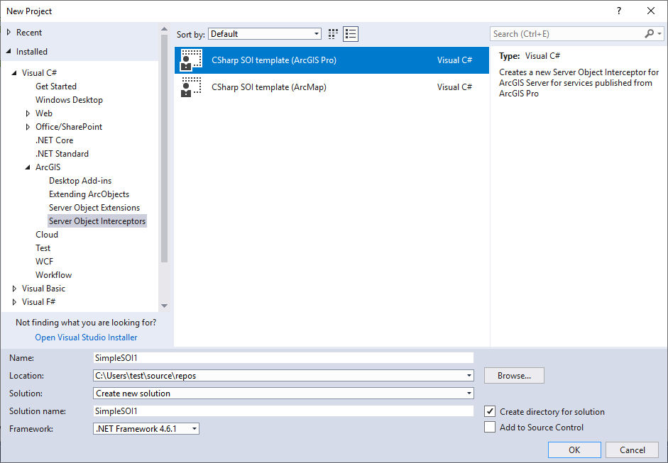

# A quick tour of a simple SOI

This topic demonstrates how to create a simple server object interceptor (SOI) project using a Visual Studio template. It also illustrates key components in an SOI class structure.

### Create a simple SOI

Before you start developing SOIs, ensure that Visual Studio and ArcGIS Enterprise SDK are installed on the development machine. If not, refer to the [Installation guide for ArcGIS Enterprise SDK](../installation-net/).  

Then, perform the following steps to create a simple SOI in Visual Studio:

- Using Visual Studio 2022 or Visual Studio 2019

	1. Launch Visual Studio and choose **Create a new project**, or click **File > New > Project** in an opened Visual Studio project.

	2. In the project templates list, set the languages filter to either `C#` or `Visual Basic` and the project types filter to `Enterprise SDK`. Choose `CSharp SOI Template (ArcGIS Pro)` in the list of templates.
    
      

    3. Set the project name, location, and solution name for your SOI project, and click **Create**.

    

- Using Visual Studio 2017 or earlier versions

	1.  On the menu bar, choose **File > New > Project**.

		To debug the SOI, you need to run Visual Studio as administrator. See [debug extensions](../debug-extensions-net/).  

	2.  In the **New Project** wizard, choose **Visual C# > ArcGIS > Server Object Interceptors > CSharp SOI template (ArcGIS Pro)**  

		

### SOI attribute

After the SOI class is created from the template, the attribute, interfaces, and methods required for the SOI class are automatically implemented. The following SOI attribute (`ServerObjectInterceptorAttribute`) is used to help the server administrator identify and understand the SOI deployed in ArcGIS Server Manager.  

```cs
[ServerObjectInterceptor("MapServer",
	Description = "",
	DisplayName = "SimpleSOI1",
	Properties = "",
	SupportsSharedInstances = false)]
public class SimpleSOI1 : IServerObjectExtension, IRESTRequestHandler, IWebRequestHandler, IRequestHandler2, IRequestHandler
{
	//... 
}
```

The first parameter is server object type. By default, `MapServer` is set, indicating this is an SOI for a map service. Starting with 10.8.1, `ImageServer` is also supported for SOIs to work with image services.

**Description** displays after the **Help** button of the extension is clicked on **Site > Extensions** tab on ArcGIS Server Manager. It can be empty.  

**DisplayName** is the SOI name that appears under **Service > Capabilities** tab on ArcGIS Server Manager.  

**Properties** is the SOI properties that can be edited by the server administrator. In addition, if the SOI has a custom property page, you should set the **HasManagerPropertiesConfigurationPane** parameter to true. See the [SOI properties](../soi-properties-net/) section for more details.  

**SupportsSharedInstances** is an optional attribute indicating whether this SOI supports shared instances and whether this SOI can be enabled when the service is set to use shared instances. By default, it's always `false`, which forbids the SOI to be enabled with shared instances. If the SOI follows the [best practices for extensions with shared instances](), this attribute can be set to `true` and the SOI can be used with a service set for shared instances. The **SupportsSharedInstances** attribute is introduced at 10.8.

### SOI initialization

The initialization logic of the SOI is defined in the`init()`method, which contains the following boilerplate code:  

```cs
public void Init(IServerObjectHelper pSOH) 
{ 
	_soHelper = pSOH; 
	_serverLog = new ServerLogger(); 
	_restSOIHelper = new RestSOIHelper(pSOH); 
	_serverLog.LogMessage(ServerLogger.msgType.infoStandard, _soiName + ".init()", 200, "Initialized " + _soiName + " SOI."); 
}
```

After the SOI is enabled with a map service and service restarts, the first method that will be triggered in the SOI is this`init()`method.`IServerObjectHelper`helps hold the reference to the current server object, which is a`MapServer`object providing service data access, layer properties, and access to other service information. `RestSOIHelper`provides access to the REST request schema and REST request handler.`ServerLogger`allows the SOI to write server logs that can be viewed by the server administrator. You may also refer to the SimpleSOI sample (**\\&lt;Installation folder of ArcGIS Enterprise SDK>\\Samples\\Java\\serverobjectinterceptors\\SimpleSOI**) for the complete SOI code.  

### SOI request handler

The SOI class implements several interfaces, which handle different types of requests, such as REST, SOAP, and OGC requests. For example, the`HandleRESTRequest()` method is implemented by `IRESTRequestHandler` for REST request. This method is called every time a service operation is performed through REST endpoint.  

```cs
public byte[] HandleRESTRequest(string Capabilities, string resourceName, string operationName, 
	string operationInput, string outputFormat, string requestProperties, out string responseProperties) 
{ 
	responseProperties = null; 

	IRESTRequestHandler restRequestHandler = _restSOIHelper.FindRequestHandlerDelegate<IRESTRequestHandler>(); 
	if (restRequestHandler == null) 
		return null; 

	return restRequestHandler.HandleRESTRequest( 
			Capabilities, resourceName, operationName, operationInput, 
			outputFormat, requestProperties, out responseProperties); 
} 
```

The REST request sent to a map service carries lots of information, including request headers, output format, request parameters, operation name, and other service information. Request headers are returned by `requestProperties`. The output format is returned by `outputFormat`, which can be JSON, GeoJSON, image, and so on, depending on the specific operation. Request parameters are passed in as `operationInput`. The `capabilities`, `resourceName`, and `operationName` variables are usually used to locate the specific service operation to intercept.  

The `HandleRESTRequest()` method in the above code is used to process the REST request and generate a byte-array response. Right now, this code doesn't modify any request or response, and just lets through the request as default.  

To modify the request, you can modify the request parameters, such as changing certain `operationInput` parameters and passing the updated parameters to the `restRequestHandler.HandleRESTRequest()` method.  

To modify the response, you can customize the return byte array object. For example, if the result of a map service query is a JSON, you can first get a byte array object from the `restRequestHandler.HandleRESTRequest()` method, and then convert this byte-array object to a JSON object and customize the JSON object based on your business logic. Finally, you can pack the updated JSON object back to a byte array and return it for the above `HandleRESTRequest()` method. Additionally, you can also provide your custom response headers by assigning `responseProperties`.  

Similarly, you can use the `HandleStringRequest()` method to intercept SOAP requests, the `HandleBinaryRequest()` for certain requests sent from ArcMap, and the `HandleStringWebRequest()` method for OGC service requests. 