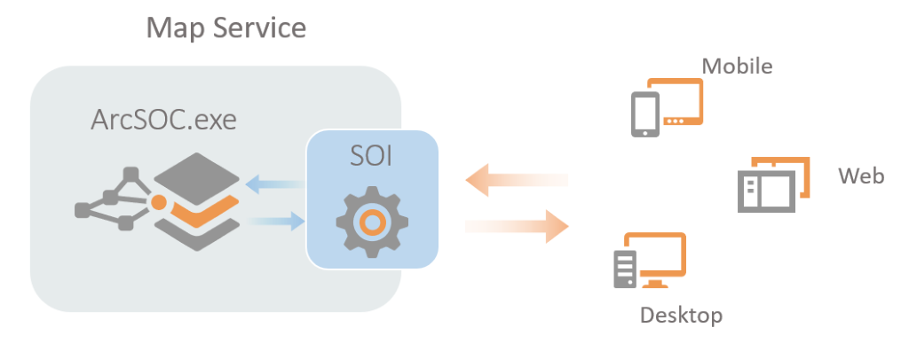
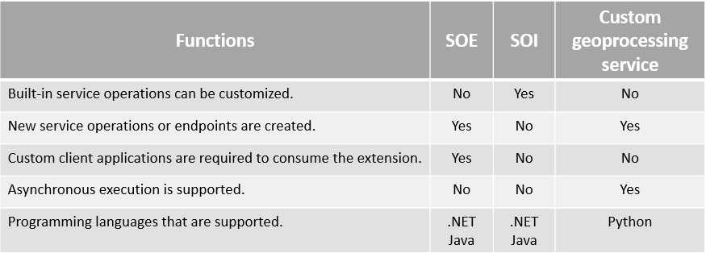

# What is an SOI?

This topic explains how server object interceptors work and compares the differences between server object extensions (SOEs) and server object interceptors (SOIs).

### What is a server object interceptor?

Server object interceptors (SOIs) allow you to intercept requests and responses for built-in operations of a service. Using SOIs, you can execute custom logic and alter the behaviors of these services by overriding existing operations in a way that is seamless to existing clients. These clients may be applications built with ArcGIS API for JavaScript, ArcGIS Runtime SDK, and more. Since SOIs perform server-side customization, client applications cannot bypass security controls within your SOIs.  

The following diagram illustrates how an SOI manages to intercept requests. Depending on the business needs, SOIs can choose to override or filter the incoming request, send it to ArcSOC for processing, and modify or filter the outgoing response before it's sent back to the client.  

  

Due to the above mechanism, SOIs can integrate custom business logic into existing service functions, such as security control, fine-grained user access control, or auditing requirements that are not fulfilled by the default map service, for example:  

-   **Auditing and notification**

    For auditing purposes, you can create SOIs to log detailed information about incoming requests and logged-in users, such as input request parameters and user identities. In addition, you can notify the client applications if invalid or abnormal map service operation occurs.  

-   **Fine-grained user access control**

    Since SOIs can obtain the identity of the logged-in user, you can develop SOIs to restrict user access to different resources of the service, both on the service operation level and the data level. For example, SOIs can be used to restrict edit operation support for certain users while granting edit support for another set of users in the same feature service. Another example of data level control is implementing an SOI to hide certain layers, fields, or records for certain users while showing them to other users in the same map service. As this customization happens on the server side, this logic will never be exposed to the client.  

    By default, ArcGIS Server and ArcGIS Enterprise only support enabling service operations and data access for all users in user roles or user groups. If your organization needs customized fine-grained user access control, you may consider developing SOIs.  

-   **Data filtering, enrichment, and validation**

    SOIs can be used to filter certain information before the response is passed to the client. The filtering criteria can be based on logged-in user information, data attributes, or spatial analysis. SOIs can also enrich the service by pulling an external data source to integrate into the service response. A typical use case is to add related data from an external database to a map service query result. This enriched result will also be reflected at client applications, such as Map Viewer pop-ups.  

    Another common data enrichment workflow is that SOIs can superimpose a custom watermark on map images exported by map services. In this way, organizations or hosting companies can ensure proper branding when their map services are displayed or printed by end users.  

    You can develop SOIs to validate requests and responses. If the SOI detects incorrect parameters in the request, such as an invalid track ID in apply edits operation, it can either override the request with a valid ID or send an error message with detailed explanations on the validation failure.  

### Do I need SOEs or SOIs?

Since both server object extensions (SOEs) and server object interceptors (SOIs) are server customizations developed by ArcGIS Enterprise SDK, which should we develop and when do we need them?  

In terms of SOEs, they will generate new operations of a map service. New service endpoints will be created and reached by the client applications. To implement the new operation, SOI developers need to design the input parameters that the operation accepts and the output response. Accordingly, client application developers also need to customize their solutions to prepare valid requests for the new endpoint. Certain client applications, such as ArcMap, Collector for ArcGIS, and ArcGIS Online Map Viewer, will not be able to leverage the new operations. SOEs support both REST and SOAP requests.  

If your workflow doesn't rely on built-in operations, or there is no need to alter them, and you have your own custom client applications to consume the new operation, an SOE may be your choice. However, as the SOE operations are synchronous, if your custom operation involves heavy tasks that cause long execution time, you may consider an asynchronous geoprocessing service published from ModelBuilder or Python scripts.  

Unlike SOEs, SOIs do not generate new service operations and only customize built-in service operations. They are designed to change the behaviors of existing operations of a map service (including map service extensions, such as feature service, WMS service, and so on) through preprocessing and postprocessing. For example, you can change the behavior of a query or apply edits request. An SOI supports all the REST, SOAP, and OGC requests that come through a service. Also, if you want to accomplish one or more tasks using a series of SOIs, you can chain multiple SOIs together on the same service in the order that they will be executed.  

If your workflow involves overriding existing service operations and seamlessly consuming the service by various clients, you may consider an SOI.  

The following table compares functionalities of SOEs and SOIs:  

  

Both developing SOEs and SOIs require knowledge of web development, ArcGIS Enterprise or ArcGIS Server management, ArcGIS developer tools, and programming languages such as Java, or a .NET-based language such as C#. Before you invest development efforts on SOEs or SOIs, consider whether there are any built-in solutions available, and whether this is the functionality you need.  
