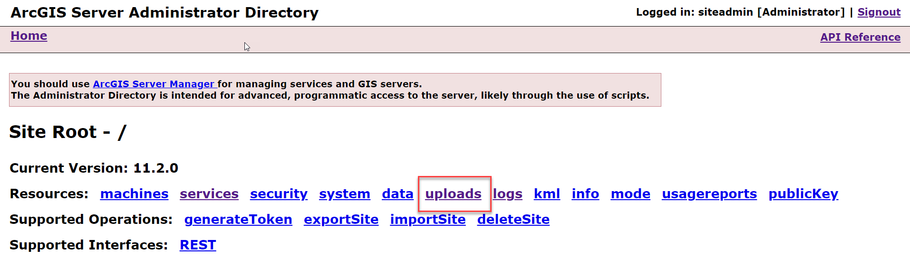

# Create a Yelp Custom Data Feed

In this tutorial, you will create a custom data feed that uses the Yelp
Fusion API to fetch data from Yelp.

## Prerequisites

Ensure that the following prerequisites are complete:

- Install ArcGIS Server and the ArcGIS Server Custom Data Feeds
  Runtime on the same machine.
- Install a version of Node.js between 16.19.1 and 20.11.1 on your development machine depending on your ArcGIS version. See [Installing and configuring](../installing-and-configuring-custom-data-feeds/) for version details.
- Install ArcGIS Enterprise SDK on your development machine.
- Create a Yelp Fusion private API key from the Yelp developer
  website.
- *It is highly recommend that your development machine and server machine are running the same operating system and the same version of Node.js.*


## Create a Custom Data App

Complete the following steps to create a custom data app named
**yelp-data-app**.

1.  On your development machine, open a command prompt and navigate to a
    directory where you want your project to be saved.

2.  Create the app by running the command: `cdf createapp yelp-data-app`.

    

3.  Verify your app runs by running the command: `npm start`.

    

4.  Once you verify that the app is running, stop it by running the command:
    `ctrl + c`.

## Create a Custom Data Provider

5.  After you've created a custom data app, open a command prompt in
    the app directory and run
    the `cdf createprovider yelp-data-provider` command. This will
    create a **yelp-data-provider** directory that includes a project
    template with boilerplate code.

    

## Install required packages

6.  In the command prompt, navigate to the **yelp-data-provider**
    directory, and run the `npm install yelp-fusion` command to install
    a wrapper client for making requests to the Yelp Fusion API.

    

## Provide Your Yelp Fusion API Key

7.  Enter your Yelp Fusion API Key for the `yelp.apiKey` field in the
    **default.json** file. The file is located in the **config** folder
    inside the **yelp-data-provider** directory. The **default.json** file
    should look like the following.

    ```json
    {
      "yelp": {
        "apiKey": "<generated API key here>"
      }
    }
    ```

## Code provider logic

8.  Write custom data provider code within the Model function in the
    **model.js** file. The Model function encapsulates the logic
    required to access data from Yelp and format it as GeoJSON. Replace
    the contents of the **model.js** file with the following code.

    ```js
    const config = require("../config/default.json");
    const parseGeoJSON = require("./parseGeoJSON");
    const yelp = require("yelp-fusion");
    const yelpClient = yelp.client(config.yelp.apiKey);
    function Model(koop) {}
    Model.prototype.getData = function(req, callback) {
      yelpClient
        .search({
          categories: "restaurants",
          location: "Redlands"
        })
        .then(response => {
          geojson = parseGeoJSON(response.jsonBody);
          geojson.metadata = { name: [host, "_in_", id].join("") };
          callback(null, geojson);
        })
        .catch(e => {
          callback(e);
        });
    };
    module.exports = Model;
    ```

9.  Create a new file called **parseGeoJSON.js** in the **src** directory to
    house an export function to parse a Yelp API response as GeoJSON.
    Add the following code to the file.

    ```js
    module.exports = body => {
      return {
        type: "FeatureCollection",
        features: body.businesses.map(business => {
          return {
            type: "Feature",
            properties: {
              name: business.name,
              category: business.categories[0].title
            },
            geometry: {
              type: "Point",
              coordinates: [business.coordinates.longitude, business.coordinates.latitude]
            }
          };
        })
      };
    };
    ```

## Parameterize the Provider

The custom data provider provides two built-in URL parameters, `host`
and `id`, which can be used to make the provider logic more generic.
In this tutorial, you will use the `host` and `id` parameters to
specify the list of categories to filter by and the location for
returning Yelp results. For example, you can use the parameters to
access specific endpoints like
_/yelp-data-provider/restaurants/Redlands/FeatureServer/0/query_ and
_/yelp-data-provider/parks/Riverside/FeatureServer/0/query_ to fetch
restaurants in Redlands and parks in Riverside, respectively.

10. Add the following code to the top of the `getData` function in the
    **model.js** file.

    ```js
    const host = req.params.host;
    const id = req.params.id;
    ```

11. Next, modify the object passed as an argument to the
    `yelpClient.search` function as follows.

    ```js
    yelpClient
      .search({
        location: id,
        categories: host
      })
      .then(/* ... */)
      .catch(/* ... */);
    ```

12. At this point, the contents of the **model.js** should look like the
    following.

    ```js
    const config = require("../config/default.json");
    const parseGeoJSON = require("./parseGeoJSON");
    const yelp = require("yelp-fusion");
    const yelpClient = yelp.client(config.yelp.apiKey);
    function Model(koop) {}
    Model.prototype.getData = function(req, callback) {
      const host = req.params.host;
      const id = req.params.id;
      yelpClient
        .search({
          categories: host,
          location: id
        })
        .then(response => {
          geojson = parseGeoJSON(response.jsonBody);
          geojson.metadata = { name: [host, "_in_", id].join("") };
          callback(null, geojson);
        })
        .catch(e => {
          callback(e);
        });
    };
    module.exports = Model;
    ```

Now that you've created a Yelp data provider, you're ready to test
and deploy it to ArcGIS Server.

## Test the Custom Data Provider

13. Open a command prompt and navigate to the **yelp-data-app**
    directory.

14. Run the `npm start` command to start the app.

    

15. In a web browser, navigate to
    http://localhost:8080/yelp-data-provider/services/rest/restaurants/redlands/FeatureServer/0/query
    and verify that the custom data provider is returning restaurants in
    Redlands.

    

## Generate a Custom Data Package File

To deploy the Yelp data provider to ArcGIS Server, you must first
package it into a custom data package file (**.cdpk**).

16. Stop the custom data app if it's running.

17. Open a command prompt and navigate to the **yelp-data-app**
    directory.

18. Run the `cdf export yelp-data-provider` command. This will create a
    file named **yelp-data-provider.cdpk** in the **yelp-data-app**
    directory.

    

## Deploy the Custom Data Feed Package to ArcGIS Server

Once you have a **.cdpk** file, use it to register the Yelp data
provider with ArcGIS Server. Instructions for registering the Yelp data 
provider through ArcGIS Server Administrator are detailed below, but 
with ArcGIS Enterprise version 11.3 and higher, you may complete this process 
with ArcGIS Server Manager or with the CDF CLI tool. 

18. In a web browser, navigate to the **ArcGIS Server Administrator
    Directory** and sign in as an administrator.

19. Click **uploads** **\>** **upload**.

    

    

20. On the **Upload Item** page, click **Choose File** and select the
    **yelp-data-provider.cdpk** file. Optionally, provide a description
    in the **Description** text box.

    

21. Click **Upload**. Once the file is uploaded, you will be directed to
    a page with the following header: **Uploaded item** **-
    \<item_id\>**. Copy the item id.

    

22. Browse back to the root of the Administrator Directory and then
    click **services \> types \> customdataproviders**.

23. On the **Registered Customdata Providers** page, click **register**
    and paste the item id into the **Id** of **uploaded item** field.

    

    

24. Click **Register**. When done you will seen something similar to the
    following.

    

## Create a Feature Service

After you've registered the Yelp data provider with ArcGIS Server, you
can create a read-only feature service that references the provider and
serves data to ArcGIS clients.

25. Browse back to the root of the Administrator Directory and click
    **services \> createService**.

    

26. On the **Create Service** page, copy and paste the following JSON
    into the **Service (in JSON format)** text box.

    ```json
    {
      "serviceName": "yelp",
      "type": "FeatureServer",
      "description": "",
      "capabilities": "Query",
      "provider": "CUSTOMDATA",
      "clusterName": "default",
      "minInstancesPerNode": 0,
      "maxInstancesPerNode": 0,
      "instancesPerContainer": 1,
      "maxWaitTime": 60,
      "maxStartupTime": 300,
      "maxIdleTime": 1800,
      "maxUsageTime": 600,
      "loadBalancing": "ROUND_ROBIN",
      "isolationLevel": "HIGH",
      "configuredState": "STARTED",
      "recycleInterval": 24,
      "recycleStartTime": "00:00",
      "keepAliveInterval": 1800,
      "private": false,
      "isDefault": false,
      "maxUploadFileSize": 0,
      "allowedUploadFileTypes": "",
      "properties": {
        "disableCaching": "true"
      },
      "jsonProperties": {
        "customDataProviderInfo": {
          "dataProviderName": "yelp-data-provider",
          "dataProviderHost": "restaurants",
          "dataProviderId": "redlands"
        }
      },
      "extensions": [],
      "frameworkProperties": {},
      "datasets": []
    }
    ```

27. Set the `dataProviderHost` field to a Yelp category of your
    choice. For a list of business categories, see the Yelp Fusion API
    documentation.

28. Set the `dataProviderId` field to a location string. The location
    string can be a valid postal code or city name.

29. Click **Create**.

30. To verify that a feature service was created, navigate to the ArcGIS
    Server Services Directory and ensure the service is listed.

    

## Consume the Feature Service

To access the Yelp feature service that you created in the previous
section, use the appropriate URL (e.g.,
https://\<domain_or_machine_name\>/\<webadaptor_name\>/rest/services/yelp/FeatureServer). You can use this URL to
consume data from Yelp in ArcGIS clients like ArcGIS Pro, ArcGIS Online,
and ArcGIS Enterprise.

You've successfully created a Yelp custom data feed that uses the Yelp
Fusion API to fetch data from Yelp.
