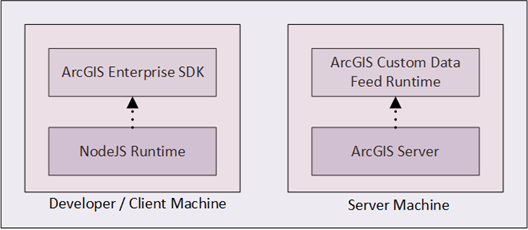

Custom Data Feeds allow you to access and use data from sources that are 
not natively supported with ArcGIS. Data from a custom data feed 
can be served to web clients, desktop apps, and field apps as read-only feature services.

The ArcGIS Server Custom Data Feeds implementation is a customization
and administration workflow in which custom data provider code written in Node.js enables one 
or more feature services. Multiple ArcGIS Enterprise
software components are configured together in the workflow requiring mulitple user roles. 
To implement a custom data feed, you must have the following software components described below
configured correctly.

## ArcGIS Server

You must have a federated or stand-alone ArcGIS Server site configured and running to handle and
deploy custom data providers by way of custom data package files (.cdpk) that are uploaded 
to your server. The ArcGIS Server version must match the version of the Custom Data Feeds Runtime 
you wish to use.

See the [ArcGIS Server installation
guide](https://enterprise.arcgis.com/en/server/latest/install/windows/welcome-to-the-arcgis-for-server-install-guide.htm)
for information on installing and configuring ArcGIS Server to meet your
organization's requirements.

## ArcGIS Enterprise SDK

The CDF command line tool allows you to create, test, and package custom 
data providers that can be registered with ArcGIS Server and is included in the ArcGIS
Enterprise SDK. Before installing the ArcGIS Enterprise SDK on your development machine, 
you must also install a version of Node.js between 16.19.1 and 20.11.1.  
For a list of Node.js versions compatible with your version of the ArcGIS 
Enterprise SDK, see the topic on [installing and configuring custom data feeds](./installing-and-configuring-custom-data-feeds/). 
It is highly recommended that your development machine is running the same OS as
the machine on which ArcGIS Server is deployed. 

For information on installing and configuring ArcGIS Enterprise SDK, see
the [ArcGIS Enterprise SDK
documentation](https://enterprise.arcgis.com/en/system-requirements/latest/windows/arcgis-enterprise-sdk-system-requirements.htm).

## ArcGIS Server Custom Data Feeds Runtime

The ArcGIS Server Custom Data Feeds runtime powers the execution
environment for custom data providers. The runtime contains all binaries
necessary to execute the provider source code written in JavaScript. For
the CDF runtime to function, it must be the same version as your ArcGIS
Server installation.
The diagram below illustrates how the different software components are
configured together as part of a custom data feed implementation.

Refer to ArcGIS Server [Custom Data Feeds runtime installation instructions](./installing-and-configuring-custom-data-feeds/)
for more installation details. 

## Implement a Custom Data Feed

The following sections provide an overview of the steps to implement a
custom data feed.

### Develop a Custom Data Provider

Custom data providers contain your custom code for requesting and handling 
data from remote data sources. Deployed custom data providers run in a single 
Node.js instance on the same machine as your ArcGIS Server deployment.
You must use the CDF command line tool to create custom data providers.
The tool offers several commands that help you quickly build, test, and package 
custom data providers. When creating a custom data provider, the tool generates 
boilerplate code allowing you to focus on implementing the core functionality. 
You must be familiar with Node.js to develop a custom data provider.

To learn more about the CDF command line tool, see the [ArcGIS Server Custom
Data Feeds CLI Reference](./custom-data-cli-reference/). For
more information about developing a custom data provider, see [Developing Custom 
Data Providers](./create-a-custom-data-feed-provider/).

### Deploy a Custom Data Provider to ArcGIS Server

The first step in deploying a custom data provider is to upload the
custom data package file to ArcGIS Server using either ArcGIS Server
Administrator Directory or ArcGIS Server Manager. Once the file is uploaded, 
use either Administrator Directory or Server Manager to register your custom 
data provider with ArcGIS Server. Refer to the documentation in ArcGIS 
Server Manager for deployment details specific to Server Manager. Furthermore, 
developer users with Server Administrator privileges may directly manage provider 
deployment and custom data provider enabled feature services via the CDF command 
line tool. See 
[What's New in 11.3](./whats-new-11-3-cdf/). 

For more information about deploying a custom data provider to ArcGIS
Server using Server Administrator, see more on [registering a custom data
provider](./register-a-custom-data-provider/).

### Create and Consume a Feature Service

After registering your custom data provider with ArcGIS Server, use the
ArcGIS Server Administrator Directory or ArcGIS Server Manager to create 
a feature service. The feature service will be read-only and have query 
capabilities enabled on all layers. When creating a feature service, you 
must ensure that the feature service JSON object includes the correct provider 
name and other associated properties. If using ArcGIS Server Manager to create a 
feature service, refer to the help system in ArcGIS Server Manager.

Once your feature service is ready, it can be consumed by ArcGIS clients
like ArcGIS Pro, ArcGIS Online, and ArcGIS Enterprise. The ArcGIS client
must be able to render the feature service, display its attribute table,
and query its data.

Follow this link to see more on [creating and
consuming a feature service](./create-a-feature-service-using-a-custom-data-feed-provider/).

