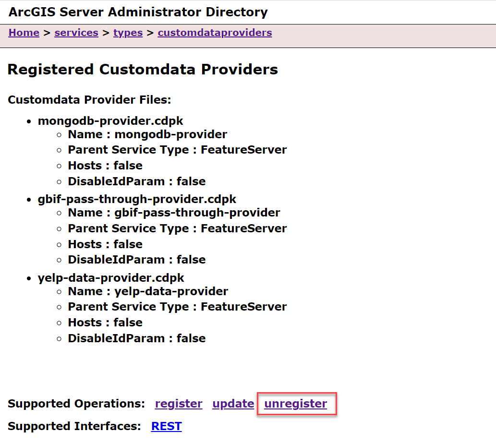
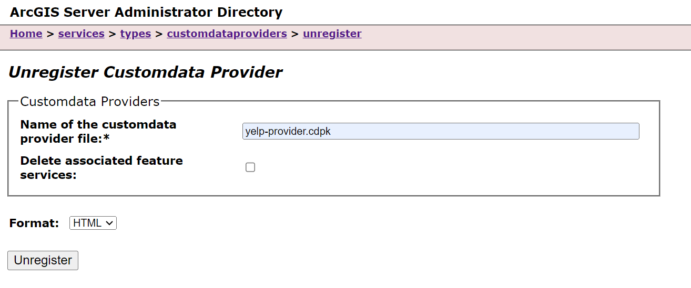

# Unregister a Custom Data Provider
There are three options for unregistering a custom data provider:
- Unregister through ArcGIS Server Administrator Directory
- Unregister through ArcGIS Server Manager
- Unregister through the CDF command line tool (_available in version ArcGIS Enterprise SDK version 11.3_)

The steps outlined in this topic are for completely removing a registered custom data provider from ArcGIS Server.
Note that if you unregister a custom data provider, associated Feature Services are not automatically deleted. 
If you wish to only modify your custom data provider and keep the Feature Service intact, 
see [Update Custom Data Provider](../update-a-custom-data-provider-feature-service/).

## Unregistration in ArcGIS Server Administrator

1.  In a web browser, navigate to the ArcGIS Server Administrator Directory, and sign in as an administrator.
    Click **services** \> **types** \> **customdataproviders**.

       

2.  On the **Registered Customdata Providers** page, click **unregister**
    and type the name of the **.cdpk** file into the **Name of the customdata provider file:** 
    field.

    

    At this stage you may optionally delete all the Feature Services associated with this provider. 
    To delete them check the **Delete associated feature services** box. To leave the associated Feature Services intact, 
    leave the box unchecked.

3.  Click the **Unregister** button.

## Unregistration in ArcGIS Server Manager
Sign into ArcGIS Server Manager and navigate to **Sites** > **Custom Data Feeds**. 
From here, follow the built in Server Manager help system. Note that you cannot 
delete associated feature services with the custom data provider unregistration 
process in ArcGIS Server Manager. Feature services must be deleted in a separate 
process.

## Unregistration with the Command Line Interface
In ArcGIS Enterprise SDK v11.3, the option to unregister a custom data provider from 
the command line is available. With this command, you may optionally delete associated 
feature services. See [Custom Data CLI Reference](../custom-data-cli-reference/) for 
more details postionals and options.

1.  Navigate to the **app-level** directory of your custom data provider. 

2.  Use the command `cdf unregister <name> <server-admin-url> <token>`