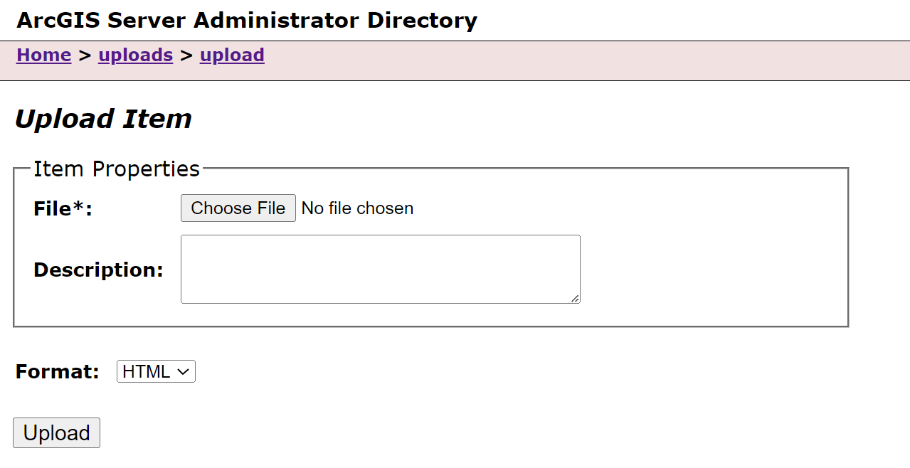
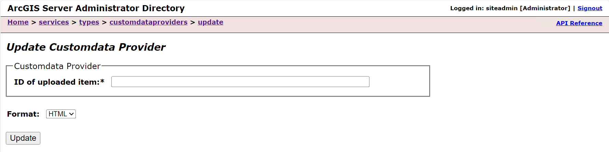

# Update a Custom Data Provider

There are three options for updating a custom data provider (CDP):
- Update a registered CDP in ArcGIS Server Administrator Directory
- Update a registered CDP in ArcGIS Server Manager
- Update a registered CDP through the CDF command line tool (_available in version ArcGIS Enterprise SDK version 11.3_)

## Update a Custom Data Provider in ArcGIS Server Administrator Directory

1.  In your development environment, make your changes to the custom data
    provider code, and export the custom data package as described in [Build Custom Data Package](../build-a-custom-data-package-file/).  
    *Do not attempt to modify and reuse an existing custom data package file **(.cdpk)**. You should
    create a new one with the* `export` *command.*

2.  Navigate to the ArcGIS Server Administrator Directory in a web
    browser, and sign in as an administrator.

3.  Click **uploads** \> **upload**.

    

    

4.  On the **Upload Item** page, click **Choose File**, and select your new
    **.cdpk** file. It is recommended that you provide a description in the
    **Description** text box to make it easier to distinguish between the new
    and old **.cdpk**. Before uploading the new **.cdpk**, you may alternatively delete
    the old one to avoid confusing the two.

    

5.  Click the **Upload** button. Once the file is uploaded, you will be directed to
    a page with the following header: **Uploaded item** - \<item_id\>.
    Copy the item id.

    

6.  Browse back to the root of the Administrator Directory and then
    click **services** \> **types** \> **customdataproviders**.

7.  On the **Registered Customdata Providers** page, click **update**. Now on the 
    **Update Customdata Provider** page, paste the item id of your updated provider
    package into the **Id of the uploaded item** field.

    

8.  Click the **Update** button.

## Update a Custom Data Provider in ArcGIS Server Manager
Sign into ArcGIS Server Manager and navigate to **Sites** > **Custom Data Feeds**. 
From here, follow the built in Server Manager help system.

## Update a Custom Data Provider Through the CDF Command Line

In ArcGIS Enterprise SDK v11.3, the option to update a custom data provider from 
the command line is available. When updating a custom data provider from the 
command line, you do not need to use the `cdf export <name>` command.
See [Custom Data CLI Reference](../custom-data-cli-reference/) for more details 
postionals and options.

1.  Navigate to the **app-level** directory of your custom data provider. 

2.  Use the command `cdf register <name> <server-admin-url> <token>`. _When using the 
    CDF command line too, the `register` command will update/overwrite any existing registered 
    custom data provider on ArcGIS server with the same provider name._

Now your feature service will be updated to use the latest changes you made to your
custom data provider. Note that the update feature works by updating the provider by 
**provider name**. In order to update your provider, *you must use the exact custom data provider
name as you used on initial provider creation, and it must match an existing provider name.*
