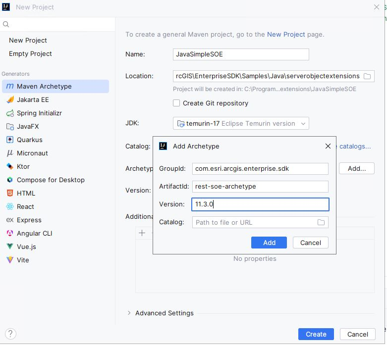
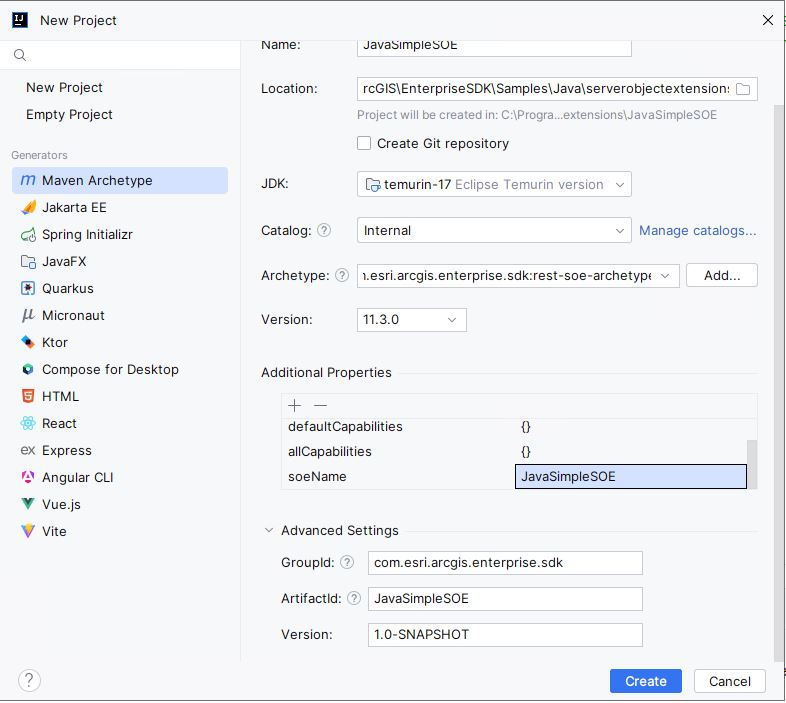
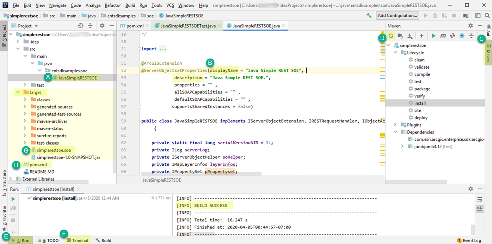

# Build REST SOEs using IntelliJ

This topic describes how to create, build, and deploy a REST server object extension (SOE) under the Maven framework using IntelliJ. It also describes how to consume the SOE from the ArcGIS Server Services Directory.

1. [Create the REST SOE project](#create-the-rest-soe-project)
2. [Build the REST SOE project](#build-the-rest-soe-project)
3. [Deploy the SOE to ArcGIS Server](#deploy-the-soe-to-arcgis-server)
4. [Consume the REST SOE](#consume-the-soe-using-the-services-directory)

The SOE that you will create in this topic is also provided as a sample, named Simple REST SOE in the ArcGIS Enterprise SDK(`..\EnterpriseSDK\Samples\Java\serverobjectextensions\simplerestsoe`).

### Create the REST SOE project

To create a REST SOE using IntelliJ, complete the following steps:

1. Ensure that ArcGIS Enterprise SDK, Java, and Maven are all installed on your development environment. See more details at the [Installation](../installation-java/) section.
2. Launch IntelliJ and click **File**.
3. Click **New** and Select **Project**.
4. Choose **Maven Archetype** on the left menu.
5. Give **name** for the project and choose the location you would like to use.
6. Ensure the project SDK is set to the supported JDK before you proceed.
7. Keep the **Catalog** as **Internal**.
8. For Archetype:
      Click the **Add** button on the right, type the following values in the **Add Archetype** wizard, and then click **Add**:
        - GroupId: `com.esri.arcgis.enterprise.sdk`
        - ArtifactId: `rest-soe-archetype`
        - Version: `11.3.0` (use `11.2.0` for 11.2.0 SDK and `11.0` for 11.0 SDK)
      
    
      The `rest-soe-archetype` is now added. 

9. To set up the Advance Settings before creating the SOI, click **Advanced Settings**.
  
      
   
10. Confirm the information in the parameters are right and approriate and click **Create**:
    If you see any warnings, you can ignore them for now as long as the project successfully generates the `entsdksamples.soe` package and `JavaSimpleRESTSOE` class under the `src\main\java` folder. You will address those warnings during project build. Continue to [build the REST SOE project](#2-build-the-rest-soe-project) now. 

### Build the REST SOE project
Building an SOE project will package the project's classes, dependencies, and resources into a `.soe` file, which can be deployed to ArcGIS Server. Since it's a Maven project, the Maven build lifecycle must be followed to build the REST SOE. Read more about [project build](../about-maven-integration/#project-build). 

You can build the SOE project in either the **Maven** tool window or the **Terminal** tool window. 

Because the project is created from `rest-soe-archetype`, it automatically loads the boilerplate code that implements a ready-to-use SOE. For now, you can customize the `displayName` and `description` of the SOE and leave the rest of the code as is.

1. Open the SOE class `JavaSimpleRESTSOE`, located in the `src\main\java` folder (see **A** in the example above).
2. Set the `displayName` and `description` to be `Java Simple REST SOE` (see **B**).
3. Now follow these steps to build the project.

    - To build the project in the **Maven** tool window, do the following:

      a. Click the **Maven** tab on the right side of IntelliJ (see **C**).

      b. Expand `simplerestsoe`. You should see **Lifecycle**, **Plugins** and **Dependencies** listed.

      c. If you don't see **Dependencies**, click the **Reimport All Maven Projects** button (see **D**) on the far left of the tool bar in the **Maven** tool window. 

      d. Now you should see **Dependencies**, and **com.esri.arcgis.enterprise.sdk:arcgis-enterprise-sdk:version** is listed as one of the dependencies.

      e. Expand **Lifecycle** and click **install**. You can also click **clean** and click **install** for a clean build of the project. 
      
      f. The project is built successfully with detailed log messages in the **Run** tool window (see **E**).

    - Alternatively, to build the project in the **Terminal** tool window, do the following:

      a. Click the **Terminal** tab at the bottom of IntelliJ (see **F**).

      b. Ensure the directory is pointing to the project's root directory.

      c. Type `mvn clean install`. This command does a clean build of the project, and you should see `Build Success`. 

4. Once the build finishes, a new folder named `target` appears in the project's base directory, and you can find the SOE file `simplerestsoe.soe` in this folder (see **G**).

If you would like to add third-party libraries as dependencies, you can add them to the project's `pom.xml` (see **H**). The POM contains project configuration information, such as the Java compiler (JDK) used, plug-ins used, project's dependencies, and project's version. Learn more about [POM dependency management](../about-maven-integration/#enterprise-sdk-maven-artifacts).

### Deploy the SOE to ArcGIS Server

The SOE you created must be deployed to ArcGIS Server and enabled on a map service. To learn how to deploy an SOE, see the [Deploy extensions](../deploy-extensions-java/) topic in the ArcGIS Enterprise SDK help. Note that the term “deploy” is used here to mean uploading the .soe file to ArcGIS Server and registering it as an extension to map services. To learn how to enable an SOE on a map service, see the [Enable extensions](../enable-extensions-java/) topic of the ArcGIS Enterprise SDK help.

### Consume the SOE using the Services Directory

To consume the SOE using the Services Directory, complete the following steps:

1.  Open the Services Directory at `https://<server name>:6443/arcgis/rest/services/`.
2.  Navigate to your map service’s root page (its URL ends with “/MapServer”) and scroll down to the **Supported Extensions** section.
3.  Click the `JavaSimpleRESTSOE` hyperlink. This brings up the SOE’s root resource web page, which lists name and description of the root resource, along with the `layers` and `serviceproperties` sub-resource in the **Child Resources** section and the `getLayerCountByType` operation in the **Supported Operations** section.
4.  Click on the `layers` sub-resource. It displays information about all layers in JSON format.
5.  Navigate back to the root resource page and click on the `serviceproperties` sub-resource. It displays several service configuration properties.
6.  Navigate back to the root resource page and click on the `getLayerCountByType` operation. Enter `feature` in the layerType field and click the **GET** button. The JSON response will include the number of feature layers. Test this operation with other types, such as `raster`, `dataset`, or `all`.
7.  Undeploy the SOE when you're finished. To learn how to undeploy the SOE, see the [Deploy extensions](../deploy-extensions-java/) topic of the ArcGIS Enterprise SDK help.

### Also See

-   [Install the Java IDE](../install-the-java-ide/)
-   [SOE with properties](../soe-properties-java/)
-   [Log messages](../log-messages-java/)
-   [Debug extensions](../debug-extensions-dedicated-java/)