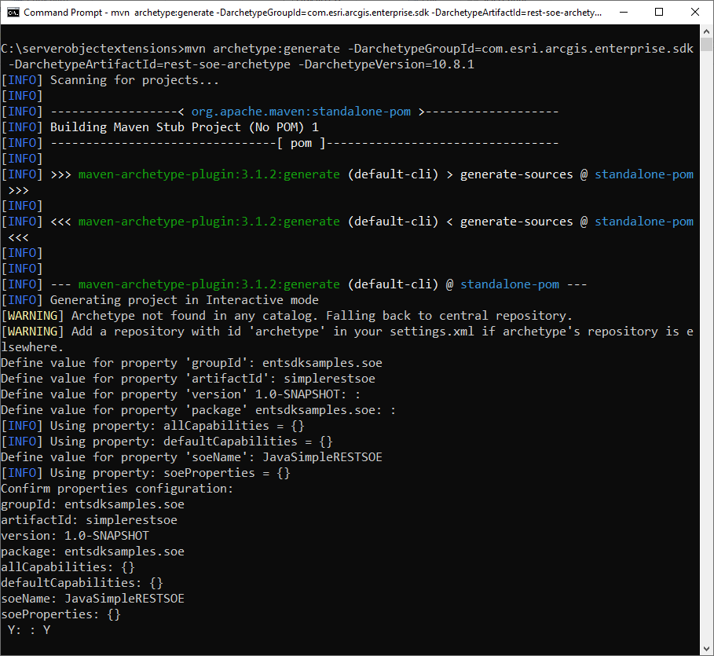
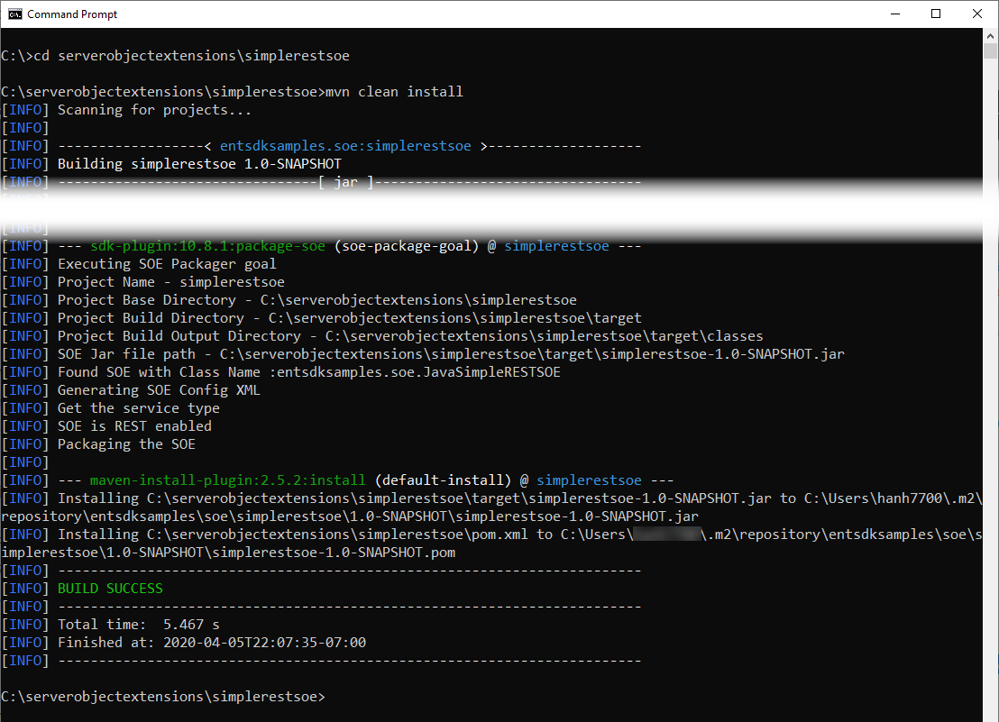

# Build REST SOEs using the Maven command

### Create the REST SOE project

Executing the Maven `archetype:generate` command against `rest-soe-archetype` in either interactive mode or non-interactive mode can create a REST SOE project. Interactive mode requires you to type every property one by one in the command line as the input to create the SOE project, whereas in non-interactive mode, you can define those properties all at once when executing the `archetype:generate` command and the project is created instantly without command line interaction. 

#### Use the Maven command in interactive mode
    
You can open the command prompt for Windows or Linux terminal and use the following Maven command to create a REST SOE project in interactive mode:

``` bash
mvn archetype:generate -DarchetypeGroupId=com.esri.arcgis.enterprise.sdk -DarchetypeArtifactId=rest-soe-archetype -DarchetypeVersion=10.9.1
```

For other versions of Enterprise SDK, remember to change `-DarchetypeVersion` to the corresponding version of the SDK, such as `-DarchetypeVersion=10.9.0` for 10.9 Enterprise SDK and `-DarchetypeVersion=10.8.1` for 10.8.1 Enterprise SDK.

You need to specify the same version of the SDK you are using as the `-DarchetypeVersion` parameter.

After executing the above command, you are prompted to enter values for the following properties: 

- **groupId**: Type `entsdksamples.soe`.
- **artifactId**: Type `simplerestsoe` as the project's name.
- **version**: Press *Enter* to skip this property. This uses the default value `1.0-SNAPSHOT`, indicating this project is still in development.
- **package**: Press *Enter* to skip this property. This uses the **groupId**'s value as the package name.
- **soeName**: Type `JavaSimpleRESTSOE`
- **Y**: Type `Y` to confirm your inputs.  



> Note: To learn more about the above properties, see the [Project creation](../about-maven-integration/#project-creation) section. 
    
#### Use the Maven command in non-interactive mode
    
If you would like to create the SOE or SOI project without interactivity, you can set the interactive property to `false` (`-DinteractiveMode=false`), or use the `-B` flag (see [generate project in batch mode](https://maven.apache.org/archetype/maven-archetype-plugin/examples/generate-batch.html)).  

The following command will achieve the same result as the project above created in interactive mode:
``` bash
mvn archetype:generate -B -DarchetypeGroupId=com.esri.arcgis.enterprise.sdk -DarchetypeArtifactId=rest-soe-archetype -DarchetypeVersion=10.9.1 -DsoeName=JavaSimpleRESTSOE -DgroupId=entsdksamples.soe -DartifactId=simplerestsoe -Dversion=1.0-SNAPSHOT
``` 

For other versions of Enterprise SDK, remember to change `-DarchetypeVersion` to the corresponding version of the SDK, such as `-DarchetypeVersion=10.9.0` for 10.9 Enterprise SDK and `-DarchetypeVersion=10.8.1` for 10.8.1 Enterprise SDK.

The REST SOE project is created successfully with `Build Success` in the command prompt.

### Build the REST SOE project
To cleanly build this project, use the `cd` command to switch to the project's base directory and execute the `mvn clean install` command. To learn more about project build phases, see the [Project build](../about-maven-integration/#project-build) section.



### Also See

-   [Install the Java IDE](../install-the-java-ide/)
-   [Deploy the SOE to ArcGIS Server](../build-rest-soes-using-intellij/#deploy-the-soe-to-arcgis-server)
-   [Consume the SOE using the Service Directory](../build-rest-soes-using-intellij/#consume-the-soe-using-the-services-directory)