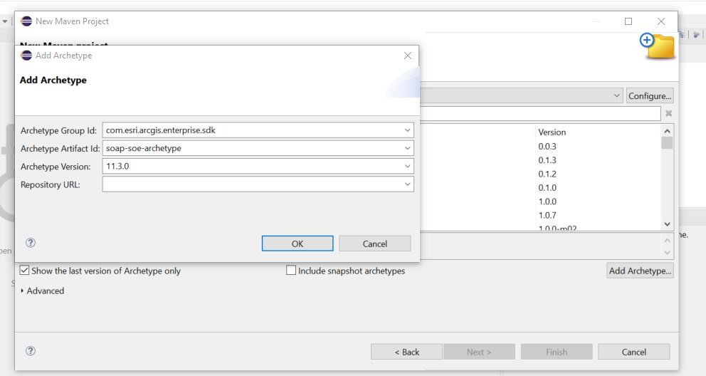
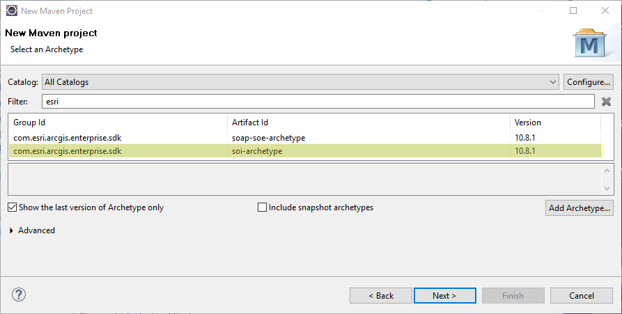
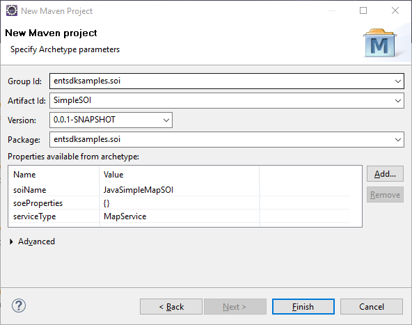
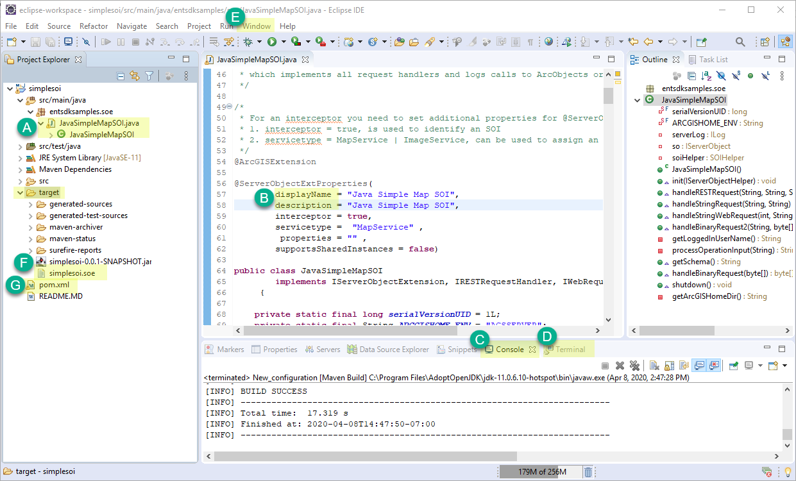
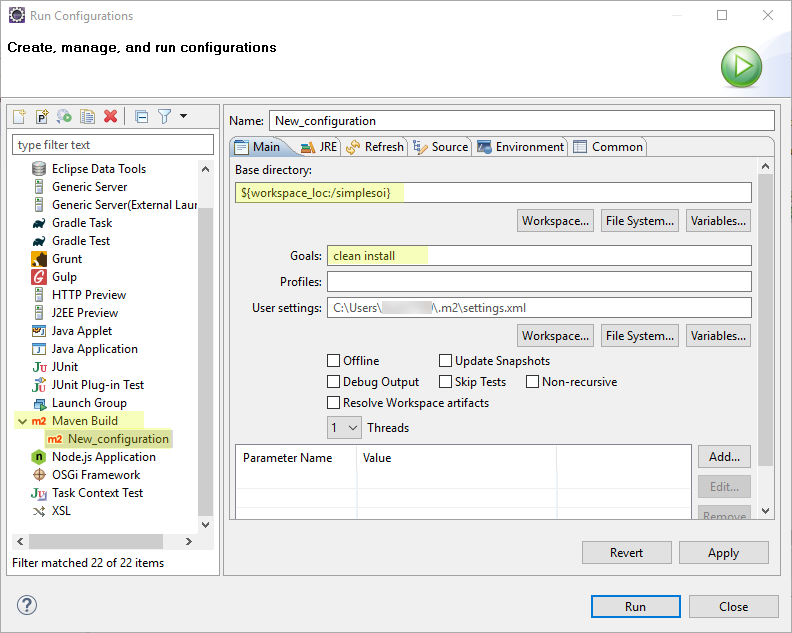

# Build SOIs using Eclipse

This topic describes how to create, build, and deploy a server object interceptor (SOI) under the Maven framework using Eclipse. It also describes how to consume the SOI from the ArcGIS Server Services Directory.

1. [Create the SOI project](#create-the-soi-project)
2. [Build the SOI project](#build-the-soi-project)
3. [Deploy the SOI and testing the SOI's functions](#deploy-the-soi-and-testing-the-sois-functions)

The SOI that you will create in this topic is also provided as a sample, named Simple SOI in the ArcGIS Enterprise SDK(`..\EnterpriseSDK\Samples\Java\serverobjectextensions\simplesoi`).

### Create the SOI project

To create a SOI using Eclipse, complete the following steps:

1. Ensure that ArcGIS Enterprise SDK, Java, and Maven are all installed on your development environment. See more details in the [Installation](../installation-java/) section.
2. Open Eclipse and select **File** > **New** > **Maven Project**. The **New Maven Project** wizard appears.
3. Uncheck **Create a simple project (skip archetype selection)** and click **Next**.
4. If the `soi-archetype` has already been added, skip this step. 

    Otherwise, click the **Add Archetype** button on the right, type the following values in the **Add Archetype** wizard, and click **OK**:
    - GroupId: `com.esri.arcgis.enterprise.sdk`
    - ArtifactId: `soi-archetype`
    - Version: `10.9.1` (use `10.9.0` for 10.9 SDK and `10.8.1` for 10.8.1 SDK)

    

5. The `soi-archetype` is now added. Select this archetype and click **Next**.

    

6. Enter the information in the parameters below and click **Finish**:

    

    - **Group Id** — entsdksamples.soi
    - **Artifact Id** — SimpleSOI
    - **Package** — entsdksamples.soi
    - **soiName** — JavaSimpleMapSOI
    - **serviceType** — Leave the default value `MapService`. Setting **serviceType** to `ImageService` will result in an image service SOI, which is supported since 10.8.1.

7. A new SOI project is created now. You should see the `entsdksamples.soe` package and the `JavaSimpleMapSOI` class under the `src\main\java` folder. 

### Build the SOI project

Building an SOI project will package the project's classes, dependencies, and resources into a `.soe` file, which can be deployed to ArcGIS Server. Since it's a Maven project, the Maven build lifecycle must be followed to build the SOI. Read more about [project build](../about-maven-integration/#project-build). 

You can build the SOE project by using either the **Maven Build** tool or the **Terminal** view in Eclipse. 

As the project is created from `soi-archetype`, it automatically loads the boilerplate code that implements a ready-to-use SOI. For now, we can just customize the `displayName` and `description` of the SOI and leave the rest of the code as is.

1. Open the SOI class `JavaSimpleMapSOI`, located in the `src\main\java` folder (see **A** in the example above).
2. Set the `displayName` and `description` to `Java Simple Map SOI` (see **B**).
3. Follow these steps to build the project.

    - To build the project using **Maven Build**, do the following:

        a. Right-click the project and choose **Run As** > **Run Configuration**.

        b. Double-click **Maven Build** from the list on the left side of the **Run Configuration** wizard.

        c. The **New_configuration** wizard appears. Click **Workspace** to set the current project as the workspace. Type `clean install` in **Goals**, click **Apply**, and click **Run**.

        
        
        d. The project is built successfully, with detailed log messages in the **Console** view (see **C**).

    - Alternatively, to build the project in the **Terminal** view, do the following:

        a. Click the **Terminal** tab at the bottom of Eclipse (see **D**). If you can't find this tab, you need to add this view from **Window** > **Show View** > **Other** > **Terminal** (see **E**).

        b. On the **Terminal** view, click **Open a Terminal**, which is a blue button on the right. A terminal is activated.

        c. Ensure the current directory is pointing to the project's base directory.

        d. Type `mvn clean install`. This command does a clean build of the project and you should see `Build Success`.  

4. Once the build finishes, a new folder named `target` appears in the project's base directory, and you can find the SOI file `simplesoi.soe` in this folder (see **F**). If you don't see the file, right-click and refresh the `target` folder or the project.

If you would like to add third-party libraries as dependencies, you can add them to the project's `pom.xml` (see **G**). The POM contains project configuration information, such as the Java compiler (JDK) used, plug-ins used, project's dependencies, and project's version. Learn more about [POM dependency management](../about-maven-integration/#enterprise-sdk-maven-artifacts).

### Deploy the SOI and testing the SOI's functions

To deploy and test the Simple SOI's functions, follow the instructions at [Audit requests in SOIs](../audit-requests-in-sois-java/). 

### Also See

-   [Install the Java IDE](../install-the-java-ide/)
-   [Audit requests in SOIs](../audit-requests-in-sois-java/)
-   [Implement the SOI's interfaces](../implement-the-sois-interfaces/)