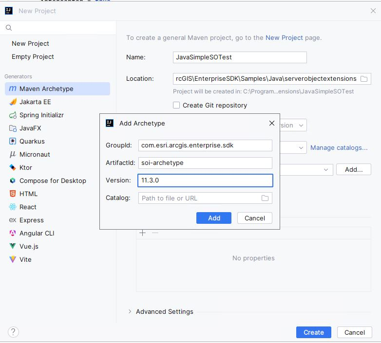
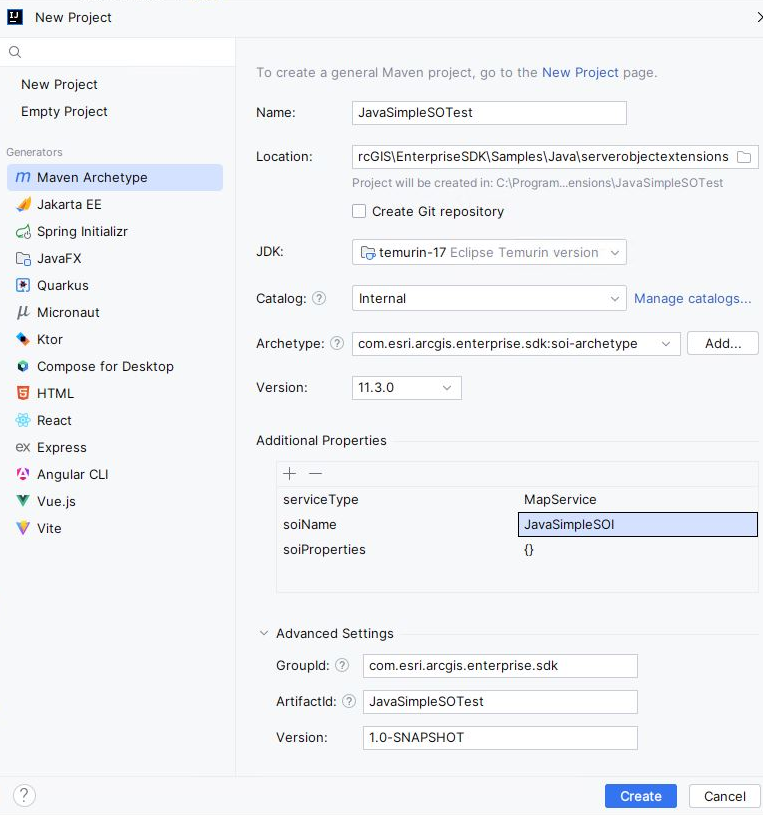
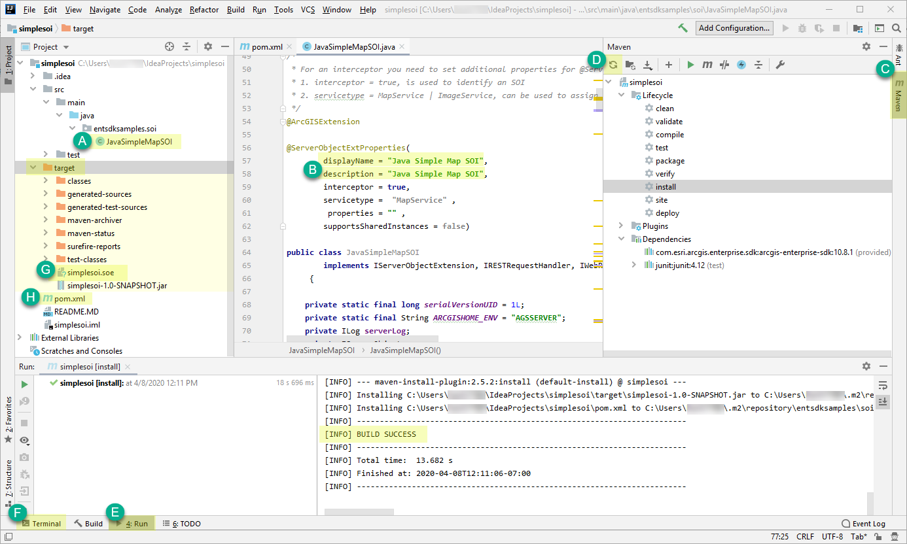

# Build SOIs using IntelliJ

This topic describes how to create, build, and deploy a server object interceptor (SOI) under the Maven framework using IntelliJ. It also describes how to consume the SOI from the ArcGIS Server Services Directory.

1. [Create the SOI project](#create-the-soi-project)
2. [Build the SOI project](#build-the-soi-project)
3. [Deploy the SOI and testing the SOI's functions](#deploy-the-soi-and-testing-the-sois-functions)

The SOI that you will create in this topic is also provided as a sample, named Simple SOI in the ArcGIS Enterprise SDK(`..\EnterpriseSDK\Samples\Java\serverobjectinterceptors\SimpleSOI`).

### Create the SOI project

To create an SOI using IntelliJ, complete the following steps:

1. Ensure that ArcGIS Enterprise SDK, Java, and Maven are all installed on your development environment. See more details at the [installation](../installation-java/) section.
2. Launch IntelliJ and Click **File** in the main menu. 
3. Click **New** and Select **Project**. 
4. Choose **Maven Archetype** on the left menu.
5. Give name for the project and choose the location you would like to use
6. Ensure the project SDK is set to the supported JDK (JDK 11 or JDK 17).
7. Keep the Catalog as Internal
8. For **Archetype**

   Click the **Add...** button on the right, type the following values in the **Add Archetype** wizard, and then click **Add**:
    - GroupId: `com.esri.arcgis.enterprise.sdk`
    - ArtifactId: `soi-archetype`
    - Version: `11.3.0` (use `11.2.0` for 11.2.0 SDK and `11.0` for 11.0 SDK)

      

  
   The `soi-archetype` is now added. Select this archetype and click **Create**.

9. To set up the Advance Settings before creating the SOI, click **Advanced Settings**.
       
10. A new SOI project is created. You should see `Build Success` on the right of the bottom **Run** Tool Window. 

If you see any warnings, you can ignore them for now as long as the project successfully generates the `entsdksamples.soi` package and `JavaSimpleMapSOI` class under the `src\main\java` folder. You will address those warnings during project build. Continue to [build the SOI project](#2-build-the-soi-project) now. 
      

### Build the SOI project
Building an SOI project will package the project's classes, dependencies, and resources into a `.soe` file, which can be deployed to ArcGIS Server. Since it's a Maven project, the Maven build lifecycle must be followed to build the SOI. Read more about [project build](../about-maven-integration/#project-build). 

You can build the SOI project in either the **Maven** tool window or the **Terminal** tool window. 

Because the project is created from `soi-archetype`, it automatically loads the boilerplate code that implements a ready-to-use SOI. For now, you can customize the `displayName` and `description` of the SOI and leave the rest of the code as is for now.

1. Open the SOI class `JavaSimpleMapSOI`, located in the `src\main\java` folder (see **A** in the example above).
2. Set the `displayName` and `description` to be `Java Simple SOI` (see **B**).
3. Now follow these steps to build the project.

    - To build the project in the **Maven** tool window, do the following:

      a. Click the **Maven** tab on the right side of IntelliJ (see **C**).

      b. Expand `simplesoi`. You should see **Lifecycle**, **Plugins** and **Dependencies** listed.

      c. If you don't see **Dependencies**, click the **Reimport All Maven Projects** button (see **D**) on the far left of the tool bar in the **Maven** tool window. 

      d. Now you should see **Dependencies**, and **com.esri.arcgis.enterprise.sdk:arcgis-enterprise-sdk:version** is listed as one of the dependencies.

      e. Expand **Lifecycle** and click **install**. You can also click **clean** and click **install** for a clean build of the project. 
      
      f. The project is built successfully with detailed log messages in the **Run** tool window (see **E**).

    - Alternatively, to build the project in the **Terminal** tool window, do the following:

      a. Click the **Terminal** tab at the bottom of IntelliJ (see **F**).

      b. Ensure the directory is pointing to the project's root directory.

      c. Type `mvn clean install`. This command does a clean build of the project, and you should see `Build Success`.  

4. Once the build finishes, a new folder named `target` appears in the project's base directory, and you can find the SOI file `simplesoi.soe` in this folder (see **G**).

If you would like to add third-party libraries as dependencies, you can add them to the project's `pom.xml` (see **H**). The POM contains project configuration information, such as the Java compiler (JDK) used, plug-ins used, project's dependencies, and project's version. Learn more about [POM dependency management](../about-maven-integration/#enterprise-sdk-maven-artifacts).

### Deploy the SOI and testing the SOI's functions

To deploy and test the Simple SOI's functions, follow the instructions at [Audit requests in SOIs](../audit-requests-in-sois-java/). 

### Also See

-   [Install the Java IDE](../install-the-java-ide/)
-   [Audit requests in SOIs](../audit-requests-in-sois-java/)
-   [Implement the SOI's interfaces](../implement-the-sois-interfaces/)