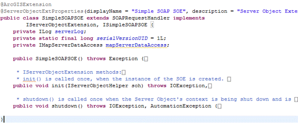

# Implement the SOAP SOE's interfaces

The pattern for developing SOAP SOEs is to create a Java class that extends the `com.esri.arcgis.server.SOAPRequestHandler` base class, implements the mandatory `IServerObjectExtension` interface, and also implements a custom ArcGIS extension interface that provides your SOE’s business methods. The `SOAPRequestHandler` base class provides functionality to handle SOAP requests and generate responses, thus relieving your SOE from this boilerplate burden and allowing you to focus on implementing your SOE's business logic. The presence of the custom interface allows your SOE to expose its business logic methods to clients through SOAP.  

The SOE that you will end up creating in this walkthrough is also provided as a sample, called SimpleSOAPSOE, in the ArcGIS Enterprise SDK.


### Add initialization and business logic to the SOE

Java SOAP SOEs support the use of primitives (as defined by W3C), Java, and the ArcGIS Enterprise SDK data types as input and return parameters in SOAP operations. You can send and receive these types to and from your SOE via SOAP. The SimpleSOAPSOE you just created will accept and return only primitives such as int and String. To use data types, see the FindNearbyFeaturesSOAPSOE sample.

The `JavaSimpleSOAPSOE` class generated by the wizard includes only the `init()` and `shutdown()` methods, which belong to the `IServerObjectExtension` interface. These methods are called by the ArcGIS Server framework when the SOE is instantiated and destroyed, respectively. These are common to SOAP and REST SOEs.



#### Implement SOE initialization logic

The following code snippet includes the `init()` and `shutdown()` methods of the SOE. The `init()` method prepares the ArcGIS Enterprise SDK members that the SOE requires at run time, including a handle to the map service that the SOE extends.

```java
public class JavaSimpleSOAPSOE extends SOAPRequestHandler implements
    IServerObjectExtension, IJavaSimpleSOAPSOE{
    private static final long serialVersionUID = 1L;
    private ILog serverLog;
    private IMapServerDataAccess mapServerDataAccess;
    private IMapLayerInfos layerInfos;

    public JavaSimpleSOAPSOE()throws Exception{
        super();
    }

    /**
     * init() is called once, when the instance of the SOE is created.
     */
    public void init(IServerObjectHelper soh)throws IOException, AutomationException{
        this.serverLog = ServerUtilities.getServerLogger();
        this.mapServerDataAccess = (IMapServerDataAccess)soh.getServerObject();

        IMapServer ms = (IMapServer)this.mapServerDataAccess;
        IMapServerInfo mapServerInfo = ms.getServerInfo(ms.getDefaultMapName());
        this.layerInfos = mapServerInfo.getMapLayerInfos();

		serverLog.addMessage(3, 200, "Initialized "
			+ this.getClass().getName() + " SOE.");
    }

    /**
     * shutdown() is called once when the Server Object's context is being shut down and is about to go away.
     */
    public void shutdown()throws IOException, AutomationException{

		this.serverLog.addMessage(3, 200, "Shutting down " + this.getClass().getName() + " SOE.");
        this.serverLog = null;
        this.mapServerDataAccess = null;		
		this.layerInfos = null;
    }
```

#### Implement business logic for the SOAP SOE

To implement business logic for the SOAP SOE, complete the following steps:

1.  Ensure your newly generated `IJavaSimpleSOAPSOE` interface looks like the following code snippet and contains no method declarations:

    ```java
    package arcgissamples.soe;

    import com.esri.arcgis.interop.extn.ArcGISExtension;

    @ArcGISExtension public interface IJavaSimpleSOAPSOE{}
    ```

2.  Add a `getLayerCountByType()` method to this interface.  
    This method counts the number of layers of the type specified by the type parameter. So, it takes in a String (acceptable values are feature, raster, all) and returns the number of layers of the matching type, in the associated map service. See the following code sample:

    ```java
    package arcgissamples.soe;

    import com.esri.arcgis.interop.extn.ArcGISExtension;

    @ArcGISExtension public interface IJavaSimpleSOAPSOE{
        public int getLayerCountByType(String type)throws Exception;
    }
    ```

#### Implement SOAP operations

Implement the `getLayerCountByType()` method in your `JavaSimpleSOAPSOE` class as shown in the following code sample: 

```java
public int getLayerCountByType(String type)throws Exception{
    if (type != null && !type.isEmpty()){
        String aoType = "";
        if (type.equalsIgnoreCase("all")){
            return layerInfos.getCount();
        }
        else if (type.equalsIgnoreCase("feature")){
            aoType = "Feature Layer";
        }
        else if (type.equalsIgnoreCase("raster")){
            aoType = "Raster Layer";
        }
        else if (type.equalsIgnoreCase("dataset")){
            aoType = "Network Dataset Layer";
        }

        int count = 0;
        for (int i = 0; i < layerInfos.getCount(); i++){
            if (layerInfos.getElement(i).getType().equalsIgnoreCase(aoType)){
                count++;
            }
        }

        return count;
    }
    else{
        throw new Exception(
            "Invalid layer type provided. Available types are: \"all\", \"feature\", \"raster\", \"dataset\".");
    }
}
```
