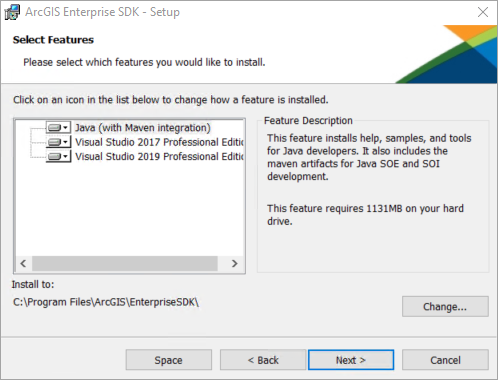
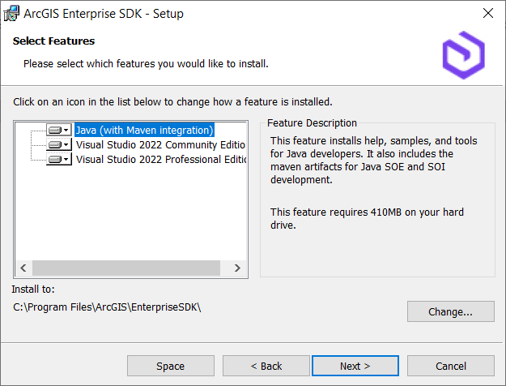

# Install ArcGIS Enterprise SDK

This topic describes components of the ArcGIS Enterprise SDK setup.

### About the ArcGIS Enterprise SDK

The first step for developing extensions for map services published via ArcGIS Pro, is to install the ArcGIS Enterprise SDK. The SDK contains all the required resources for developing extensions (SOEs and SOIs) to extend map services. The SDK includes samples, tools, and documentation for developing Java SOEs and SOIs. After the SDK is installed, make sure the SDK's environment variable is configured on the development machine.

### Install ArcGIS Enterprise SDK on Linux

Developing SOEs or SOIs on Linux machine only supports Java. You can install ArcGIS Enterprise SDK via the setup wizard or in silent mode:

1. Verify that the machine meets [System Requirements](../system-requirements-java/).
2. Download the ArcGIS Enterprise *.tar.gz file from [My Esri](https://my.esri.com/) and extract it.
3. Run the Setup program:
    - To run as a wizard (requires a display), just run `./Setup` without any arguments.

      The installation wizard will pop up and you can review the master license agreement and choose the installation location.

      

    - To run the Setup silently, use the following arguments `./Setup -m silent -l yes -d INSTALLATION_PATH`.
    
      The `INSTALLATION_PATH` is the location where you want the software installed. The `-l` followed by `yes` indicates your acceptance of the license agreement, which is available on Esri's website.
4. After the SDK is installed, make sure you add the SDK's location as the `ENTDEVKITJAVA` environment variable. 

   Please refer to [set environment variables](../install-java-and-maven/#set-environment-variables) for more instructions.

Once you finish installing the SDK, you can follow the next topic [install Java and Maven](../install-java-and-maven/) to continue setting up the Java and Maven environment.

### Install ArcGIS Enterprise SDK on Windows

The ArcGIS Enterprise SDK setup offers the following features:

-   Java (with Maven integration) -> Installs help, samples and Maven tools for Java developers.
-   Visual Studio -> Installs help, samples and tools for .NET developers using Visual Studio.

Since different versions of ArcGIS Enterprise SDK support different versions of Visual Studio, you may see one or more Visual Studio features showing up in the SDK setup. For example, ArcGIS Enterprise SDK 10.9.1 supports Visual Studio 2017 and Visual Studio 2019, so if you are installing the SDK on a Windows machine where Visual Studio 2019 Professional Edition and Visual Studio 2017 Professional Edition are both installed, you will be able to choose each of these three features. 

Similarly, the ArcGIS Enterprise SDK 11.3 setup only shows the Visual Studio 2022 editions as features since Visual Studio 2022 is the supported version.

On the Windows machine, you can install ArcGIS Enterprise SDK by accepting all available IDE options during installation, including both the .NET (Visual Studio) feature and the Java feature.

Refer to the [System Requirements](https://enterprise.arcgis.com/en/system-requirements/latest/windows/arcgis-enterprise-sdk-system-requirements.htm), before installing the ArcGIS Enterprise SDK on a Windows machine.

### Also See

-   [Install Java and Maven](../install-java-and-maven/)
-   [Install the Maven artifacts](../install-the-maven-artifacts/)