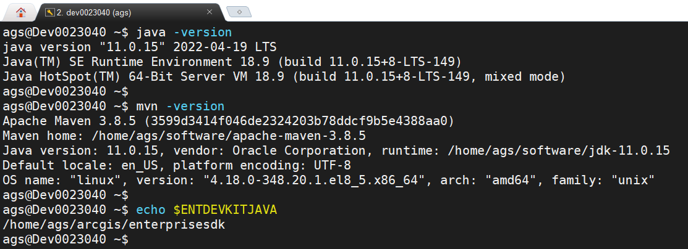
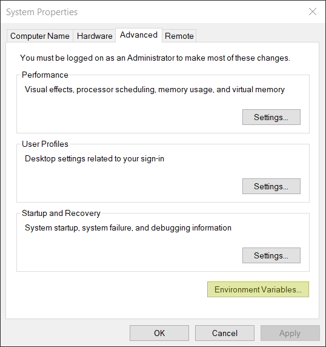
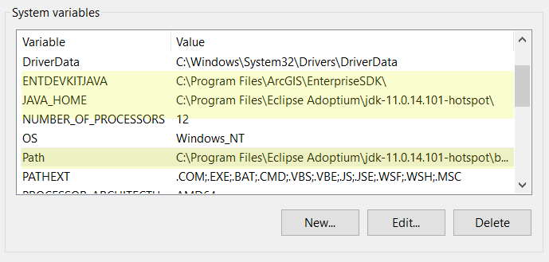
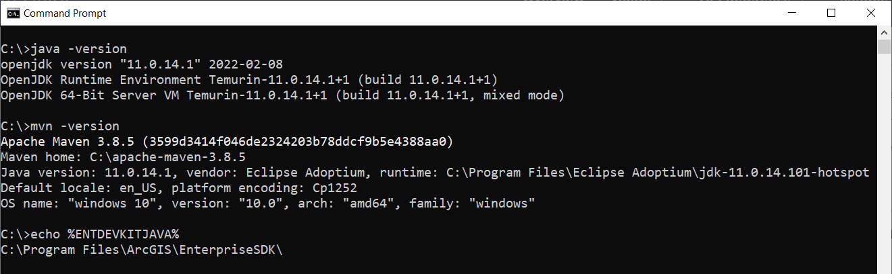

# Install Java and Maven

This topic describes the prerequisites for developing extensions with ArcGIS Enterprise SDK in Java. You must complete the following steps:

1. [Download JDK and Maven](#download-jdk-and-maven)
    - Download and install a compatible Java development kit (JDK). 
    - Download and install a [Maven binary archive](https://maven.apache.org/download.cgi).
2. [Set environment variables](#set-environment-variables)
    - Add the installed JDK to the `JAVA_HOME` and `PATH` environment variables.
    - Add the Maven installation path to the `PATH` environment variable.
    - Add the `ENTDEVKITJAVA` environment variable.
    
The `ENTDEVKITJAVA` environment variable is automatically added during the Enterprise SDK installation on a Windows environment. On a Linux environment, you must set it manually (see [set environment variables](#linux)).

## Download JDK and Maven
To develop extensions with ArcGIS Enterprise SDK in Java, you must have a compatible JDK as a stand-alone installation, or as part of an integrated development environment (IDE). If the environment is not set correctly, the Java proxies will be unable to access core ArcGIS Enterprise SDK objects through the Java Native Interface (JNI).

You can download and install [Oracle JDK](https://www.oracle.com/java/technologies/javase-jdk11-downloads.html), [AdoptOpenJDK](https://adoptopenjdk.net/), or another JDK from your designated vendor based on your organization's requirement. Be sure the version of the JDK meets the ArcGIS Enterprise SDK [system requirements](https://enterprise.arcgis.com/en/system-requirements/latest/windows/arcgis-enterprise-sdk-system-requirements.htm). For ArcGIS Enterprise SDK 11.3, the supported JDK version is 17, at the same time, the JDK 11 also works for ArcGIS Enterprise SDK 11.3. However, building SOE or SOI with Java 18 or later is not supported.

As ArcGIS Enterprise SDK uses the Maven framework to manage the Java SOE and SOI projects, you must download and install Maven. Maven binary archives can be downloaded [here](https://maven.apache.org/download.cgi). Be sure the version of Maven meets the SDK's [system requirements](https://enterprise.arcgis.com/en/system-requirements/latest/windows/arcgis-enterprise-sdk-system-requirements.htm). For ArcGIS Enterprise SDK 11.3, the supported Maven version is 3.8.8 or later. For Linux machines, choose the binary tar.gz archive link. For Windows machine, choose the binary zip archive file. After the Maven archive is downloaded, extract the file to your machine. To learn more about Maven, visit [Apache Maven](https://maven.apache.org/).

## Set environment variables

After installing JDK and Maven, you must set the environment variable with your installed JDK and Maven. At the same time, ensure the SDK's environment variable `ENTDEVKITJAVA` is also set correctly. You can use the `export` Bash command to set these environment variables together as follows:

### Linux

1. Type the following command in the terminal to open the SDK user's user profile. 
    ```bash
    [ags@linuxmachine ~]$ nano ~/.bash_profile
    ```
    The above command opens the user profile of the SDK user `ags` from the `nano` text editor. You can also choose other text editors based on your preference, such as `vi`, `gedit`, and so on.

2. Add environment variables for the SDK user. 

   Add the `JAVA_HOME` and `ENTDEVKITJAVA` environment variables. Add the `JAVA_HOME` and Maven installation path to the `PATH` environment variable.
    ``` bash
    export JAVA_HOME=/home/ags/opt/jdk-17.0.10
    export ENTDEVKITJAVA=/home/ags/arcgis/enterprisesdk

    PATH=$JAVA_HOME/bin:/home/ags/sdk/apache-maven-3.8.8/bin:$PATH:$HOME/.local/bin:$HOME/bin
    export PATH
    ```

    `JAVA_HOME` should be the JDK path. `ENTDEVKITJAVA` should be the ArcGIS Enterprise SDK installation path. By default, it's `/home/<sdkuser>/arcgis/enterprisesdk`.

3. Press *Ctrl* + *X*, press *Y*, and press *Enter* to save the edits.

4. Use the `source` command to apply the above changes to `bash_profile`.

    ``` bash
    [ags@linuxmachine ~]$ source ~/.bash_profile
    ```
5. Type `java -version` in the terminal. It should show the version number of the installed JDK you set for `JAVA_HOME`.
   Type `mvn -version`  in the terminal. It should show the correct Maven version number along with the JDK version number.
   Type `echo $ENTDEVKITJAVA` in the terminal. It should show the path of the ArcGIS Enterprise SDK installation.
    

### Windows

On Windows, the `JAVA_HOME` and Maven environment variables can be created from the **System Properties** dialog box.

1.  To access the **System Properties** dialog box, click **Start** and click **Control Panel**.
2.  In the **Control Panel** window, search for **View advanced system settings** and click the item. The **System Properties** dialog box appears. (This step may vary depending on your Windows operating system version).  
    
3.  On the **System Properties** dialog box, click **Environment Variables**. The **Environment Variables** dialog box appears.  
4.  On the **Environment Variables** dialog box, click **New** to create a new system variable if it's not set yet. Otherwise, click **Edit** to edit existing system variables.
5.  Ensure `ENTDEVKITJAVA`, `JAVA_HOME`, and `PATH` environment variables are set as follows: 
    

    `ENTDEVKITJAVA` is set to the Enterprise SDK installation path (by default, `C:\Program Files\ArcGIS\EnterpriseSDK\`). `JAVA_HOME` is the installed JDK path. Last, ensure you add locations of both the JDK bin folder and the Maven bin folder to `PATH`. To check which version of Java and Maven should be used, refer to [ArcGIS Enterprise SDK system requirements](https://enterprise.arcgis.com/en/system-requirements/latest/windows/arcgis-enterprise-sdk-system-requirements.htm).
6.  Click **OK** on the **Environment Variables** dialog box and click **OK** on the **System Properties** dialog box to apply the changes.
7.  Open a command prompt or command shell and type `java -version`. It should show the version number of your Java installation.
    Type `mvn -version`. It should show the correct Maven version number along with the JDK version number.
    Type `echo %ENTDEVKITJAVA%` in the terminal. It should show the path of the Enterprise SDK installation.
    

After you finish setting up the Java and Maven environment variables, you can continue to [install the Maven artifacts](../install-the-maven-artifacts/).

## Also See

-   [Install the Maven artifacts](../install-the-maven-artifacts/)
