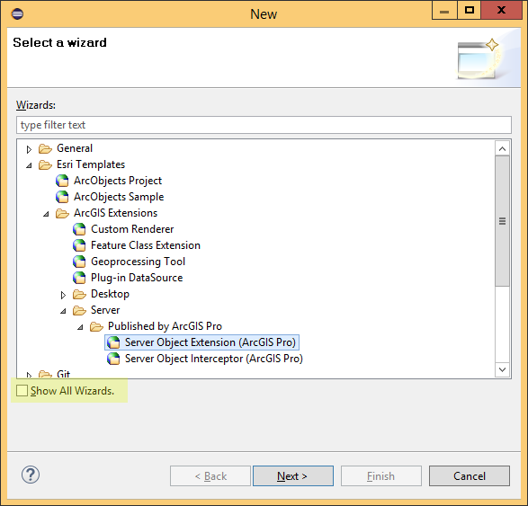
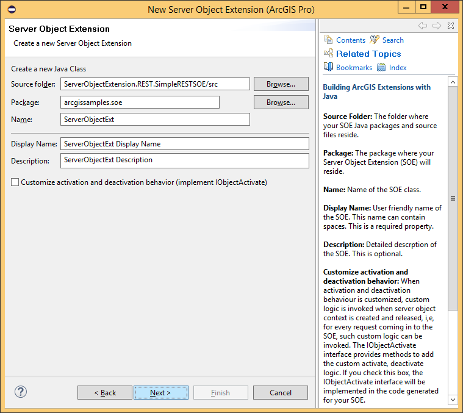
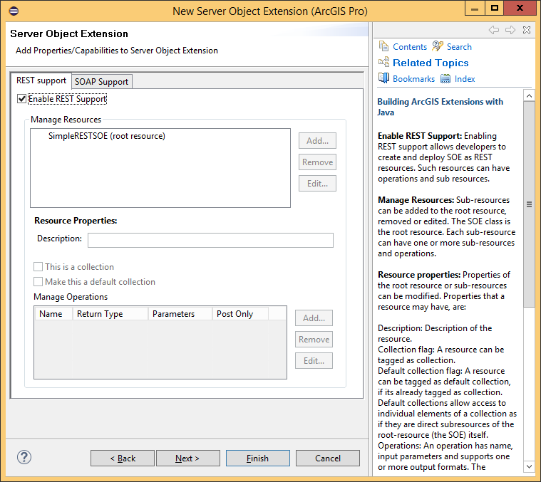
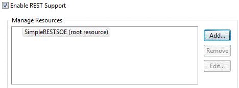
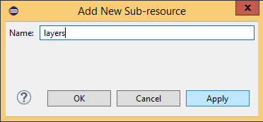
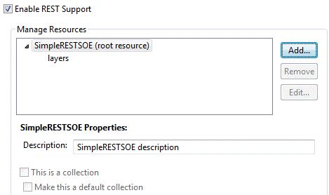
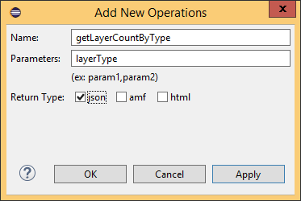
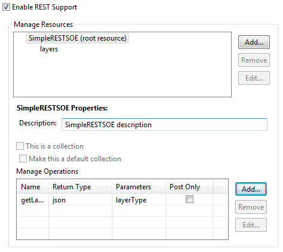
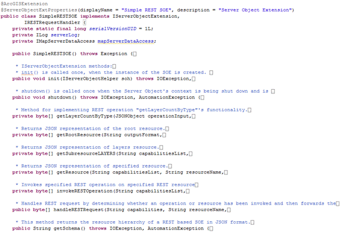

# Develop REST SOEs

This topic describes how to create a REST server object extension (SOE) and export it using the Eclipse IDE wizard that is available via the ArcGIS Enterprise SDK ArcGIS Eclipse plugin. It also describes deployment of the SOE and its use in the ArcGIS for Server Services Directory.

### About developing REST SOEs using Java

The pattern for developing REST server object extensions (SOEs) is to create a Java class that implements the mandatory `IServerObjectExtension` and `IRestRequestHandler` interfaces. The `IServerObjectExtension` interface provides `init()` and `shutdown()` methods that are called when your map service starts and shuts down, while the `IRestRequestHandler` methods handle HTTP requests to your SOE.  

The SOE that you will end up creating in this walk-through is also provided as a sample, called SimpleRESTSOE, in the ArcGIS Enterprise SDK.

### Create a REST SOE using the SOE Eclipse wizard

To create a REST SOE using the Eclipse SOE wizard, complete the following steps:

1.  Ensure that your PATH environment variable includes reference to /&lt;JDK home&gt;/bin.
2.  Ensure that the ArcGIS Enterprise SDK is installed on your computer. 

	The SDK provides access to libraries required for developing Java extensions, as well as the Eclipse plugin that provide wizards to create and export SOEs.
3.  Ensure that ArcGIS Eclipse plugin is installed in your copy of Eclipse. 

	The minimum supported version of Eclipse is Oxygen. For instructions on how to install the ArcGIS Eclipse plugin, see the [Use ArcGIS Eclipse Plugin](../legacy-use-arcgis-eclipse-plugin/) topic.
4.  Create a new Eclipse Java project, or use an existing one.
5.  Add the ArcGIS Enterprise SDK library to your Eclipse project. 

	This library becomes available only after the ArcGIS Eclipse plug-ins are installed.
6.  Create a new REST SOE, and call it SimpleRESTSOE.

### Configure the REST SOE using the SOE Eclipse wizard

1.  With your project selected, right-click your source folder (typically src), and select New > Other from the context window. The New dialog box appears with a list of wizards. 
2.  Expand the Esri templates, ArcGIS Extension, Server and Published by ArcGIS Pro folders, then find the **Server Object Extension (ArcGIS Pro)** wizard.

    

    These wizards become available only after the ArcGIS Eclipse plugin is installed. If you already installed the ArcGIS Eclipse plugin but still don't see the **Server Object Extension (ArcGIS Pro)** wizard, make sure you check the **Show All Wizards** checkbox and reopen this New dialog box.

3.  Select Sever Object Extension (ArcGIS Pro), and click Next in the wizard to get started. This opens the New Server Object Extension wizard. On the first page of this wizard, you'll create your Java SOE class. See the following screen shot:

    

4.  Enter a package name and class name for your SOE.
5.  Enter a display name (can contain spaces) and some user-friendly description.
6.  There is an option to implement the IObjectActivate interface. This interface provides methods to invoke custom logic upon SOE creation and destruction. Since your SimpleSOAPSOE will not have any custom logic at creation or destruction time, leave this check box unchecked, and click Next.

      

7.  Ensure that the “REST Support” tab is selected. Check the “Enable REST Support” checkbox. This displays a dialog to add sub-resources and operations.
8.  Add a sub-resource to the root resource. To do so, select the root resource and click Add.

      

9.  You’ll call this sub-resource “layers”, because it will return all layers in the associated map service in JSON format. Type in the name “layers” for this sub-resource and click “OK”, in the dialog that pops up. If you’d like to add more sub-resources, click “Apply” and continue typing name of the new sub-resource. When done, click “OK”.

      

10. This lists the newly created sub-resource below the root resource in a tree-like structure.

      

11. Note that the “layers” sub-resource could have its own subresources as well. To add one, you would select “layer” and repeat the process for adding sub-resources. Since this is a simple REST SOE, we’ll restrict the sub-resource hierarchy to one level.
12. Modify description for your newly create sub-resource. This is optional.
13. If you wish to make your sub-resource a collection, check the “This is a Collection” checkbox. A sub-resource is tagged “Collection” only when developers intend to expose elements of a similar nature together as one sub-resource. This allows developers to specify operations on the whole collection, on individual elements of the collection. A good example of a collection sub-resource is layers in a map service.
14. A sub-resource that is already tagged as collection can be further tagged as default collection. The distinguishing factor between a collection and default collection is that elements in a default collection can be accessed without naming the collection. If you wish to tag your sub-resource as default collection, check the “Make this a default collection” check box. Please note that if you have tagged several sub-resources as collection, you must tag only one of them as the default.
15. Add an operation to the root resource and call it “getLayerCountByType”. So why add an operation instead of another sub-resource? An operation allows users to provide input and uses that to generate output, whereas subresources only return pre-determined output. Your operation will take in a layer type from the user (such as “feature”, “raster”, “dataset”, or “all”) and then return a count of that type of layer in the associated map service.
16. To add the operation, select the root resource, and click “Add” in the “Manage Operations” section.

      

17. This displays the “Add New Operations” dialog. Type in the operation name and input parameters and select “json” as its return type. If you wish to add more operations, just click “Apply” and the input fields are ready to accept the second operation. Click “OK” when done.

      

18. You now have a REST resource called “SimpleRESTSOE” with one sub-resource and one operation.

      

19. Leave the “Post Only” check box unchecked. This flag is used to indicate that a REST operation is accessible only though the HTTP POST method.
20. Click Finish. A dialog may come up asking you if you would like to add the ArcGIS library to your build path. Select 'OK' to add the required arcgis-enterprise-sdk.jar to your project’s build path.
21. Verify that the wizard generated one Java class, **SimpleRESTSOE.java**

### Add initialization and business logic to the SOE

The SimpleRESTSOE.java class generated by the wizard includes methods that correspond to the choices you made in the wizard, in terms of sub-resources and operations. The wizard generates the following methods for an SOE created as described in the previous sections.



Starting from methods listed at the top:

-   The `init()` and `shutdown()` methods, declared in the IServerObjectExtension interface, are called when SOE is instantiated and destroyed respectively. These methods are common to SOAP and REST SOEs.
-   The `getLayerCountByType()` method corresponds to the REST operation by same name. This is the suggested implementation point for this REST operation.
-   The `getRootResource()` method corresponds to the root resource (the SOE itself) . Its implementation, as generated by the wizard, includes creating a JSON object with name of SOE in it. This can be customized to add more information to the root resource, such as description.
-   The `getSubResourcelayers()` method stub is generated to hold business logic for the “layers” sub-resource. Thus, this is the suggested implementation point for this sub-resource.
-   The `invokeRESTOperation()` method is an internal method and is used to provide all the internal logic needed to invoke the correct REST operation at runtime. You don't need to modify this method, unless new REST operations are added to the SOE and/or existing ones are removed or modified.
-   The `handleRESTRequest()` method is the entry point into a REST SOE at runtime. This method is called by Server’s REST handler and all information regarding the REST request is made available to this method. This method needs to be modified only if new sub-resources are added or existing ones removed.
-   The `getSchema()` method returns the resource hierarchy for your RESTSOE in JSON format. If using the Eclipse IDE wizard to create SOEs, this method will be generated automatically based on the resource hierarchy you specify on the “REST Support” page. This method should be modified only if you wish to modify the resource hierarchy after SOE has been created by the Eclipse wizard.

#### Implement SOE initialization logic

The following code snippet includes the `init()` and `shutdown()` methods of the SOE. The `init()` method prepares ArcGIS Enterprise SDK members that the SOE requires at runtime, including a handle to the map service that the SOE extends.

```java
public class SimpleRESTSOE implements IServerObjectExtension, IRESTRequestHandler{
    private static final long serialVersionUID = 1L;
    private IServerObjectHelper soHelper;
    private ILog serverLog;
    private IMapLayerInfos layerInfos;

    public SimpleRESTSOE()throws Exception{
        super();
    }

    /**
     * init() is called once, when the instance of the SOE is created.
     */
    public void init(IServerObjectHelper soh)throws IOException, AutomationException{
        this.soHelper = soh;
        this.serverLog = ServerUtilities.getServerLogger();

        IMapServer ms = (IMapServer)this.soHelper.getServerObject();
        IMapServerInfo mapServerInfo = ms.getServerInfo(ms.getDefaultMapName());
        this.layerInfos = mapServerInfo.getMapLayerInfos();

        serverLog.addMessage(3, 200, "Initialized " + this.getClass().getName() + 
            " SOE.");
    }

    /**
     * shutdown() is called once when map service is shutting down
     */
    public void shutdown()throws IOException, AutomationException{
        serverLog.addMessage(3, 200, "Shutting down " + this.getClass().getName() + 
            " SOE.");
        this.soHelper = null;
        this.serverLog = null;
    }
```

#### Implement business logic for “layers” sub-resource

The following code snippet implements the “layers” sub-resource. The ArcGIS Enterprise SDK API is used to gather information about all layers in the associated map service, through use of methods in the `com.esri.arcgis.carto.IMapLayerInfos` interface. This information is then poured into a JSONObject and is returned as an array of bytes to the user. Copy this code snippet into the SimpleRESTSOE class.

```java
/**
 * Returns info about layers in associated map service
 * 
 * @return
 * @throws Exception
 */
private byte[] getLayersInfoAsJSON()throws Exception{
    JSONObject json = new JSONObject();
    int count = layerInfos.getCount();
    json.put("layerCount", count);

    JSONArray layerArray = new JSONArray();
    for (int i = 0; i < count; i++){
        IMapLayerInfo layerInfo = layerInfos.getElement(i);

        JSONObject layerJSON = new JSONObject();
        layerJSON.put("name", layerInfo.getName());

        String layerType = layerInfo.getType();
        layerJSON.put("layerType", layerType);

        int id = layerInfo.getID();
        layerJSON.put("id", id);

        layerJSON.put("description", layerInfo.getDescription());
        if (layerInfo.isFeatureLayer()){
            FeatureClass fc = new FeatureClass
                (this.mapServerDataAccess.getDataSource("", id));
            layerJSON.put("featureCount", fc.featureCount(null));
        }

        layerArray.put(i, layerJSON);
    }
    json.put("layersInfo", layerArray);

    return json.toString(4).getBytes();
}
```

#### Implement business logic for the “getLayerCountByType” operation.

The following code snippet shows implementation of the “getLayerCountByType” operation. The `com.esri.arcgis.carto.IMapLayerInfos` interface provides access to individual layers and other information such as type. This method below merely returns a count of layers of the type specified by the user. Acceptable types in the following code are feature, raster, dataset, or all. This list can easily be extended to include other types as well. Copy this code snippet into the SimpleRESTSOE class.

```java
private byte[] getLayerCountByType(JSONObject operationInput){
    String type = operationInput.getString("layerType");

    JSONObject json = new JSONObject();
    try{
        int count = 0;
        if (type != null && !type.isEmpty()){
            String aoType = "";
            if (type.equalsIgnoreCase("all")){
                count = layerInfos.getCount();
            }
            else if (type.equalsIgnoreCase("feature")){
                aoType = "Feature Layer";
            }
            else if (type.equalsIgnoreCase("raster")){
                aoType = "Raster Layer";
            }
            else if (type.equalsIgnoreCase("dataset")){
                aoType = "Network Dataset Layer";
            }

            for (int i = 0; i < layerInfos.getCount(); i++){
                if (layerInfos.getElement(i).getType().equalsIgnoreCase(aoType)){
                    count++;
                }
            }

            json.put("count", count);

            return json.toString().getBytes();
        }
        else{
            throw new Exception(
                "Invalid layer type provided. Available types are: \"all\", \"feature\", \"raster\", \"dataset\".");
        }
    }
    catch (AutomationException e){
        e.printStackTrace();
    }
    catch (JSONException e){
        e.printStackTrace();
    }
    catch (IOException e){
        e.printStackTrace();
    }
    catch (Exception e){
        e.printStackTrace();
    }

    return null;
}
```

### Export the SOE to a .soe file

Once the implementation of REST sub-resource and operation is complete, the SOE needs to be packaged into a .SOE container file. The “Export SOE” wizard could be used to accomplish this. For more details on using this wizard, please see the [Export SOEs and SOIs](../legacy-export-soes-and-sois/) topic.

### Deploy the SOE to ArcGIS Server

The SOE you just created must be deployed to ArcGIS for Server and enabled on a map service. To learn how to deploy an SOE, see the [Deploying extensions](../deploy-extensions-java/) topic of the ArcGIS Enterprise SDK help. Note that the term “Deploy” is used here to signify uploading of the .soe file to ArcGIS for Server and registering it as an extension to map services. To learn how to enable an SOE on a map service, see the [Enable extensions](../enable-extensions-java/) topic of the ArcGIS Enterprise SDK help.

### Consume the SOE using the Services Directory

To consume the SOE using the Services Directory, complete the following steps:

1.  Open the Services Directory at `https://<server name>:6443/arcgis/rest/services/`.
2.  Navigate to your map service’s root page (its URL ends with “/MapServer”) and scroll down to the “Supported Extensions” section.
3.  Click the “SimpleRESTSOE” hyperlink. This brings up the SimpleRESTSOE’s root resource web page, which lists name and description of the root resource, along with the “layers” sub-resource in the “Child Resources” section and the “getLayerCountByType” operation in the “Supported Operations” section.
4.  Click on the “layers” sub-resource. It displays information about all layers in JSON format.
5.  Navigate back to the root resource page and click on the “getLayerCountByType” operation. Enter “feature” in the layerType field and click “GET”. The JSON response will include the number of feature layers. Test this operation with other types, such as “raster”, “dataset”, or “all”.
6.  Undeploy the SOE when you're finished. To learn how to undeploy the SOE, see the [Deploy extensions](../deploy-extensions-java/) topic of the ArcGIS Enterprise SDK Help System.