# Export SOEs and SOIs

SOE or SOI project can be exported by using the **Export SOE/SOI** Eclipse tool or the SOEPackager script tool. This topic discusses these two approaches to export the project and generate the `.soe` file.

### Prerequisites for exporting SOEs and SOIs

Prior to exporting an SOE to a .soe file, please ensure that:

1.  JDK version 1.8.0_191 and above is installed on your computer and /&lt;JDK Home>/bin is added to the PATH environment variable.
2.  The ArcGIS Enterprise SDK is installed on your computer. The SDK provides access to libraries required for developing Java extensions, as well ArcGIS Eclipse plugins that hold Java extension creation and export wizards.

### Use the Export SOE/SOI Eclipse tool

1. Right-click the SOE or SOI project in the **Package Explorer** view. 
  
2. Select the **ArcGIS** > **Export SOE/SOI** menu item. 
    
    This will display the **Export SOE/SOI** wizard. Note that this wizard becomes available to Eclipse projects only after ArcGIS Eclipse plugins are installed into Eclipse.

    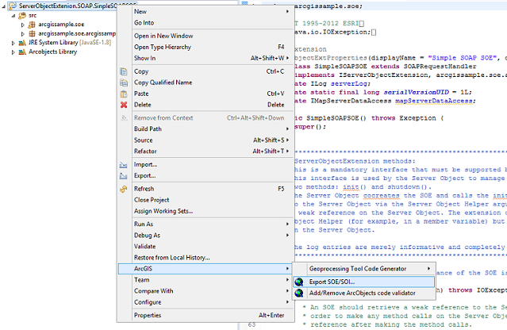

3.  Select all the classes, interfaces, and files (such as the custom property page files) within this project. Provide the name of the output `.soe` file. 

    If you want to modify other options that the **JAR Export** wizard presents, click **Next**. When done, click **Finish**. A `.soe` file will be created in your output folder.

    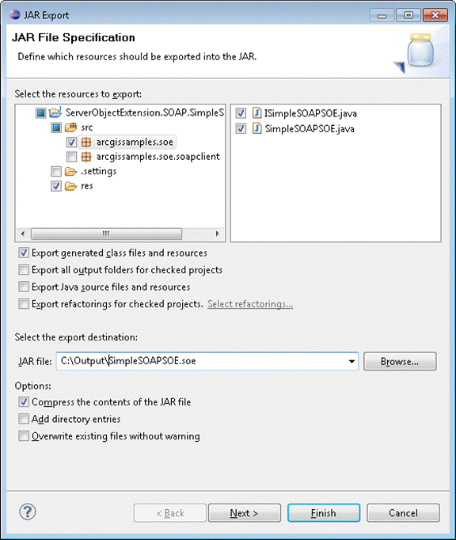

    For SOAP SOEs, in addition to the .soe file, a `.jar` file containing client-side stubs for your SOE and a WSDL file are also created in the output folder. The jar file can be used by Java client applications to consume the SOAP SOE. If you encounter an error message indicating that JDK version 8 is required, please add /&lt;JDK 8 directory>/bin to your path environment variable, restart Eclipse IDE and retry exporting the SOAP SOE.

    **Note:** If you encounter the ExportSOE error " “org.eclipse.osgi.internal.framework.ContextFInder cannot be cast to java.net.URLClassLoader”, follow the instructions at [use the SOEPackager script tool](#use-the-soepackager-script-tool).

4.  Deploy the SOAP SOE to ArcGIS Server. For more details on deploying SOEs, see the [deploying extensions](../deploy-extensions-java/) topic of the ArcGIS Enterprise SDK Developer Help.

### Use the SOEPackager script tool

ArcGIS Enterprise SDK includes a script tool called SOEPackager which helps generate the `.soe` file for the SOE or SOI project without using Eclipse. This tool can be invoked from the command line. It requires a JAR file of the project as input and generates a `.soe` file as output. You must first export the SOE or SOI project to a JAR file, and then execute the `soepackager` tool from the command line, as follows:

1. In Eclipse, right-click the SOE or SOI project and select **Export**.
    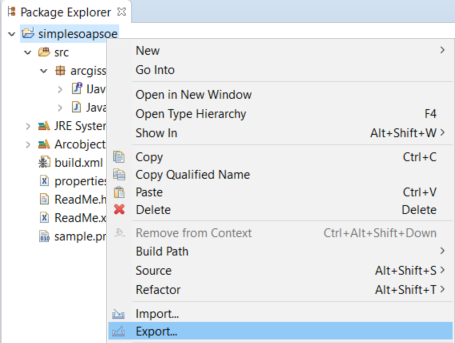

2. In the **Export** wizard, select **Java** > **JAR file**. Click **Next**.
    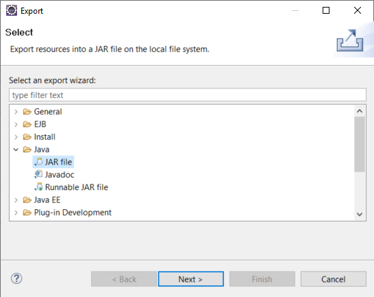

3. In the **JAR Export** wizard, ensure that all the classes, interfaces, and files (such as the custom property page files) within this project are selected. Define the export destination for the JAR file. 

4. Click **Finish**. The project is exported to a JAR file successfully.

5. Execute the SOEPackager script tool from the `<SDK installation path>\java\tools\soepackager` directory. 

    On Windows, invoke `soepackager_ent.bat` as the following command: 
    ``` bash
    soepackager_ent.bat -p \[path to SOE jar file] -o \[path to output folder] -j \[path to the JDK] \[optional parameters]
    ```
    On Linux, invoke `soepackager_ent.sh` as the following command: 
    ``` bash
    soepackager_ent.sh -p \[path to SOE jar file] -o \[path to output folder] -j \[path to the JDK] \[optional parameters]
    ```

    Following are required parameters to soepackager:
    
    `-p`: absolute path to jar file containing SOE classes and dependencies
    
    `-o`: absolute path to folder that must hold the newly generated .soe file
    
    `-j`: path to the JDK. If the "bin" directory in JDK home is not added to your environment PATH variable, then the JDK path can be supplied directly using this parameter.

    Following are optional parameters to soepackager:

    `-h`: Shows help message

    `-n`: Name of SOE (e.g. TestSOE). If using spaces, please enclose in double quotes.

    `-d`: Description of SOE (e.g. "This is a test SOE")

    `-v`: SOE Version (e.g. 1.0)

    `-a`: SOE Author (e.g. "John Doe")

    `-c`: Company/Organization name (e.g. "Esri")

    `-t`: Target deployment version (e.g. 10.6)

    `-f`: Semi-colon separated list of dependent jar files (overrides value of `-l` if both `-f` and `-l` are provided)

    `-l`: Folder containing dependent jar files (ignored if `-f` is also used)

    For example:  

    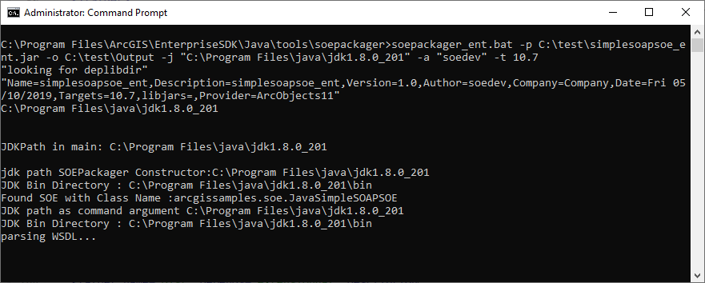

### Export SOEs an SOIs with dependencies

ArcGIS Server supports SOEs that depend on or use libraries that reside in separate jar files. Examples of such dependencies are third-party libraries or components of the SOE itself that reside in separate jar files. Such dependencies can be bundled into either the `.soe` file using the **Export SOE** Eclipse tool, or the `.jar` file which can then be exported to the `.soe` file using the SOEPackager script tool.

1.  Start Eclipse and open the your SOE or SOI project.
2.  Create a folder called “lib” in the Eclipse project.

    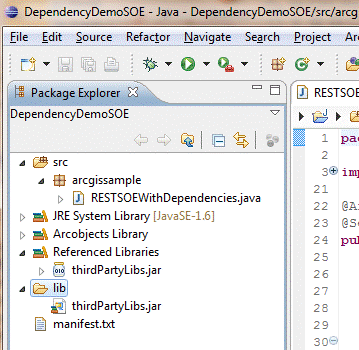

3.  Place all JAR files that your SOE or SOI depends on, in the “lib” folder.
4.  Add these JARs to the project’s build path.
5.  Create a manifest file to hold class-path information for the project.

    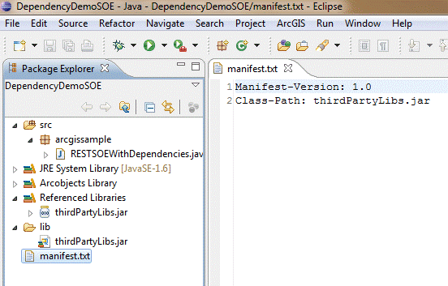

6.  Export the extension by either using the **Export SOE/SOI** Eclipse tool, or [using the SOEPackager script tool](#use-the-soepackager-script-tool):

    - Use the **Export SOE/SOI** Eclipse tool

        a. Right-click on your project and select **ArcGIS** > **Export SOE/SOI…**.

        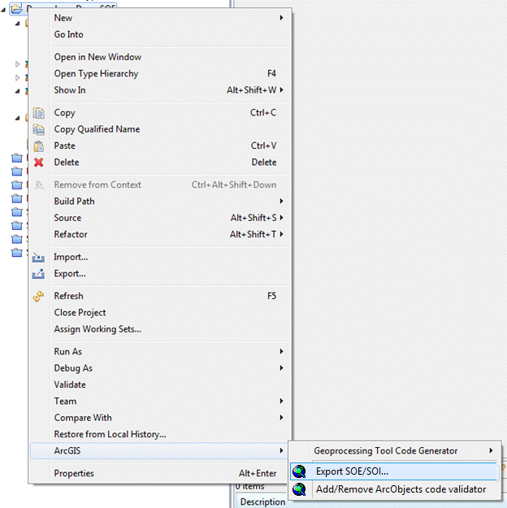
        
        b. On the **JAR File Specification** page, check the **lib** folder and all JAR files that the SOE depends on.

        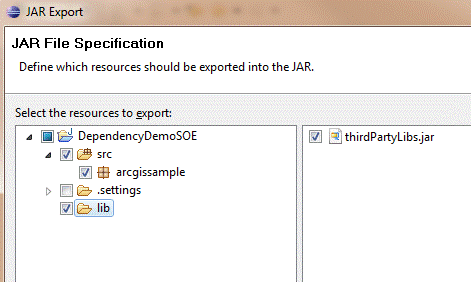

        c.  Click the **Next** button twice to reach the **Jar Manifest Specification** page. Check the **Use existing manifest…** check box and browse to the manifest file you created earlier.

        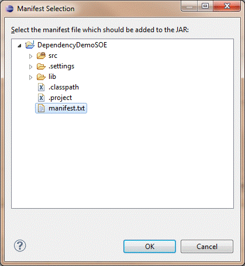

        d. Select the manifest text file and click OK.

        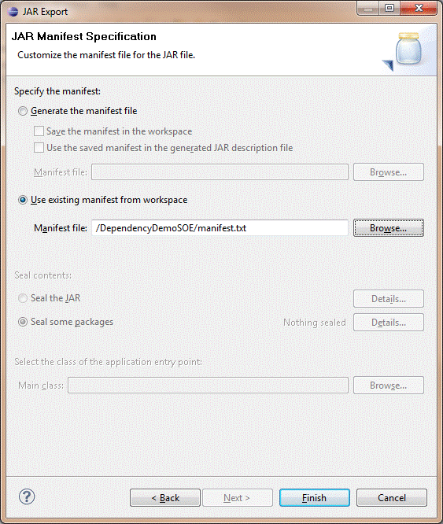

        e. Click **Finish**. The `.soe` file is successfully exported with all the dependencies bundled.

    - Use the SOEPackager script tool

        a. Right-click the SOE or SOI project and select **Export**.

        b. In the **Export** wizard, select **Java** > **JAR file**. Click **Next**.

        c. In the **JAR Export** wizard, ensure that all the classes, interfaces, and files (such as the custom property page files) within this project are selected. Note that you must also select the `manifest.txt` file and all the JAR files in the **lib** folder.

        d. Define the export destination for the JAR file.

        e. Click the **Next** button twice to reach the **Jar Manifest Specification** page. Check the **Use existing manifest…** check box and select to the manifest file you created earlier.

        f. Click **Finish**. The `.jar` file is successfully exported with all the dependencies bundled.

        g. To bundle the dependent JARs into the `.soe` file, the `-f` or `-l` options could be used. The `-f` option allows specifying one or more jar files (i.e. the absolute path to the JAR files), separated by space. For example:

        ``` bash
        soepackager_ent.bat -p <absolute path to the project jar file> -o <absolute path to output folder> -f "<absolute path to the dependent jar1> <absolute path to the dependent jar2>"
        ```

        The `-l` option allows specifying a directory containing the JAR files. For example:

        ``` bash
        soepackager_ent.bat -p <absolute path to the project jar file> -o <absolute path to output folder> -l <absolute path to the lib directory containing dependent jars>
        ```

        If -f and -l options are used simultaneously, the -f option overrides the -l option.
