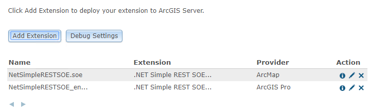

# Migration strategies

This topic describes migration strategies that needs to be understood, before migrating extensions developed in the ArcObjects Java SDK to the ArcGIS Enterprise SDK.

### Interface changes

ArcGIS Enterprise SDK bundles **arcgis-enterprise-sdk.jar** which facilitates the development of custom extensions and interceptors. This jar file includes necessary classes and interfaces required for development of custom extensions and interceptors. While migrating server object extensions and interceptors from the ArcObjects Java SDK to the ArcGIS Enterprise SDK, you may receive a common error saying, “Interface cannot be resolved to type”.

To illustrate this, refer to the code below.

```java
public class SimpleRESTSOE implements IServerObjectExtension, IRESTRequestHandler{
    private static final long serialVersionUID = 1L;
    private IServerObjectHelper soHelper;
    private ILog serverLog;

    public SimpleRESTSOE()throws Exception{
        super();
    }

    /**
     * init() is called once, when the instance of the SOE is created.
     */
    public void init(IServerObjectHelper soh)throws IOException, AutomationException{
        this.soHelper = soh;
        this.serverLog = ServerUtilities.getServerLogger();

        IMapServer3 ms = (IMapServer3)this.soHelper.getServerObject();      

        serverLog.addMessage(3, 200, "Initialized " + this.getClass().getName() + 
            " SOE.");
    }
 }
```

If you try to compile above code, in the ArcGIS Enterprise SDK template, you will receive error saying **"'IMapServer3' cannot be resolved to a type"**.

To fix the above error change 'IMapServer3' to 'IMapServer’ in your code. The ‘IMapServer3’ interface does not exist in the ArcGIS Enterprise SDK. The ‘IMapServer’ interface is latest interface which includes the required methods and properties. Likewise, you may encounter such errors for various other interfaces, like IMapLayerInfo, IMapServerDataAccess, ILayerDescription etc.

Refer to the [Sample Code](/sample-code/) available with ArcGIS Enterprise SDK, to get an idea of the interface changes.

We strongly advise that you refer to the [ArcGIS Enterprise SDK JavaDoc](/api-reference/java/) section of this help document to get rid of such errors.

### Retrieval of the service configuration parameter

In the ArcObjects Java SDK, you can use the interface ‘IMapServerInit’ to retrieve service configurations details like MaxBufferCount, MaxImageHeight, MaxImageWidth, MaxRecordCOunt, PhysicalCacheDirectory, and PhysicalOutputDirectory.

But in the ArcGIS Enterprise SDK, the interface ‘IMapServerInit’ does not exist. In the ArcGIS Enterprise SDK, you can retrieve service configurations as below.

```java
public class SimpleRESTSOE implements IServerObjectExtension, IRESTRequestHandler{
    private static final long serialVersionUID = 1L;
    private IServerObjectHelper soHelper;
    private ILog serverLog;
    private SOIHelper soihelper;

    public SimpleRESTSOE()throws Exception{
        super();
    }

    /**
     * init() is called once, when the instance of the SOE is created.
     */
    public void init(IServerObjectHelper soh)throws IOException, AutomationException{
        this.soHelper = soh;
        this.serverLog = ServerUtilities.getServerLogger();
        this.soihelper = new SOIHelper();
        IServerObject pServerObject = this.soHelper.getServerObject();
        IPropertySet pPropSet = this.soihelper.queryConfigurationProperties(pServerObject.getConfigurationName(), pServerObject.getTypeName());
        String MaxRecordCount =  pPropSet.getProperty("MaxRecordCOunt").toString();
                
        serverLog.addMessage(3, 200, "Initialized " + this.getClass().getName() + 
            " SOE.");
    }
 }
```

Refer to the [SimpleRESTSOE Sample](/sample-code/Samples/java/soe/simplerestsoe/ReadMe/) available with the ArcGIS Enterprise SDK. This sample contains snippet for retrieving service configuration parameters.

### Extensions can coexist

In ArcGIS Server, you can register extensions (SOE/SOI) developed in the ArcObjects SDK and in the ArcGIS Enterprise SDK with the same extension name. But the extension file name should be different. For example, if you have developed an extension with the name “SimpleRESTSOE” and extension file name “SimpleRESTSOE.soe” using the ArcObjects Java SDK, then a similar extension can be developed using the ArcGIS Enterprise SDK. Its extension name can also be “SimpleRESTSOE”, but its extension file name should be different, such as “SimpleRESTSOE_ent.soe”. You can rename the file to any appropriate name you want.

Once you register your extensions with ArcGIS Server, to help you distinguish between extensions developed using the ArcObjects SDK and the ArcGIS Enterprise SDK, access ArcGIS Server Manager. In Manager, navigate to “Site -> Extensions”. You will find one additional column is added with the column name “Provider”. Extensions developed using the ArcObjects Java SDK have “ArcMap” for a provider value, whereas extensions developed using the ArcGIS Enterprise SDK have “ArcGIS Pro”.



In ArcGIS Server, if you try to upload an extension with the same extension file again, you should get an error saying **"The extension file with the name has already been registered. Please upload and register the file with a different name".**.

Consider a scenario where, you have already registered one extension with ArcGIS Server developed using the ArcGIS Enterprise SDK and you are trying to register another extension developed using the ArcGIS Enterprise SDK with the same extension name but a different extension file name. In this case, you should get an error saying **"An extension with name 'XXXXXXXX' is already registered for service type 'MapServer'"**.

Important points to remember:

1.  Extensions developed (using the ArcObjects SDK and the ArcGIS Enterprise SDK) with same extension name can coexist, as long as their file names are different.
2.  You cannot use the same extension name for multiple extensions developed using the ArcGIS Enterprise SDK.
3.  All extensions registered with ArcGIS Server and developed using the ArcGIS Enterprise SDK, should have a unique extension name and extension file name.

### Custom HTML property pages

You can use custom HTML property pages in your SOEs and SOIs. These will be displayed in ArcGIS Server Manager inside the Capabilities section of the map service, on which you are enabling your extension. As explained above you can register extensions with the same name if you have developed extensions in the ArcObjects SDK and the ArcGIS Enterprise SDK. If your extension is implementing custom HTML property page, then the folder structure under “Resources” should be different (Make sure your update config.js with respect to updated folder structure under “Resources” folder) for extensions developed in the ArcObjects Java SDK and the ArcGIS Enterprise SDK, even though extension name might be same. If you keep the same folder structure under “Resources” folder for both extensions, then after registering extensions with ArcGIS server, it will override property page with each other.

Make sure you update the config.js file with respect to the updated structure of the“Resources” folder. If you keep the same structure for the“Resources” folder for both extensions, registering the extension with ArcGIS Server will override each other’s property page.

Refer to the [SimpleRESTSOEWithProperties Sample](/sample-code/Samples/java/soe/simplerestsoewithproperties/ReadMe/) available with the ArcGIS Enterprise SDK, to understand custom HTML property page.

### Unsupported interfaces, classes and methods

As explained in the [design philosophy](../design-philosophy-for-arcgis-enterprise-sdk-java/) section , the ArcGIS Enterprise SDK does not support some implementations in this release.

For example, geoprocessing is not supported with the ArcGIS Enterprise SDK. You cannot execute any geoprocessing model in your SOEs.

To illustrate this, see the code below.

```java
IGeoProcessor gp = new GeoProcessor();
```

Using this code, you should get an error saying **"‘IGeoProcessor’ cannot be resolved to type"**.

Similarly, geometric networks and plugin data sources are not supported in the ArcGIS Enterprise SDK.

During your migration process if you find some interfaces, classes, methods are missing which are required in your SOE/SOI and if you think you have an appropriate use case to have those missing interfaces, classes, methods, then you can log a case with Esri Technical Support and provide your use case.

### Also See

-   [Migration steps](../migration-steps-java/)
