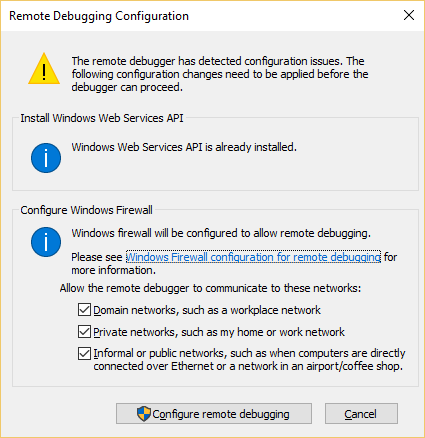
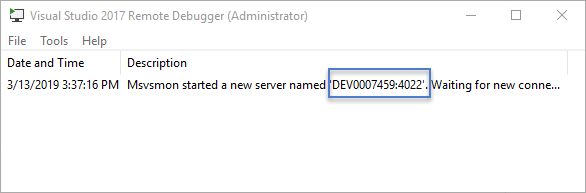
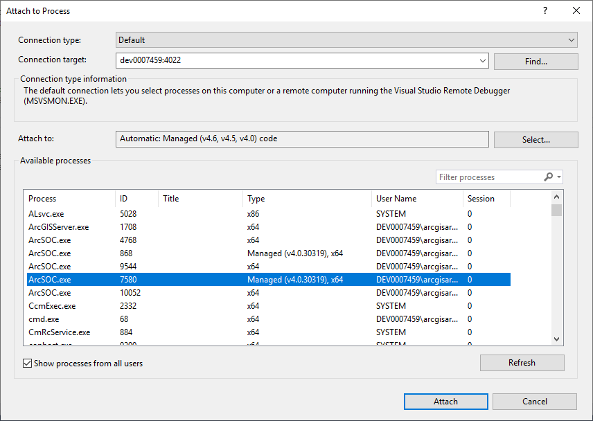

# Remotely debug extensions

If ArcGIS Server is not installed on the same machine as Visual Studio, you must install the Visual Studio remote debugging tool and adopt the remote debugging approach demonstrated by the following steps.

### On the server machine

1.  Download and install the Visual Studio remote debugging tool on the machine where ArcGIS Server is installed. The download link for each version of the Visual Studio remote debugging tools can be found [here](https://docs.microsoft.com/en-us/visualstudio/debugger/remote-debugging?view=vs-2022).

2.  Go to **Start** menu > Expand the **Visual Studio 2022** (or another version of the Visual Studio remote tool that you installed) folder. Run **Remote Debugger** as Administrator.

3.  The first time you start the remote debugger or before you have configured it, the **Remote Debugging Configuration** dialog box appears. Click the **Configure remote debugging** button.

    

4.  When configuration is complete, the **Remote Debugger** window appears. The **Remote Debugger Tools > Options** window allows you to set a specific port for the connection and change the authentication mode. You can leave the options as default.

5.  The remote debugger is now waiting for a connection. Take note of the server name and port number shown in the following window for later use.

    

    The remote debugger is set now. For more information about Visual Studio remote debugging, refer to [Visual Studio Docs](https://docs.microsoft.com/en-us/visualstudio/debugger/remote-debugging?view=vs-2022).

6.  Follow steps 3 through 6 in [manually attach the Visual Studio debugger](../debug-extensions-net-manual/) section, to get the PID of the service that the debugger will be attached to.

### On the development machine

On the development machine where Visual Studio is installed, you can manually attach the debugger to the remote server where the extension is running. Once the remote debugger is set up on the server machine, follow these steps to attach the debugger to the service remotely:

7.  Run Visual Studio as Administrator and open the extension project.

8.  Click **Debug > Attach to Process** to open the **Attach to Process** dialog box.

    Under **Connection target**, enter the server name with the port number from step 5 on the server machine. Alternatively, you may also enter the remote machine's IP address with the port number, for example, “dev0007459:4022” or “10.44.4.123:4022”.

    Make sure **Show processes from all users** is checked.

    Now all the service instances are shown in ArcSOC.exe in the **Attach to Process** window. Choose the ArcSOC.exe process with an ID as the PID from step 6. Click **Attach**.

    

9.  Click **Attach** again when the **Attach Security Warning** dialog box appears.

10. Now the debugger is attached to the service process. You can perform certain service operations to trigger the breakpoints and step into the code as you normally would.

11. If you would like to remotely debug the`Init()`method in the extension, you can follow the steps in Enable debugging of the extension's initialization phase to use ArcGIS Server Debug Settings.
