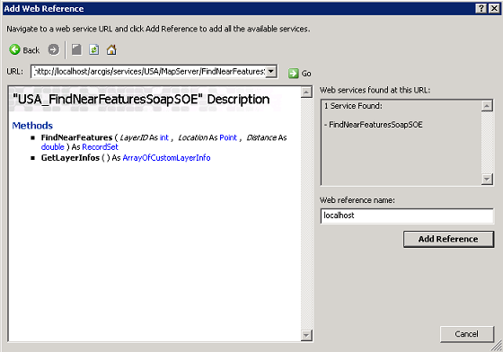
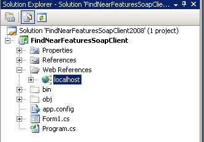
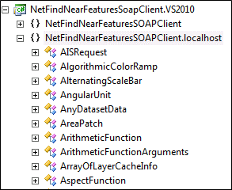
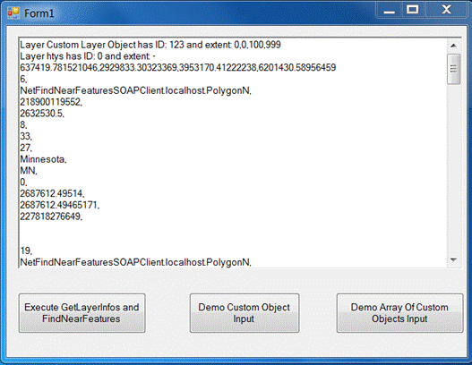

# Develop SOAP SOEs

This topic describes how to create a SOAP server object extension (SOE) in .NET. It also describes deployment of the SOE and its use in the SOAP client application.

### About developing SOAP SOEs

Simple Object Access Protocol (SOAP) services are built on the standard SOAP message framework that uses a Web Service Description Language (WSDL) document to define strongly typed value objects and service capabilities for clients. ArcGIS Server provides a set of prepackaged service types, such as map and geocode, and a common SOAP service handler by which they can be accessed. Custom server object extensions (SOEs) can also be accessed using the ArcGIS Server SOAP service handler to expose custom methods, and utilize ArcGIS and custom SOAP types. This topic discusses the implementation and use of a custom SOAP SOE. The following are a few key items to remember in the context of this topic:

- Implementation of the `IRequestHandler2` interface is required to enable SOAP access to an SOE.
- A WSDL must be created to define the capabilities of a custom SOAP SOE. It is packaged into your SOE when you build the project and is automatically copied to `\<ArcGIS Server Install Location>\XmlSchema` when you deploy the SOE. A WSDL template containing SOAP serializable ArcGIS Enterprise SDK types is included with the SOAP SOE samples.
- The `ESRI.Server.SOESupport` library makes SOAP implementation easier.

### Open the SOAP SOE template in Visual Studio

When you install the SDK, you get a template project that can help you get started building a SOAP SOE. Follow these instructions to open the template:

1.  Launch Microsoft Visual Studio and choose **Create a new project**.
2.  Select `SOAP SOE Template (ArcGIS Pro)` and click **Next**.
3.  Set the project name, location, and solution name, and then click **Create**.
4.  In the Solution Explorer, click the .cs or .vb file (depending on your chosen template's language in Step 2) and modify the template code as desired.

### SOAP SOE implementation

ArcGIS Enterprise SOEs leverage the same SOAP message processing framework used by core ArcGIS Server services. This framework supports serialization and de-serialization of both primitive types (for example, integer, string, and date) and ArcGIS Enterprise SDK application types. SOAP services are accessible via Hypertext Transfer Protocol (HTTP) requests and responses that carry SOAP messages. SOAP messages are physically encoded using Extensible Markup Language (XML). In general, a SOAP message has a name and a set of parameters. Parameters are written as XML elements. Parameters can be primitive types or application types. Normally, application types are classes that are serialized to XML when the message is written, or de-serialized from XML when the message is read. Such parameter classes, must implement the IXMLSerialize interface. You can create your own domain-specific parameter classes.

SOAP uses XML schema to define the layout of XML documents. A parameter class has an associated type defined in the XML schema. The XML schema type for PointN, for instance, states that a Point is serialized as a sequence (order is important) of XML elements, the first of which is called X and is a double, followed by another double called Y, and so on. The following code example shows the PointN XML schema type:

```xml
<xs:complexType name="PointN">
  <xs:complexContent>
    <xs:extension base="Point">
      <xs:sequence>
        <xs:element name="X" type="xs:double"/>
        <xs:element name="Y" type="xs:double"/>
        <xs:element minOccurs="0" name="M" type="xs:double"/>
        <xs:element minOccurs="0" name="Z" type="xs:double"/>
        <xs:element minOccurs="0" name="ID" type="xs:int"/>
        <xs:element minOccurs="0" name="SpatialReference" type="SpatialReference"/>
      </xs:sequence>
    </xs:extension>
  </xs:complexContent>
</xs:complexType>
```

In the preceding code example, the element for M is optional (that is, minOccurs="0"). This means an instance document containing a serialized Point might not have this element. Conversely, the elements for X and Y are mandatory. XML schema types are defined to belong to an XML namespace. PointN belongs to the ESRI namespace. This namespace has types for all other ArcGIS Enterprise SDK parameter classes.

De-serializing XML documents use the XML Class Registry. This registry defines the class that should be instantiated when an instance of a parameter class is found in an XML document. The registry is a set of XML documents, each with entries similar to the following code example:

```xml
<Type>
  <Name>PointN</Name>
  <Namespace>http://www.esri.com/schemas/ArcGIS/2.5.0</Namespace>
  <CLSID>{00A5CB41-52DA-11d0-A8F2-00608C85EDE5}</CLSID>
</Type>
```

A Point in an XML document looks like the following code example:

```xml
<Location
  xmlns:q1="http://www.esri.com/schemas/ArcGIS/2.5.0"
  xsi:type="q1:PointN"
  xmlns="">
  <X>
    551658.56245521992
  </X>
  <Y>4905022.8291804288</Y>
</Location>
```

In the preceding code example, the xsi:type attribute describes the XML schema type as PointN. When a PointN (in the ESRI namespace) is found in a document, the XML Class Registry is used to determine the class identifier (CLSID) of the Component Object Model (COM) class to instantiate.

In summary, SOAP messages are XML documents that can include application types. Each application type needs the following three components:

1.  A COM class that implements IXMLSerialize.
2.  An XML schema type that describes the layout of the class when serialized to XML. The type is included in the service's WSDL document.

The NetFindNearFeaturesSoapSOE has a parameter class called CustomLayerInfo. See the following code example:

```cs
[ComVisible(true)]
[Guid("EE82B345-23E7-43A2-94EE-867ABAF0A8AC")]
[ClassInterface(ClassInterfaceType.None)]
[ProgId("NetFindNearFeatures.CustomLayerInfo")]
[ArcGISCoCreatable]
public class CustomLayerInfo: IXMLSerialize
{
    public string Name
    {
        get;
        set;
    }
    public int ID
    {
        get;
        set;
    }
    public IEnvelope Extent
    {
        get;
        set;
    }

    //empty constructor is required by ArcGISCoCreatable
    public CustomLayerInfo(){

    }
}
```

The implementation of Serialize defines the name and namespace of the XML schema type, then adds each of the fields to the IXMLSerializeData instance. See the following code example:

```cs
public void Serialize(IXMLSerializeData data)
{
    data.TypeName = GetType().Name;
    data.TypeNamespaceURI = Constants.SOENamespaceURI;
    data.AddString("Name", Name);
    data.AddInteger("ID", ID);
    data.AddObject("Extent", Extent);
}
```

The De-serialize method works in the opposite way. It uses IXMLSerializeData.Find to find a field by name, then uses a typed method (such as GetInteger) to retrieve the value of the field. IXMLSerializeData.GetObject requires passing the namespace and XML schema type. In the following code example, all fields are mandatory. To de-serialize an optional field, you would attempt to find and avoid getting the value if not found.

```cs
public void Deserialize(IXMLSerializeData data)
{
    int idx = FindMandatoryParam("Name", data);
    this.Name = data.GetString(idx);

    idx = FindMandatoryParam("ID", data);
    this.ID = data.GetInteger(idx);

    idx = FindMandatoryParam("Extent", data);
    this.Extent = (IEnvelope)data.GetObject(idx, Constants.ESRINamespaceURI,
        "Envelope");

}

private int FindMandatoryParam(string fieldName, IXMLSerializeData data)
{
    int idx = data.Find(fieldName);
    if (idx ==  - 1)
        throw new MissingMandatoryFieldException(fieldName);
    return idx;
}
```

The following code example is the XML schema type for the CustomLayerInfo class:

```xml
<xs:complexType name="CustomLayerInfo">
  <xs:sequence>
    <xs:element name="Name" type="xs:string"/>
    <xs:element name="ID" type="xs:int"/>
    <xs:element name="Extent" type="Envelope"/>
  </xs:sequence>
</xs:complexType>
```

ArcGIS provides a SOAP SOE template that is integrated with Visual Studio. For more information, see [overview of developing a server object extension](../overview-of-developing-soes-net/).

### Service API description

The FindNearFeatures service extends any map service by allowing clients to find features in a layer that are within a given distance. The following code example shows the methods exposed by the service:

```cs
CustomLayerInfo[] GetLayerInfos();
RecordSet FindNearFeatures(int layerID, Point location, double distance);
```

The following describes the elements in the preceding code example:

- GetLayerInfos—Return an array of CustomLayerInfo instances, one for each layer in the map service.
- FindNearFeatures—Return the set of features in a layer that are within a given location and distance. The features are returned as records in the RecordSet.
- CustomLayerInfo—A developer defined parameter class. RecordSet is an ArcGIS Enterprise SDK parameter class.
- A client can call GetLayerInfos to discover the layers and their extents, then call FindNearFeatures to get a layer's features within a certain distance of a location.

### Use SOESupport

SOESupport includes helper classes that make implementing a SOAP SOE easier. The general idea is to create an SOE class that contains SOESupport.SoeSoapImpl. This class helps with de-serialization of the SOAP request, checking for required capabilities, creating the SOAP response, basic logging, and error handling. It ensures all exceptions are mapped into SOAP faults, so clients can process them according to the standard. The following code example shows the declaration of the SOE class:

```cs
[ComVisible(true)]
[Guid("C41E8674-F186-4a0c-8FC9-AAB7885EFD00")]
[ClassInterface(ClassInterfaceType.None)]
[ServerObjectExtension("MapServer",
    AllCapabilities = "GetInfo,FindFeatures,DemoCustomObject,DemoArrayOfCustomObjects",
    DefaultCapabilities = "GetInfo,DemoCustomObject,DemoArrayOfCustomObjects",
    Description = ".NET Find Near Features SOAP SOE Sample",
    DisplayName = ".NET Find Near Features Soap SOE",
    Properties = "",
    SupportsREST = false,
    SupportsSOAP = true,
    SOAPNamespaceURI = Constants.SOENamespaceURI)]

public class NetFindNearFeaturesSoapSOEFindNearFeaturesSoapSOE: ServicedComponent,
    IRequestHandler2, IServerObjectExtension, IObjectConstruct
{

    private IServerObjectHelper serverObjectHelper;
    private ServerLogger logger;
    private IPropertySet configProps;

    IRequestHandler2 reqHandler;

    public NetFindNearFeaturesSoapSOE FindNearFeaturesSoapSOE()
    {
        SoapCapabilities soapCaps = new SoapCapabilities();
        soapCaps.AddMethod("GetLayerInfos", "getInfo");
        soapCaps.AddMethod("FindNearFeatures", "findFeatures");
        soapCaps.AddMethod("DemoCustomObjectInput", "DemoCustomObject");
        soapCaps.AddMethod("DemoArrayOfCustomObjectsInput",
            "DemoArrayOfCustomObjects");


        logger = new ServerLogger();

        SoeSoapImpl soapImpl = new SoeSoapImpl(Constants.SOEName, soapCaps,
            HandleSoapMessage);

        reqHandler = (IRequestHandler2)soapImpl;
    }
```

- The class implements the interfaces required by the server.
- The constructor does the following:
  - Uses the SOESupport.SoapCapabilities helper class to define the capabilities to execute each method.
  - Creates an instance of the SOESupport.ServerLogger class and keeps a reference.
  - Creates an instance of SoeSoapImpl and keeps a reference to its IRequestHandler2 interface.
- The implementation of IRequestHandler.HandleStringRequest delegates the call to SoeSoapImpl.

See the following code example:

```cs
public string HandleStringRequest(string Capabilities, string request)
{
    return reqHandler.HandleStringRequest(Capabilities, request);
}
```

SoeSoapImpl.HandleStringRequest uses the ArcGIS Enterprise SDK XML framework to de-serialize the string into a higher-level IMessage instance. This includes de-serializing any parameter classes in the message (ArcGIS Enterprise SDK or developer defined). It also verifies the configuration has the required capability to execute the method, and lastly, it calls HandleSoapMessage on the SOE class.

HandleSoapMessage is a delegate, an implementation of which is passed to SoeSoapImpl in its constructor. The following code example shows how the delegate is defined:

```cs
public delegate void HandleSoapMessage(IMessage reqMsg, IMessage respMsg);
```

The HandleSoapMessage implementation in the SOE class determines what function should be called based on the request's message. The following code example shows the implementation:

```cs
public void HandleSoapMessage(IMessage reqMsg, IMessage respMsg)
{
    string methodName = reqMsg.Name;

    if (string.Compare(methodName, "GetLayerInfos", true) == 0)
        GetLayerInfos(reqMsg, respMsg);

    else if (string.Compare(methodName, "FindNearFeatures", true) == 0)
        FindNearFeatures(reqMsg, respMsg);

    else if (string.Compare(methodName, "DemoCustomObjectInput", true) == 0)
        DemoCustomObjectInput(reqMsg, respMsg);

    else if (string.Compare(methodName, "DemoArrayOfCustomObjectsInput", true) == 0)
        DemoArrayOfCustomObjectsInput(reqMsg, respMsg);

    else
        throw new ArgumentException("Method not supported: " + QualifiedMethodName
            (c_soe_name, methodName));
}
```

The implementation of the FindNearFeatures method is shown in the following code example. This is a wrapper method that deals with getting parameters from the request, executing the business logic, and setting parameters on the response.

```cs
private void FindNearFeatures(IMessage reqMsg, IMessage respMsg)
{
    IXMLSerializeData reqParams = reqMsg.Parameters;

    int layerID = reqParams.GetInteger(FindParam("LayerID", reqParams));

    IPoint location = (IPoint)reqParams.GetObject(FindParam("Location", reqParams),
        Constants.ESRINamespaceURI, "PointN");


    double distance = reqParams.GetDouble(FindParam("Distance", reqParams));

    IRecordSet recordSet = FindNearFeatures(layerID, location, distance);

    respMsg.Name = "FindNearFeaturesResponse";
    respMsg.NamespaceURI = Constants.SOENamespaceURI;
    respMsg.Parameters.AddObject("Result", recordSet);
}
```

FindNearFeatures uses the ArcGIS Enterprise SDK IMessage interface to retrieve the request parameters, then it uses IXMLSerialize (also Enterprise SDK) to find and retrieve the method's parameters. The FindParam utility function finds a parameter given its name (or fails). See the following code example:

```cs
private int FindParam(string parameterName, IXMLSerializeData msgParams)
{
    int idx = msgParams.Find(parameterName);
    if (idx ==  - 1)
        throw new ArgumentNullException(parameterName);
    return idx;
}
```

IXMLSerializeData has methods to coerce a parameter to a specific type. For example, in the case of the LayerID parameter, the code uses GetInteger to coerce the value in the message to an integer.

After de-serialization of the request parameters, the code calls a second FindNearFeatures method that has the business logic and finally, fills up the response message by setting its name (FindNearFeaturesResponse), namespace (Constants.SOENamespaceURI), and parameters (Result). The code also shows how to retrieve a request parameter that is a value object of a known type, in this case, PointN. The GetObject call requires the type's namespace (Constants.SOENamespaceURI) and the type's name ("PointN"). It returns an object; therefore, a cast to IPoint is required. See the following code example:

```cs
IPoint location = (IPoint)reqParams.GetObject(FindParam("Location", reqParams),
    Constants.ESRINamespaceURI, "PointN");
```

The response message is marked as belonging to the Constants.SOENamespaceURI namespace. This namespace is not the ESRI namespace and should be uniquely defined for each SOE. The following code example shows how it is defined:

```cs
namespace NetFindNearFeaturesSoapSOE
{
    internal static class Constants
    {
        public static string SOENamespaceURI = "http://examples.esri.com/schemas/NetFindNearFeaturesSoapSOE/1.0";
		//...
```

Careful attention should be taken with the strings used in the implementation of wrapper methods. Message and parameter names are case-sensitive, and mismatches between the code and the WSDL are the number one cause of development problems for SOAP SOEs.

The following code example shows the implementation of the business logic for FindNearFeatures. The code buffers the input point, creates a filter, and queries the data. Lastly, it returns the record set. RecordSet is a class that supports XML serialization. This implementation uses a method available in the coarse map service application programming interface (API). In real-world SOEs, developers can choose to use the fine-grained ArcGIS Enterprise SDK API instead.

```cs
private IRecordSet FindNearFeatures(int layerID, IPoint location, double distance)
{
    IMapServer mapServer = m_soh.ServerObject as IMapServer;
    if (mapServer == null)
        throw new Exception("Unable to access the map server.");

    IGeometry queryGeometry = ((ITopologicalOperator)location).Buffer(distance);

    ISpatialFilter filter = new SpatialFilterClass();
    filter.Geometry = queryGeometry;
    filter.SpatialRel = esriSpatialRelEnum.esriSpatialRelIntersects;

    IQueryResultOptions resultOptions = new QueryResultOptionsClass();
    resultOptions.Format = esriQueryResultFormat.esriQueryResultRecordSetAsObject;

    IMapTableDescription tableDesc = GetTableDesc(mapServer, layerID);

    IQueryResult result = mapServer.QueryData(mapServer.DefaultMapName, tableDesc,
        filter, resultOptions);

    return (RecordSet)result.Object;
}
```

### Arrays of parameter classes

The SOAP specification defines the XML representation for arrays of parameter classes. It dictates the names of the XML elements and their layout. To help create these arrays, SOESupport includes a base class—SerializableList—that implements IXMLSerialize. In FindNearFeaturesSoapSOE, CustomLayerInfos derives from SerializableList and creates a concrete, COM-visible class of CustomLayerInfo instances. See the following code example:

```cs
[ComVisible(true)]
[Guid("8D7CF4B1-D915-4B31-B6BF-FB06FB9A3580")]
[ClassInterface(ClassInterfaceType.None)]
[ProgId("NetFindNearFeatures.CustomLayerInfos")]
[ArcGISCoCreatable]
public class CustomLayerInfos: SerializableList < CustomLayerInfo >
{
    public CustomLayerInfos(string namespaceURI): base(namespaceURI){}

    //empty constructor is required by ArcGISCoCreatable. NamespaceURI must be there!
    public CustomLayerInfos(): base(Constants.SOENamespaceURI){}
}
```

SerializableList derives from `List<T>`, therefore, it implements any methods of that class. For example, you can use the Add method to add instances to the list (see the implementation of GetLayerInfos).

The following code example shows an XML schema type that corresponds to CustomLayerInfos:

```xml
<xs:complexType name="ArrayOfCustomLayerInfo">
  <xs:sequence>
    <xs:element
      minOccurs="0"
      maxOccurs="unbounded"
      name="CustomLayerInfo"
      type="tns:CustomLayerInfo"/>
  </xs:sequence>
</xs:complexType>
```

It is defined as a sequence of zero, one, or more XML elements whose name and type is CustomLayerInfo. An XML containing this type of array is shown in the following code example (taken from a GetLayerInfos response):

```xml
<Result xsi:type="tns:ArrayOfCustomLayerInfo">
  <CustomLayerInfo xsi:type="tns:CustomLayerInfo">
    <Name>Buildings</Name>
    <ID>0</ID>
    <Extent xsi:type="esri:EnvelopeN">[...]</Extent>
  </CustomLayerInfo>
  <CustomLayerInfo xsi:type="tns:CustomLayerInfo">
    <Name>Parcels</Name>
    <ID>1</ID>
    <Extent xsi:type="esri:EnvelopeN">[...]</Extent>
    </Extent>
  </CustomLayerInfo>
</Result>
```

### WSDL description

The WSDL document describes the web service. Any WSDL included with your SOE is packaged into the .SOE file when you build. At the time the SOE is deployed, ArcGIS Server places the WSDL under the folder `ArcGIS\XmlSchema`. The WSDL describes the following:

- Namespace for the service
- Methods exposed by the service
- Parameters of each method and their representation in XML
- How to transport the messages
- Name and address of the service

Think of the WSDL as having a set of sections roughly corresponding to the preceding bullet items. The first section defines the namespaces to use. See the following code example:

```xml
<definitions
  xmlns:soap="http://schemas.xmlsoap.org/wsdl/soap/"
  xmlns:xs="http://www.w3.org/2001/XMLSchema"
  xmlns="http://schemas.xmlsoap.org/wsdl/"
  xmlns:e="http://examples.esri.com/schemas/NetFindNearFeaturesSoapSOE/1.0"
  targetNamespace="http://examples.esri.com/schemas/NetFindNearFeaturesSoapSOE/1.0">
  ...
</definitions>
```

The definitions element defines the namespace of the service via the targetNamespace attribute. This namespace must match the one used in code (Constants.SOENamespaceURI). It also declares namespaces that will be used within the document (SOAP and XML schema).

The types section defines the types that will be used as parameters (for example, Point and double) and the methods (for example, GetLayerInfos). It does so by defining two XML schemas, represented by the schema elements. The first schema defines the ESRI types that can be used as parameters of the service's methods. For instance, one of the inputs of FindNearFeatures is a Point and its output is a RecordSet. Both types belong to the ESRI namespace and are defined in this first schema. This schema is surrounded by the comments "start of esri types" and "end of esri types." See the following code example:

```xml
<types>
  <!-- start of esri types -->
  <xs:schema
    xmlns="http://www.esri.com/schemas/ArcGIS/2.5.0"
    targetNamespace="http://www.esri.com/schemas/ArcGIS/2.5.0"
    xmlns:xs="http://www.w3.org/2001/XMLSchema">
    <xs:complexType name="PropertySetProperty">. . .</xs:complexType>
  </xs:schema>
  <!-- end of esri types -->
  . . .
</types>
```

The second schema defines the elements and types for the service. They will belong to the service's target namespace, which again must match the one used in code (Constants.SOENamespaceURI). The types from the ESRI namespace are imported into this second schema using the import element. See the following code example:

```xml
<!-- start of service schema -->

<xs:schema xmlns="http://www.esri.com/schemas/ArcGIS/2.5.0"
               targetNamespace="http://examples.esri.com/schemas/NetFindNearFeaturesSoapSOE/1.0"
               xmlns:tns="http://examples.esri.com/schemas/NetFindNearFeaturesSoapSOE/1.0">

    <xs:import namespace="http://www.esri.com/schemas/ArcGIS/2.5.0"/>
```

A service method is defined in the WSDL using two elements. The first defines the request name and its parameters, and the second defines the response name and its parameters. A request or response can have zero or more parameters.

The definition for the FindNearFeatures method is shown in the following code example. Its request message takes as inputs an integer for the LayerID, a Point for the location, and a double for the distance. Its response message returns a RecordSet in an element called Result. The WSDL defines elements for requests and responses for the method GetLayerInfos as well (with no input parameters). Once again, the element names here must exactly match those used in the code.

```xml
<xs:element name="FindNearFeatures">
  <xs:complexType>
    <xs:sequence>
      <xs:element name="LayerID" type="xs:int"/>
      <xs:element name="Location" type="Point"/>
      <xs:element name="Distance" type="xs:double"/>
    </xs:sequence>
  </xs:complexType>
</xs:element>
<xs:element name="FindNearFeaturesResponse">
  <xs:complexType>
    <xs:sequence>
      <xs:element name="Result" type="RecordSet"/>
    </xs:sequence>
  </xs:complexType>
</xs:element>
```

The preceding code example section is very important in this process. The remaining code example sections can be considered boilerplate code and can be created easily by following a template.

The following code example section defines the messages exchanged between the client and server, and is for the FindNearFeatures method. The names in the message elements add the suffixes In and Out, as in FindNearFeaturesIn and FindNearFeaturesOut.

```xml
<message name="FindNearFeaturesIn">
  <part name="parameters" element="e:FindNearFeatures"/>
</message>
<message name="FindNearFeaturesOut">
  <part name="parameters" element="e:FindNearFeaturesResponse"/>
</message>
```

The next code example section defines the portType or the web service's interface. It defines the name of the portType and its operations. The definition of the operation FindNearFeatures is copied in the following code example (notice that it uses the messages previously defined).

```xml
<portType name="FindNearFeaturesSoapSoePortType">
  <operation name="FindNearFeatures">
    <input message="e:FindNearFeaturesIn"/>
    <output message="e:FindNearFeaturesOut"/>
  </operation>
  . . .
</portType>
```

The binding section states the operations of the portType will be serialized using SOAP and be transported using HTTP.

```xml
<binding name="FindNearFeaturesSoapSoeBinding" type="e:FindNearFeaturesSoapSoePortType">

  <soap:binding style="document" transport="http://schemas.xmlsoap.org/soap/http" />

  <operation name="FindNearFeatures">
    <soap:operation soapAction="" style="document" />
    <input>
      <soap:body use="literal" />
    </input>
    <output>
      <soap:body use="literal" />
    </output>
  </operation>
```

The last section defines the service's name and address. The name and address will be derived from an actual service instance. For example, if the SOE is enabled on a map service named UKCounties, the SOE service's name will be UKCounties and its uniform resource locator (URL) will be

```bash
http://webservername/arcgis/services/UKCounties/MapServer/FindNearFeaturesSoap
```

Because a single WSDL document is used for all service instances, it has placeholders for the name and address. At runtime, the server replaces these placeholders with the appropriate values. See the following code example:

```xml
<service name="#NAME#">
  <port
    name="FindNearFeaturesSoapSoePortType"
    binding="e:FindNearFeaturesSoapSoeBinding">
    <soap:address location="#URL#"/>
  </port>
</service>
```

We recommend examining the WSDL file provided in the NetFindNearFeaturesSOAPSOE for examples of SOAP operations that consume and return custom object types.

### Considerations when creating a SOAP SOE

- For reference, review the [NetFindNearFeaturesSoapSOE sample](/sample-code/Samples/net/SOE/FindNearFeaturesSOAPSOE/).
- The ServerObjectExtension attribute must have the SOAPNamespaceURI property set for SOAP SOEs.
- The WSDL file should be in the Resources folder in your project.
- The WSDL files Build Action property should be “AddInContent” (to see a Build Action of any project item, open the Properties window then select an item in the Solution Explorer)
- Custom SOAP value objects you want to consume in your SOE must have the ArcGISCoCreatable attribute and a default public parameter-less constructor. See the [NetFindNearFeaturesSoapSOE sample](/sample-code/Samples/net/SOE/FindNearFeaturesSOAPSOE/) for an example.
- Custom SOAP value objects inherited from `SerializableList<T>` must have everything from the previous step and must also set namespaceURI for a base class in the default constructor. See [NetFindNearFeaturesSoapSOE sample](/sample-code/Samples/net/SOE/FindNearFeaturesSOAPSOE/) for an example.
- For every class with the ArcGISCoCreatable attribute set, check the length of its full class name. If the full class name is longer than 39 characters, specify a ProgId attribute on that class and set its value to a shorter string. See [NetFindNearFeaturesSoapSOE sample](/sample-code/Samples/net/SOE/FindNearFeaturesSOAPSOE/) for an example.
- > Note: ProgId has a maximum length set to 39 characters. If you don’t define a custom ProgId, its value defaults to `<namespace>.<className>`. That string can be longer than 39 characters, which would result in an invalid ProgId. For more details, see the MSDN documentation for ProgIdAttribute.

### Create a SOAP client

Once you've written your SOAP SOE, deployed it to ArcGIS Server and enabled it on a service, you'll need a client application that can consume it. Most development platforms maintain one or more SOAP toolkits that provide a convenient engine for creating native client proxies and classes to support working with a SOAP service. One significant benefit of a SOAP service is the ability to access and work with it via a standard contract (WSDL) so proprietary components (for example, ArcGIS Enterprise SDK) are not needed on the client.

Microsoft's .NET SDK includes a wsdl.exe command line utility that is also integrated with Visual Studio (all versions and editions). The utility generates a set of native .NET classes to work with a SOAP service. Visual Studio manages the creation and use of these classes quite effectively. The following are the steps to generate the necessary client code to build a SOAP client in Visual Studio:

1.  Right-click References in the Solution Explorer.
2.  Click Add Service Reference.
3.  Click Advanced at the bottom of the dialog box.
4.  Click Add Web Reference at the bottom of the dialog box.
5.  Add the URL to the SOE service, adding ?wsdl at the end, then click Go. For example, if the USA map service has FindNearFeaturesSoapSoe enabled, the SOE endpoint is as follows:

    ``` bash
    http://webservername/arcgis/services/USA/MapServer/FindNearFeaturesSoapSoe?wsdl
    ```

    See the following screenshot:
    
    On the preceding screenshot, the name of the reference is win2008r2rx (the web server's name). The generated proxy classes will be placed in a C# namespace that includes that name. You can change the web reference name.

6.  Click Add Reference. This adds a new entry under Web References in the Solution Explorer using the Web reference named you defined on the dialog box. See the following screenshot:  
      
    You can right-click the web reference and click View on the Object Browser to see the proxy classes created for you. Esri defined value classes, such as Envelope and PointN are available, as is the proxy for the service, such as USA_FindNearFeaturesSoapSoe (again, assuming the map service name is USA and the SOE's name is FindNearFeaturesSoapSoe). On the Object Browser, note the namespace. See the following screenshot:  
      
    Open the code and add a using directive (or Imports when using VB .NET) to import the types defined in that namespace.
    - using NetFindNearFeaturesSOAPClient.localhost;
      Once the namespaces is referenced, the following code example can be added to execute the methods in the SOE (for example, as the body of the click event on a button). The code first creates an instance of the service's proxy, then calls GetLayerInfos and FindNearFeatures on the first layer. The FindNearFeatures method requires the FindFeatures capability to be enabled on the SOE associated with the map service.

  ```cs
  private void button1_Click(object sender, EventArgs e)
  {
      try
      {
          //Create an instance of the proxy.
          USA_FindNearFeaturesSoapSOE nearFeatsService = new
              USA_FindNearFeaturesSoapSOE();
          nearFeatsService.Url =
              "http://localhost/ArcGIS/services/USA/MapServer/FindNearFeaturesSoapSOE";

          //getLayerInfos.
          CustomLayerInfo[] layerInfos = nearFeatsService.GetLayerInfos();
          foreach (CustomLayerInfo layerInfo in layerInfos)
          {
              EnvelopeN extent = (EnvelopeN)layerInfo.Extent;
              debug(string.Format("Layer {0} has ID: {1} and extent: {2},{3},{4},{5}",
                  layerInfo.Name, layerInfo.ID, extent.XMin, extent.YMin, extent.XMax,
                  extent.YMax));
          }

          //findNearFeatures.
          CustomLayerInfo aLayerInfo = layerInfos[0];
          PointN location;
          double distance;
          GetCenterPointAndDistance((EnvelopeN)aLayerInfo.Extent, out location, out
              distance);
          RecordSet feats = nearFeatsService.FindNearFeatures(aLayerInfo.ID, location,
              distance);
          foreach (Record record in feats.Records)
          {
              foreach (object o in record.Values)
                  if (o != null)
                      debug(o.ToString() + ", ");
              debug("\n");
          }
      }
      catch (Exception ex)
      {
          MessageBox.Show(ex.Message);
      }
  }
  ```

  The following are the two helper functions:

  - GetProperty finds a property in a property set given its name.
  - GetCenterPointAndDistance calculates the center point of the extent of a layer (envelope) and returns a distance that is 1/10th of the envelope's width. These values are used in the call to FindNearFeatures.

  See the following code example:

  ```cs
  private object GetProperty(PropertySet props, string key)
  {
      foreach (PropertySetProperty prop in props.PropertyArray)
      {
          if (string.Compare(prop.Key, key, true) == 0)
              return prop.Value;
      }
      return null;
  }

  private void GetCenterPointAndDistance(EnvelopeN extent, out PointN center, out
      double distance)
  {
      center = new PointN();
      center.SpatialReference = extent.SpatialReference;
      center.X = extent.XMin + (Math.Abs(extent.XMax - extent.XMin) / 2);
      center.Y = extent.YMin + (Math.Abs(extent.YMax - extent.YMin) / 2);
      distance = Math.Abs(extent.XMax - extent.XMin) / 10;
  }
  ```

  At runtime, the extent for each layer is returned and features in the first layer that intersect the envelope returned by GetCenterPointAndDistance will be returned with their attributes displayed in a text window. See the following screenshot:

  

### Also See

- [Debug an extension](../debug-extensions-net/)
- [Migrate extensions](../migrate-extensions-net/)
