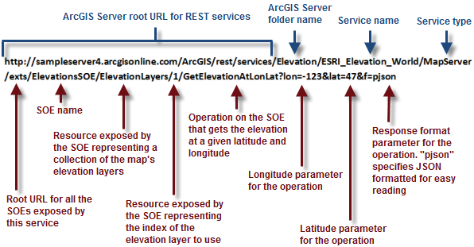

# What is a REST SOE?

This topic provides an overview of REST services and REST SOEs with examples.

### About REST server object extensions

A useful way to extend ArcGIS Server in a way that’s useable by Esri web or mobile application programming interfaces (APIs)—for example, JavaScript, Runtime APIs, and so on—is to write a SOE as a REST web service.

REST-based services receive requests through simple data types passed back and forth as requests and responses, often through JavaScript Object Notation (JSON). Don’t let this intimidate you if you haven’t developed with REST before. JSON is just textual information formatted in a standard way that can be read by applications.

To work with REST SOE web services, get the uniform resource locator (URL) to the SOE and append some input parameters, such as x,y coordinates or a layer name. The server then does all the GIS work and returns the response, which can be some attribute data, feature vertices, or even an image streamed back to your Web browser.

### REST service example

The following code is an example of working with an ArcGIS Server REST service. This first example doesn’t have an SOE, but it’s a good introduction to how requests to REST web services work. In this case, you want to request recent earthquakes with a magnitude greater than 3.0. This is the URL to send to the server. Notice the parameters that begin with the question mark "?", including the where expression "magnitude &gt; 3":

``` bash
http://sampleserver3.arcgisonline.com/ArcGIS/rest/services/Earthquakes/EarthquakesFromLastSevenDays/MapServer/0/query?where=magnitude>3&f=pjson
```

This is the response returned by the server in JSON. Looking closely at the JSON, you can see that it consists of a structured set of name/value pairs. These are grouped together by curly brackets "{}" to make objects. See the following code example:

```json
{
  "displayFieldName" : "eqid",
  "fieldAliases" : {
    "eqid" : "Earthquake ID"
  },
  "geometryType" : "esriGeometryPoint",
  "spatialReference" : {
    "wkid" : 4326
  },
  "fields" : [
    {
      "name" : "eqid",
      "type" : "esriFieldTypeString",
      "alias" : "Earthquake ID",
      "length" : 50
    }
  ],
  "features" : [
    {
      "attributes" : {
        "eqid" : "en172819"
      },
      "geometry" : {
        "x" : 73.780690684000035,
        "y" : 23.527025298000069
      }
    }
  ]
}
```

A client application can read or "parse" the JSON response and do something with it in the application. For example, a Web browser can draw a point using the x,y coordinate information in the "geometry" object in the previous code, effectively showing the location of the earthquake.

### REST SOE example

The previous example just used a regular ArcGIS Server map service. There wasn’t an SOE involved. Now, take a look at a call to a REST SOE. The following URL requests the elevation at a given latitude and longitude (the SOE is called ElevationsSOE):

``` bash
http://sampleserver4.arcgisonline.com/ArcGIS/rest/services/Elevation/ESRI_Elevation_World/MapServer/exts/ElevationsSOE/ElevationLayers/1/GetElevationAtLonLat?lon=-123&lat=47&f=pjson
```

The following is a detailed look at each part of this URL. Notice how the REST SOE exposes resources and operations. A resource is something on the server that you can get information about. An operation is something that the server does. The operation in this example is ***GetElevationAtLonLat***. See the following illustration:



With this particular operation, the server returns the response in a very simple JSON object (called "elevation"). This value can be reported in a table, label, or another place in the application. See the following code example:

```json
{
  "elevation": 83.003478588350134
}
```

What happened on the server when both of these REST services were called? Most likely, the server ran some ArcGIS Enterprise SDK code to get the result. But the client application has no need to know about ArcGIS Enterprise SDK. The client just has to know how to send a URL request and get a JSON response.