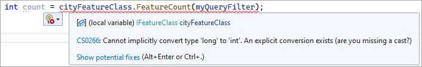

# What's new in 11.0

## .NET 6 support for SOEs and SOIs

Starting from ArcGIS Enterprise SDK 11.0, developing .NET-based SOEs and SOIs with .NET 6 is supported. See [Overview of .NET 6 support for SOEs and SOIs](../net-8-support/).

Note that using .NET Framework 4.x to develop .NET-based SOEs and SOIs is no longer supported. The .NET SOE or SOI projects built with the previous versions of the SDK will no longer work with ArcGIS Enterprise SDK 11.0. To migrate these older projects to ArcGIS Enterprise SDK 11.0, you must first create a new SOE or SOI project using the template of ArcGIS Enterprise SDK 11.0, which automatically pulls the project dependencies and tools for .NET 6 and targets the project to .NET 6. Then, you should port all the existing code and project files to the new project. Directly recompiling the older SOE or SOI projects with ArcGIS Enterprise SDK 11.0 and .NET 6 is not supported. See more details in [Migrate older .NET SOE or SOI projects to 11](../net-8-support/#migrate-older-net-soe-or-soi-projects-to-11).

## Migration paths for the 10.x versions of SOEs and SOIs

Using SOEs or SOIs built with the 10.x versions of ArcGIS Enterprise SDK or ArcObjects SDK in ArcGIS Enterprise 11.0 is no longer supported, and you will no longer be able to deploy these extensions to ArcGIS Server. Only the SOEs and SOIs built with ArcGIS Enterprise SDK 11.0 can be deployed to ArcGIS Enterprise 11.0.

Follow the migration paths for the above extensions in 11.0:

- .NET and Java SOEs and SOIs built with ArcObjects SDK

   The ArcObjects SOEs and SOIs need to be migrated to ArcGIS Enterprise SDK. See [Migrate ArcObjects extensions to ArcGIS Enterprise SDK](../migrate-ao-ext-to-ent-sdk-net/).

- .NET SOEs and SOIs built with the 10.x versions of ArcGIS Enterprise SDK
  
   The .NET SOEs and SOIs built with the 10.x versions of Enterprise SDK need to be migrated to the new .NET 6 SOE or SOI projects created from the templates of the Enterprise SDK 11.0. See [Migrate older .NET SOE or SOI projects to 11](../net-8-support/#migrate-older-net-soe-or-soi-projects-to-11).

- Java SOEs and SOIs built with the 10.x versions of ArcGIS Enterprise SDK

  The Java SOEs and SOIs built with the 10.x versions of Enterprise SDK do not necessarily need to be migrated to the new SOE or SOI Maven projects created with from the archetypes of the Enterprise SDK 11.0. If the older SOE or SOI project is a Maven project, it can be recompiled with the updated 11.0 SDK's artifacts. Otherwise, a new SOE or SOI Maven project should be created from the archetype. See [Upgrade extensions](../../java/upgrade-extensions/) for detailed instructions.

Since certain API changes in ArcGIS Enterprise SDK 11.0 may affect your existing extension's code that works with previous versions of the SDK, refer to [API changes in 11.0](#api-changes-in-110) and [New in 11.0 API](../whats-new-api-11-0-net/) to fix any compile errors that you may encounter when you migrate or upgrade your extensions.

## API changes in 11.0

Certain API changes introduced in Enterprise SDK 11.0 may affect your existing SOE or SOI code that used to work with previuos versions of the SDK and can cause compile errors when you compile your existing SOE or SOI code with Enterprise SDK 11.0. Continue this section to learn about how these API changes may affect your code and how to fix the compile errors. For a complete list of the API changes, visit [New in 11.0 API](../whats-new-api-11-0-net/).

### Interface changes

When you compile your existing SOE or SOI code with Enterprise SDK 11.0, you may see some compile errors saying `The type or namespace name 'IField2' could not be found. (Are you missing a using directive or an assembly reference?)`:

To fix this error, change the interface `IField2` to `IField`. Similar errors for `IFieldEdit2`, `IAttachment3`, and more interfaces in the Geodatabase assembly can be fixed by using their main interfaces instead, in other words, removing the number appended at the end of these interfaces.

### Method parameters and return types changed from `int` to `long`

You may also see this compile error `Cannot implicitly convert type 'long' to 'int'. An explicit conversion exists (are you missing a cast?)`:

To fix this error, define the method return type as `long` instead of `int` in the above code.

This type of changes not only affects certain method's return types, such as `long IFeatureClass.FeatureCount(IQueryFilter QueryFilter)` and `long IAttachment.AttachmentID`, but also affects certain method's input parameter types, such as `IFeatureClass.GetFeature(long OID)`, and `IFIDSet.Delete(long OID)`. To make the existing extension's code compile with the Enterprise SDK 11.0, you will need to change these types from `int` to `long`. 

### Deprecated APIs in GISClient and Server

Some interfaces, classes, and enumerations in the GISClient and Server assemblies are deprecated and removed from ArcGIS Enterprise SDK 11.0. See [New in 11.0 API](../whats-new-api-11-0-net/) for a list of deprecated APIs in these assemblies.
