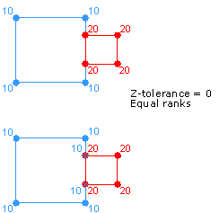
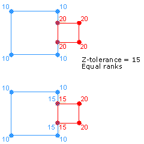

# Introduction

Topologies are collections of one or more feature classes in a geodatabase feature dataset, with rules governing how point, line, and polygon features share coincident geometry. Many geographic features share a common boundary; for example, ZIP Codes might follow street centerlines, shorelines share a border with oceans, and land parcels share an edge with neighboring lots.

Topologies provide a mechanism to perform integrity checks on data for validating and maintaining feature representations in a geodatabase. A feature dataset can have numerous topologies, but a feature class can only belong to one topology.

A typical topology example is a feature dataset containing public roads, land parcels, and buildings as polygon feature classes, which has rules that parcels should not overlap public roads or other parcels; and buildings should be contained within a parcel. Topologies enable these rules to be defined, validated, and broken through the exception settings.

### Topology creation

Topologies can be created in the geodatabase using the `ITopologyContainer.CreateTopology()` and `ITopologyContainer.CreateTopologyEx()` methods, both of which have an `ITopology` return type. Once the topology is created, the `ITopology.AddClass()` and `ITopologyRuleContainer.AddRule()` methods can be used to add feature classes and rules to the topology.

Both topology creation methods create a topology with the specified name, cluster tolerance, and maximum allowable number of generated errors. When a topology is initially created, it has no participating feature classes or rules. The decision on when to use the `CreateTopology()` method over `CreateTopologyEx()` is based on whether the feature classes that participate in the topology are z-aware. If they are not z-aware, use the `CreateTopology()` method. If the feature classes are z-aware, use the `CreateTopologyEx()` method, because it allows the setting of a z-cluster tolerance in addition to the x,y cluster tolerance.

Once the topology is built, none of the parameters can be modified. The topology must be deleted and rebuilt with the new parameters to change its properties. Therefore, careful consideration must be given to specify the parameters when creating a topology. The following snippet uses both topology creation methods:

``` c#
  public ITopology CreateTopology(IFeatureDataset featureDataset, string topologyName, bool isZAwareTopology)
  {
    ITopology topology = null;

    // Attempt to acquire an exclusive schema lock on the feature dataset.
    ISchemaLock schemaLock = (ISchemaLock)featureDataset;
    try
    {
      schemaLock.ChangeSchemaLock(esriSchemaLock.esriExclusiveSchemaLock);

      // Cast the feature dataset to the ITopologyContainer interface to create a topology.
      ITopologyContainer topologyContainer = (ITopologyContainer)featureDataset;
      if (isZAwareTopology)
      {
        topology = topologyContainer.CreateTopologyEx(topologyName, topologyContainer.DefaultClusterTolerance, topologyContainer.DefaultZClusterTolerance, -1, "");
      }
      else
      {
        topology = topologyContainer.CreateTopology(topologyName, topologyContainer.DefaultClusterTolerance, -1, "");
      }
    }
    catch (Exception)
    {
      // do something
    }
    finally
    {
      schemaLock.ChangeSchemaLock(esriSchemaLock.esriSharedSchemaLock);
    }
    return topology;
  }
```

When features are created, edited, or deleted, the topology is responsible for creating or modifying a dirty area that encompasses the envelope of the feature. A dirty area is a special type of feature in which the state of the topology is unknown. Features that are covered by dirty areas can still be edited and queried, but their topological relationships cannot be guaranteed to be correct. A dirty area must be validated to discover the topology of its underlying features and guarantee their correctness.

Before creating the topology, ensure that an exclusive schema lock has been obtained for the feature dataset. Use the `ISchemaLock` interface to determine if other locks exist and to get an exclusive lock on the feature dataset.

#### Topology name

A name is required to create a topology. The name of the topology must be unique within the geodatabase. The `IWorkspace2.NameExists` property can be used to verify the uniqueness of a name. 

#### Cluster tolerance 

The cluster tolerance defines how close together features must be where all vertices and boundaries in a feature dataset are considered identical or coincident. To minimize error, the cluster tolerance chosen should be as small as possible, depending on the precision level of your data. For example, if your data is accurate within 10 meters, you would want to set your cluster tolerance no larger than 10 meters and smaller if possible.

In general, the cluster tolerance is set to the `ITopologyContainer.DefaultClusterTolerance` property of the feature dataset. Values smaller than the default cluster tolerance or larger than the `ITopologyContainer.MaximumClusterTolerance` properties are not permitted.

The default cluster tolerance of zero (0) represents the minimum possible tolerance value that is calculated in the units of the spatial reference of the input.

#### Z-cluster tolerance

The z-tolerance is used to distinguish the z-height, or elevation, of vertices within the tolerance of one another. For example, two adjacent features of different heights can share a common edge between them. Their x,y vertices are located close together, not their z-value or height.

The value supplied for z-tolerance depends on the type of surface being modeled with the z-aware feature classes. When modeling city buildings, two buildings can be adjacent to one another and appear to share a common edge in the x,y domain. However, there might be concerns about maintaining the relative height of each building structure during the topology validation process. Setting the z-cluster tolerance to a value of 0 prevents z-values from clustering when the topology is validated. The default z-cluster tolerance for all topologies is 0 and can be obtained through the `ITopologyContainer.DefaultZClusterTolerance` property.

The following illustration shows how the validation process behaves with a z-cluster tolerance of 0. The vertices on the left side of the red feature (smaller squares) are coincident with the right edge of the blue feature (larger squares). This results in two vertices being introduced to the blue feature during validation. Because the z-tolerance is 0, the two new vertices have z-values of 10, equaling the values of their neighboring vertices in the blue feature.

 

When modeling a surface, datasets can be collected with different x,y,z accuracies. In this case, it might be beneficial to set the z-cluster tolerance to greater than 0 to allow clustering during the validation process. Each feature class can be assigned a rank to avoid z-values collected with a high level of accuracy clustering to z-values of less accuracy. Lower-ranked features' z-values cluster to the elevation of higher-ranked vertices if they fall within the cluster tolerance. The z-values of vertices belonging to feature classes of the same rank are averaged if they fall within the cluster tolerance.

The following illustration shows how the validation process behaves with a z-cluster tolerance greater than 0. The vertices on the left side of the red feature (smaller squares) are coincident with vertices on the right edge of the blue feature (larger squares). The vertices on the red feature have z-values of 20, while the vertices of the blue feature have z-values of 10. During validation, the z-values are clustered since they lie within the z-cluster tolerance and result in the vertices having z-values of 15.

 

#### Maximum generated error count and configuration keywords

The `maxGeneratedErrorCount` parameter specifies the maximum number of errors validation generates before stopping. Setting a value of -1 indicates there is no limit to the number of errors that are generated. Generally, use the default value of -1.

The `configurationKeyword` parameter allows the application to control the physical layout for this table in the underlying relational database management system (RDBMS). For example, in the case of an Oracle database, the configuration keyword controls the table space where the table is created, the initial and next extents, and other properties.

The `configurationKeyword` parameter allows the application to specify a configuration keyword for the topology. Configuration keywords are set up by the enterprise geodatabase data administrator. The list of available keywords supported by a workspace can be obtained using the `IWorkspaceConfiguration` interface. The `configurationKeyword` parameter is not mandatory when building a topology in an Enterprise Geodatabase. An empty string can be specified where the topology is built using the default configuration.

### Open an existing topology

When checking for topology error features, open the topology by opening a feature dataset, cast it to the `ITopologyContainer` interface, and open the topology using the `ITopologyContainer.TopologyByName` property. 

Alternatives to using the `ITopologyContainer` interface exist. For example, the `ITopologyWorkspace` interface can be used if the feature dataset containing the topology is unknown.

See the following code example:

``` c#
  public ITopology OpenTopologyFromFeatureWorkspace(IFeatureWorkspace featureWorkspace, string featureDatasetName, string topologyName)
  {
    // Open the feature dataset and cast it to ITopologyContainer.
    IFeatureDataset featureDataset = featureWorkspace.OpenFeatureDataset(featureDatasetName);
    ITopologyContainer topologyContainer = (ITopologyContainer)featureDataset;

    // Open the topology and return it.
    ITopology topology = topologyContainer.TopologyByName[topologyName];
    return topology;
  }
```

### Add a feature class to a topology

The `AddClass()` method adds a feature class to a topology with the specified weight and ranks. The weight must be an integer between 1 and 10. Although it is not used, it must still be specified. The x,y rank and z-rank must be an integer between 1 and 63.

Ranks higher than 51 result in errors when specified on the new topology. Even if the feature class added to the topology is not z-aware, it must have a specified z-rank. The x,y and z-ranks represent the accuracies of the feature class relative to other feature classes participating in the topology. Feature classes with a higher rank, such as 1, are more accurate than feature classes with a lower rank, such as 2. Ranks are a relative measure of accuracy. The difference between the two feature classes of ranks 1 and 2 is the same as those with 1 and 50. Multiple feature classes in topology can have the same rank.

The `EventNotificationOnValidate` parameter indicates if an event is broadcast when the feature class's topology is validated. The `ITopologyClassEvents` interface exposes the `OnValidate` event, which is fired each time a dirty area is validated in the topology in which the class is participating. The event returns an `IGeometry` reference corresponding to the area that was validated. However, this functionality is currently not supported in the ArcGIS Enterprise SDK, so set `EventNotificationOnValidate` to `False` during the feature class addition.

> Note: The complicated feature classes, such as annotation, dimension, geometric network, and feature classes already in topology, cannot be added to a topology. Also, object classes, or tables and versioned uncomplicated feature classes, cannot be added to a topology.

After a populated feature class is added to a topology that has been validated—in whole or in part—the state of the topology changes, and a dirty area corresponding to the extent of the feature class is created. If an unpopulated feature class is added to a topology, the topology's state does not change, and no dirty area is created.

The following code example shows how to add a feature class to a topology:

``` c#
  public void AddFeatureClassToTopology(ITopology topology, IFeatureClass featureClass)
  {
    // Add a feature class with weight=5, xy-rank=1, z-rank=1, and no event notification on validation 
    topology.AddClass(featureClass, 5, 1, 1, false);
  }
```

### Add rules to a topology

Each topology is created with at least one default rule (that is, it must be larger than the cluster tolerance rule). In most cases, additional rules will be added to a topology. The `ITopologyRuleContainer` interface provides access for adding, removing, and returning topology rules from a topology. This interface also provides access to members who control the promotion and demotion of topology errors and exceptions.

Before adding a rule to a topology, use the `CanAddRule` property to determine if the rule is consistent and does not conflict with any existing topology rules. For example, topology rules of the same type cannot be specified at the class level and subtype level for the same feature class.

Adding a new rule on a topology that has already been validated—in whole or in part—results in a dirty area created for the extent of the feature classes participating in the rule and a change in the topology state to `esriTSUnanalyzed`. An exclusive schema lock is required to add and modify the rules in a topology. 

The following code example shows how to create a single feature class topology rule and add it to a topology:

``` c#
  public void AddRuleToTopology (ITopology topology, esriTopologyRuleType ruleType, string ruleName, IFeatureClass featureClass)
  {
    // Create a topology rule.
    ITopologyRule topologyRule = new TopologyRuleClass
    {
      TopologyRuleType = ruleType,
      Name = ruleName,
      OriginClassID = featureClass.FeatureClassID,
      AllOriginSubtypes = true
    };

    // Cast the topology to the ITopologyRuleContainer interface and add the rule.
    ITopologyRuleContainer topologyRuleContainer = (ITopologyRuleContainer)topology;
    if (topologyRuleContainer.CanAddRule[topologyRule])
    {
      topologyRuleContainer.AddRule(topologyRule);
    }
    else
    {
      throw new ArgumentException("Could not add specified rule to the topology.");
    }
  }
```

### Access existing topology rules

The topology's rules can be accessed by using `ITopologyRuleContainer`, which is implemented by the Topology class. `ITopologyRuleContainer` has several methods for viewing a topology's rules based on the ID of a feature class or a specific subtype of a feature class. 

The following code example shows how to acquire and use an enumerator of topology rules:

``` c#
  public void DisplayTypesForEachRule(ITopology topology)
  {
    // Cast the topology to ITopologyRuleContainer and get the rule enumerator.
    ITopologyRuleContainer topologyRuleContainer = (ITopologyRuleContainer)topology;
    IEnumRule enumRule = topologyRuleContainer.Rules;

    // Iterate through each rule.
    enumRule.Reset();
    IRule rule = null;
    while ((rule = enumRule.Next()) != null)
    {
      // Cast to ITopology and display the rule type.
      ITopologyRule topologyRule = (ITopologyRule)rule;
      Console.WriteLine("Rule type: {0}", topologyRule.TopologyRuleType);
    }
  }
```

### Validate topology

Topology validation is the process of checking the features to identify any violations of the rules that have been defined for the topology. Dirty areas represent the areas where the spatial integrity of the topology has not been validated. The entire dataset is considered dirty when the topology is first created. Then, dirty areas are created whenever a feature’s geometry or subtype is modified, or topology rules are added or removed. A topology validation operation also cleans up the dirty areas. 

Topology validation is not required, but until it is performed, the entire topology will be covered by a dirty area, and the topological relationships of the features cannot be guaranteed.

The following code example shows the topology validation by calling the `ValidateTopology()` method:

``` c#
  public void ValidateTopology(ITopology topology, IEnvelope envelope)
  {
    // Get the dirty area within the provided envelope.
    IPolygon locationPolygon = new PolygonClass();
    ISegmentCollection segmentCollection = (ISegmentCollection)locationPolygon;
    segmentCollection.SetRectangle(envelope);
    IPolygon polygon = topology.DirtyArea[locationPolygon];

    // If a dirty area exists, validate the topology.
    if (!polygon.IsEmpty)
    {
      // Define the area to validate and validate the topology.
      IEnvelope areaToValidate = polygon.Envelope;
      IEnvelope areaValidated = topology.ValidateTopology(areaToValidate);
    }
  }
```

### Topology graph

The topology graph is an in-memory planar representation of the geometries in the feature classes participating in the topology. When a `TopologyGraph` is built via the `ITopologyGraph.Build()` method using an extent, or the `ITopologyGraph.BuildFromPolygon()` method using a polygon, the spatial relationships between features are discovered, analyzed, and established to form an in-memory graph of topological elements (`ITopologyElement`). The topological elements consist of edges (`ITopologyEdge`) and nodes (`ITopologyNode`).

Building the graph can be time consuming for large extents containing a large number of features. Keep the size of the topology graph to a minimum when providing the build extent to reduce the memory footprint of the graph, and to increase performance. To minimize rebuilding the graph, verify that the applicable area is already contained within the existing topology graph using the `ITopologyGraph.BuildExtent` property.

Once the topology graph is built for the applicable area, the properties and methods on the topology graph can be used to query the relationships for the shared features that each topological element represents, such as adjacency or coincidence, and perform updates on the coincident geometry. Users can also traverse the graph by enumerating through the connectivity between the topology edges and topology nodes.

A few ways to access topology elements from the topology graph are shown below:

- For a given feature in the topology graph, return its edges through `ITopologyGraph.GetParentEdges()`:
   
  ``` c#
  public void GetFeatureParentEdges(ITopologyGraph topologyGraph, IFeatureClass featureClass, IFeature feature)
  {
    // Get a list edges of a feature with specified OID from the feature class.
    IEnumTopologyEdge enumTopologyEdge = topologyGraph.GetParentEdges(featureClass, feature.OID);
    enumTopologyEdge.Reset();
  }
  ```
   
- Select topological elements that intersect a specified geometry through `ITopologyGraph.SelectByGeometry()`:

  ``` c#
  public void SelectTopologicalElements(ITopologyGraph topologyGraph, IFeature feature)
  {
    //Get a feature's geometry and use it to make a selection in the topology graph.
    IGeometry geometry = feature.ShapeCopy;

    topologyGraph.SelectByGeometry((int)esriTopologyElementType.esriTopologyNode, esriTopologySelectionResultEnum.esriTopologySelectionResultNew, geometry);
  }
  ```

- Return an element closest to a given point via the `ITopologyGraph.HitTest()` method:
   
  ``` c#
  public void FindNearestElement(ITopologyGraph topologyGraph)
  {
    ITopologyElement addressTopologyElement;
    double hitRadius;
    IPoint point = new PointClass() { X = 0, Y = 0 };

    // Find the topology element that is closest to the queryPoint and within the search radius of 10.0. 
    bool isElementFound = topologyGraph.HitTest((int)esriTopologyElementType.esriTopologyNode, point, 10.0, null, out hitRadius, out addressTopologyElement);
  }
  ```

#### Adjacency

Topological elements maintain a list of shared features they represent. For topology edges, you can enumerate through the `ITopologyEdge.LeftParents` and `ITopologyEdge.RightParents` properties to return the features (polygons) on the left and right side of a topology edge. This allows you, for example, to calculate a left and right attribute for a line that coincides with a polygon boundary, such as street and ZIP Code boundaries.

In this case, the `ITopologyElement.Parents` property returns the street and the two polygon features without an indication of side.

The following truncated code example calculates the left polygon for a supplied feature cursor of polylines:

``` c#
  public void LeftParentFromFeatureCursor(IFeatureCursor featureCursor, ITopologyGraph topologyGraph)
  {
    //Get a line feature from the cursor.
    IFeature lineFeature = featureCursor.NextFeature();
    while (lineFeature != null)
    {
      //Build the topology graph around the feature.
      IEnvelope envelope = lineFeature.Shape.Envelope;
      envelope.Expand(1.25, 1.25, true);
      topologyGraph.Build(envelope, false);
      
      IEnumTopologyEdge enumTopoEdge = topologyGraph.GetParentEdges(lineFeature.Class as IFeatureClass, lineFeature.OID);
      enumTopoEdge.Reset();

      ITopologyEdge topoEdge = enumTopoEdge.Next();
      IEnumTopologyParent leftParents = topoEdge.LeftParents[true];
      leftParents.Reset();

      esriTopologyParent leftParent = leftParents.Next();
        
      // Suppose the left polygon field index value in the line feature class is 10.
      lineFeature.Value[10] = leftParent.m_FID; 
      
      lineFeature = featureCursor.NextFeature();
    }
  }
```

#### Updating coincident geometry

The `ITopologyGraph.SetEdgeGeometry()` and `ITopologyGraph.ReshapeEdgeGeometry()` methods are used to replace or reshape topology edges. The topology edges and nodes can be moved or transformed with the `ITopologyGraph.TransformSelection()` method.

In all these cases, changes to the topology elements will change the location and maintain connectivity with the underlying features.

### Check topology states and errors

The `ITopology.State` property can be used to check for the existence of error features in a topology. It has a return type of `esriTopologyState`. If the topology has been validated and errors were found, `esriTSAnalyzedWithErrors` will be returned.

### Topology errors

Topologies can be cast to the `IErrorFeatureContainer` interface, which has properties that can be used to return the error features associated with a topology. Given a topology error feature, the following properties can be inspected through the `ITopologyErrorFeature` interface:

-	Rule violated.
-	Feature class or classes involved in the error.
-	Geometry of the error.
-	Feature IDs of the features involved in the error.
-	If the error has been marked as an exception.

Each property on `IErrorFeatureContainer` requires a spatial reference parameter. For most users, this will be the spatial reference of the topology, which can be obtained from `IGeodataset:: SpatialReference` with the `ITopology` object cast to `IGeodataset`.

#### Access error features with an `ITopologyRule`

There are four properties on the `IErrorFeatureContainer` interface. The `IErrorFeatureContainer.ErrorFeatures` property returns an enumerator of error features belonging to the specified topology rule within the supplied extent.

> Note: The final two parameters of the `IErrorFeatureContainer.ErrorFeatures` property indicate if error features and error features marked as exceptions, respectively, should be retrieved. The preceding code example shows error features, not exceptions. At least one of the parameters must have a true value, or the property fails.

The following code example shows how to get the error features for the extent of the topology:

``` c#
  // Given the topology and specific topology rule, return the error features for that rule.
  public void DisplayErrorFeaturesForRule(ITopology topology, ITopologyRule topologyRule)
  {
    // Cast to required interfaces and get the spatial reference.
    IErrorFeatureContainer errorFeatureContainer = (IErrorFeatureContainer)topology;
    IGeoDataset geoDataset = (IGeoDataset)topology;
    ISpatialReference spatialReference = geoDataset.SpatialReference;

    // Get an enumerator for the error features.
    IEnumTopologyErrorFeature enumTopologyErrorFeature = errorFeatureContainer.get_ErrorFeatures(spatialReference, topologyRule, geoDataset.Extent, true, false);

    // Display the origin IDs for each of the error features.
    ITopologyErrorFeature topologyErrorFeature = null;
    while ((topologyErrorFeature = enumTopologyErrorFeature.Next()) != null)
    {
      Console.WriteLine("Origin feature OID: {0}", topologyErrorFeature.OriginOID);
    }
  }
```

#### Access error features by geometry type

The `IErrorFeatureContainer.ErrorFeaturesByGeometryType` property returns all error features of a certain geometry type.

Similar to the `IErrorFeatureContainer.ErrorFeatures` property, the final parameter of the `IErrorFeatureContainer.ErrorFeaturesByGeometryType` property is a Boolean, which indicates if errors or exceptions should be returned. See the following:

- If set to false (as in the preceding code example), only error features will be returned.
- If set to true, only exceptions will be returned.

The following code example writes the ID properties for each error feature with the specified geometry type:

``` c#
  public void DisplayErrorFeatureByGeometryType(ITopology topology, esriGeometryType geometryType)
  {
    // Cast to required interfaces and get the spatial reference.
    IErrorFeatureContainer errorFeatureContainer = (IErrorFeatureContainer)topology;
    IGeoDataset geoDataset = (IGeoDataset)topology;
    ISpatialReference spatialReference = geoDataset.SpatialReference;

    // Get all errors that have the specified geometry type.
    IEnumTopologyErrorFeature enumTopologyErrorFeature = errorFeatureContainer.ErrorFeaturesByGeometryType[spatialReference, geometryType, false];

    // Display each error feature (if any exist) and display their properties.
    ITopologyErrorFeature topologyErrorFeature = null;
    while ((topologyErrorFeature = enumTopologyErrorFeature.Next()) != null)
    {
      Console.WriteLine("Error Feature Origin Class ID: {0}", topologyErrorFeature.OriginClassID);
      Console.WriteLine("Error Feature Origin Feature ID: {0}", topologyErrorFeature.OriginOID);
      Console.WriteLine("Error Feature Dest. Class ID: {0}", topologyErrorFeature.DestinationClassID);
      Console.WriteLine("Error Feature Dest. Feature ID: {0}", topologyErrorFeature.DestinationOID);
    }
  }
```

#### Access error features by rule type

The `IErrorFeatureContainer.ErrorFeaturesByRuleType` property returns an enumerator of error features belonging to the specified topology rule type in the supplied extent. Notice how this differs from the `IErrorFeatureContainer.ErrorFeatures` property in that a reference to an `ITopologyRule` is not required, but rather a value from the `esriTopologyRuleType` enumeration is. This differs from the other property in that no specific rule is specified; therefore, if several rules have the same rule type, error features from each will be returned.

As with the `IErrorFeatureContainer.ErrorFeatures` property, the final two parameters are Booleans. The first parameter indicates if error features will be returned, and the second indicates if exceptions will be returned. 

See the following code example:

``` c#
  public void DisplayErrorFeatureByRuleType(ITopology topology, esriTopologyRuleType topologyRuleType)
  {
    // Cast to required interfaces and get the spatial reference.
    IErrorFeatureContainer errorFeatureContainer = (IErrorFeatureContainer)topology;
    IGeoDataset geoDataset = (IGeoDataset)topology;
    ISpatialReference spatialReference = geoDataset.SpatialReference;

    // Return all errors for the supplied rule in the given extent, then retrieve the first one.
    IEnumTopologyErrorFeature enumTopologyErrorFeature = errorFeatureContainer.get_ErrorFeaturesByRuleType(spatialReference,
        topologyRuleType, geoDataset.Extent, true, false);

    // Get the first error feature (if any exist) and display its properties.
    ITopologyErrorFeature topologyErrorFeature = enumTopologyErrorFeature.Next();
    if (topologyErrorFeature != null)
    {
      Console.WriteLine("Error Feature Origin Class ID: {0}", topologyErrorFeature.OriginClassID);
      Console.WriteLine("Error Feature Origin Feature ID: {0}", topologyErrorFeature.OriginOID);
      Console.WriteLine("Error Feature Dest. Class ID: {0}", topologyErrorFeature.DestinationClassID);
      Console.WriteLine("Error Feature Dest. Feature ID: {0}", topologyErrorFeature.DestinationOID);
    }
  }
```

#### Access error features individually

The `IErrorFeatureContainer.ErrorFeature` property returns a specific topology error feature corresponding to the rule type, geometry type, and source feature information. The rule and geometry type are required, as topological rules can result in error features with different geometries (point, line, or polygon). 

See the following code example:

``` c#
  // The following code example returns a polygon topology error feature for the must not overlap rule.
  public ITopologyErrorFeature GetErrorFeatureForNoOverlapRule(ITopology topology, IFeatureClass featureClass, int originFeatureOID, int destFeatureOID)
  {
    // Cast to required interfaces and get the spatial reference.
    IErrorFeatureContainer errorFeatureContainer = (IErrorFeatureContainer)topology;
    IGeoDataset geoDataset = (IGeoDataset)topology;
    ISpatialReference spatialReference = geoDataset.SpatialReference;

    // Find the error feature and return it.
    ITopologyErrorFeature topologyErrorFeature = errorFeatureContainer.get_ErrorFeature(spatialReference,
      esriTopologyRuleType.esriTRTAreaNoOverlap,
      esriGeometryType.esriGeometryPolygon, featureClass.FeatureClassID,
      originFeatureOID, featureClass.FeatureClassID, destFeatureOID);

    return topologyErrorFeature;
  }
```

The IErrorFeatureContainer.ErrorFeature property has the following parameters that require knowledge of the rule being used and the feature classes and features resulting in the error feature:

- GeometryType — Geometry type of the error feature requested
- OriginClassID — Class ID of the feature class to which the rule is applied
- OriginOID — Object ID of the origin feature causing the error
- DestinationClassID — Class ID of the feature class in which the rule interacts
- DestinationOID — Object ID of the destination feature causing the error

Passing correct values into each parameter is crucial, as the property returns a null value if any are incorrect. In addition, not all parameters are applicable for each rule type. An example is the must not have gaps rule. Since gaps do not belong to features, the `OriginOID` and `DestinationOID` parameters must have values of 0.

Many rules involve a single class, with no destination class involved (as shown in the previous code example). Since two features are involved, both feature class IDs must be specified, even though the origin and destination class ID are the same. For the most part, if only one feature class is part of the rule and only a single feature is involved, the destination class ID can be set to 0.

Other rules use two classes but only an origin feature. The polygon rule contains a point that follows this pattern. The origin and destination class ID parameters must contain valid class IDs, but since the error features indicate the absence of a feature (a point within a polygon), the destination Object ID will always be 0. The polygon rule must cover each other requires features of two different polygon feature classes to cover each other. If an origin feature is uncovered, the destination feature ID will be 0, but if a destination feature is uncovered, the origin feature ID will be 0.

Selecting the correct geometry type for the error feature is also essential. A rule applied to a feature class of one geometry type can return error features of a different geometry type. For example, the must not have gaps rule applies to feature classes containing polygons but returns error features with polyline geometries. Further complicating the situation is that not all rules consistently return error features with the same geometry type. The rule for lines must not intersect is an example of this, as it can return error features with point or line geometries, depending on the cause of the error. If an incorrect geometry type is passed to the `IErrorFeatureContainer.ErrorFeature` property, a null value will be returned, even if the other parameters are correct.

#### Access error features by extent

Another common task is finding the topology errors within a given extent. The following code example shows how to do this:

``` c#
  public void FindAllErrorFeatures(ITopology topology, IEnvelope searchExtent)
  {
    // Cast to required interfaces and get the spatial reference.
    IErrorFeatureContainer errorFeatureContainer = (IErrorFeatureContainer)topology;
    IGeoDataset geoDataset = (IGeoDataset)topology;
    ISpatialReference spatialReference = geoDataset.SpatialReference;
    ITopologyRuleContainer topologyRuleContainer = (ITopologyRuleContainer)topology;

    // Get an enumerator for the topology's rules and iterate through them.
    IEnumRule enumRule = topologyRuleContainer.Rules;
    enumRule.Reset();
    IRule rule = null;
    while ((rule = enumRule.Next()) != null)
    {
      // For each rule, get an enumerator for all of the error features and exceptions.
      ITopologyRule topologyRule = (ITopologyRule)rule;
      IEnumTopologyErrorFeature enumTopologyErrorFeature =
          errorFeatureContainer.get_ErrorFeatures(spatialReference, topologyRule,
          searchExtent, true, true);

      ITopologyErrorFeature topologyErrorFeature = null;
      while ((topologyErrorFeature = enumTopologyErrorFeature.Next()) != null)
      {
        // For each error feature, display the class ID, ObjectID, and if it's an exception.
        Console.WriteLine("Class ID: {0} Object ID: {0} IsException {0}",
            topologyErrorFeature.OriginClassID, topologyErrorFeature.OriginOID,
            topologyErrorFeature.IsException);
      }
    }
  }
```